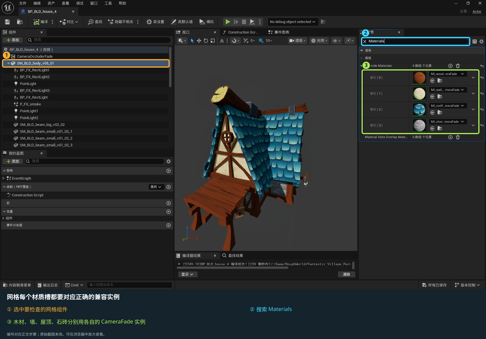
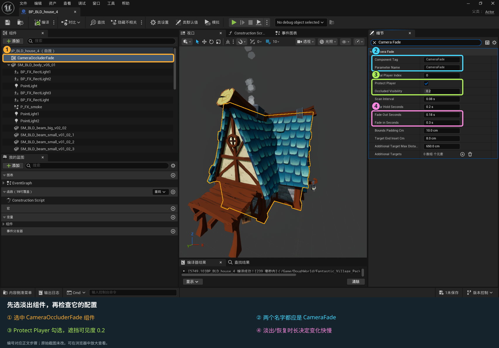
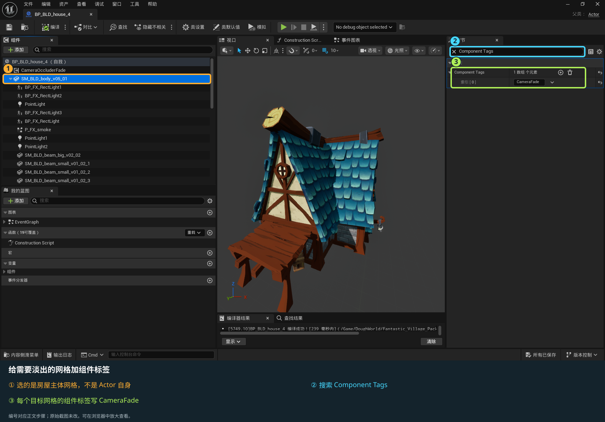
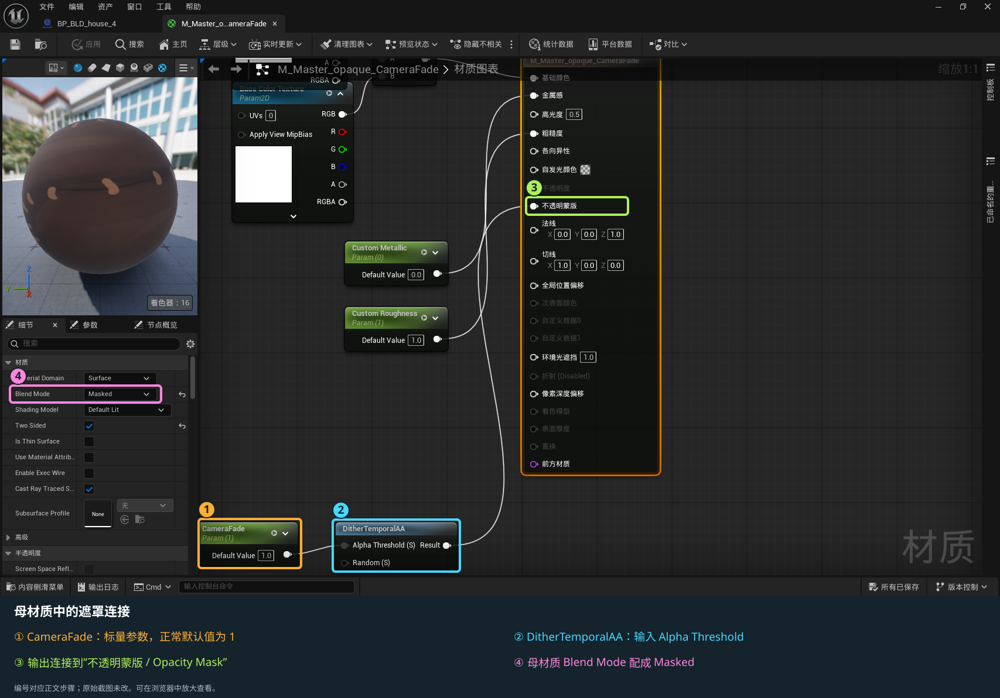
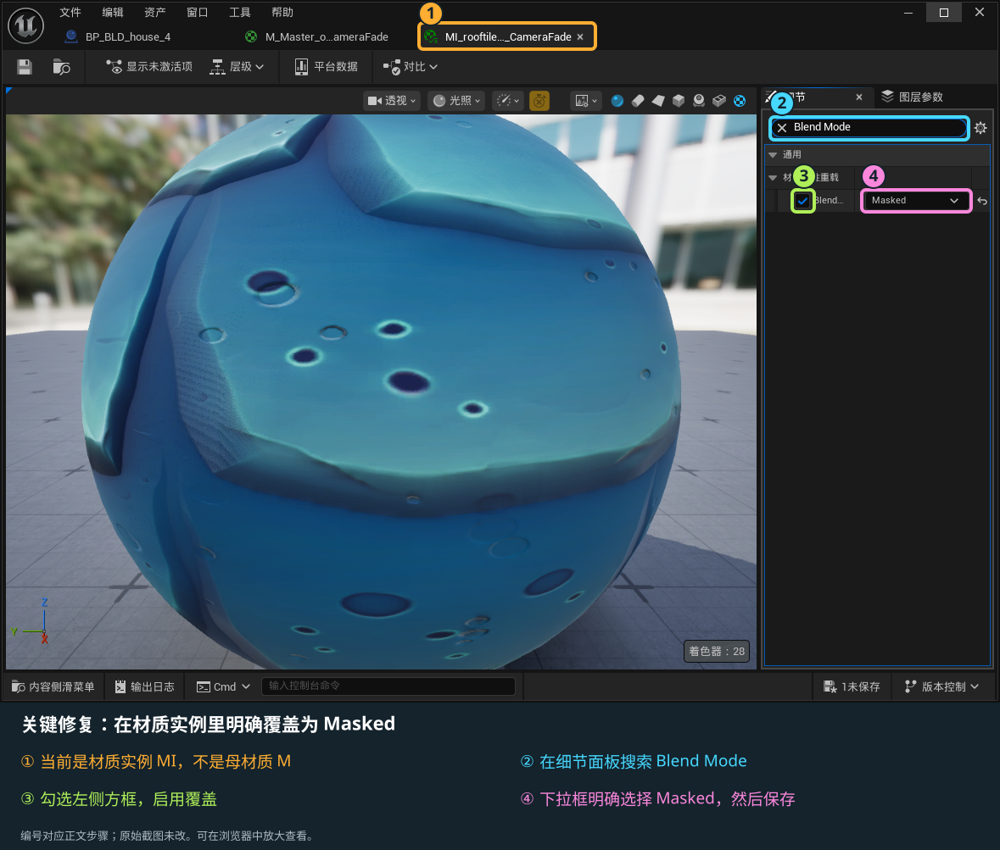
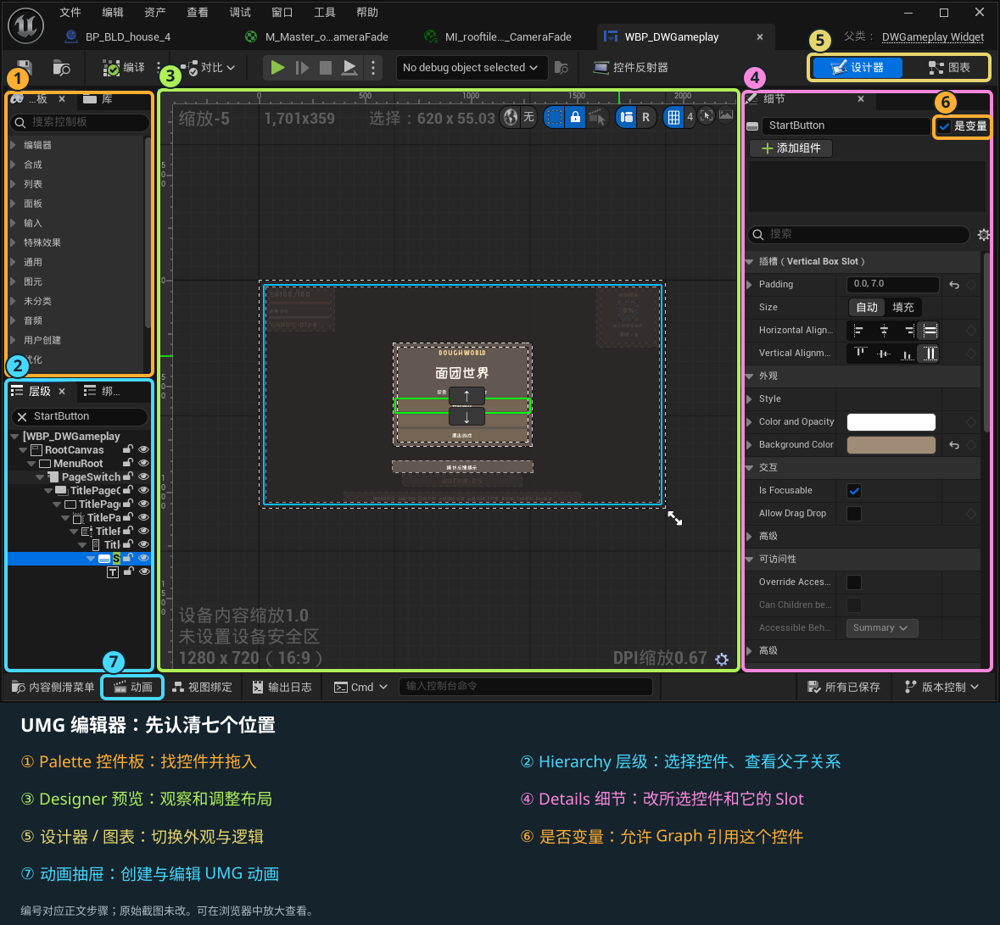
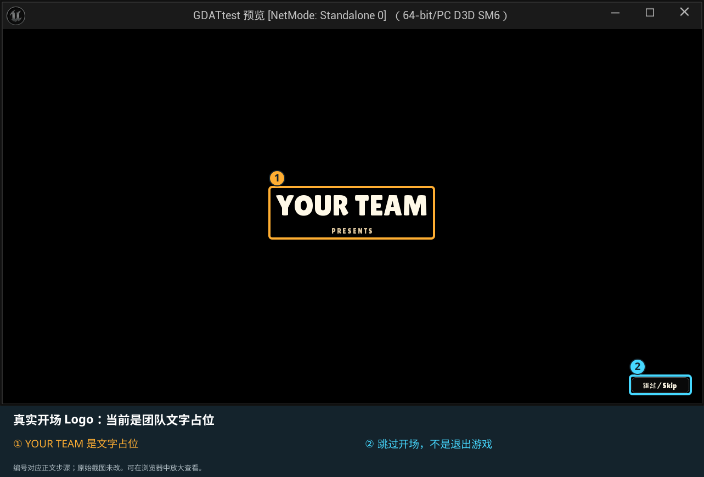
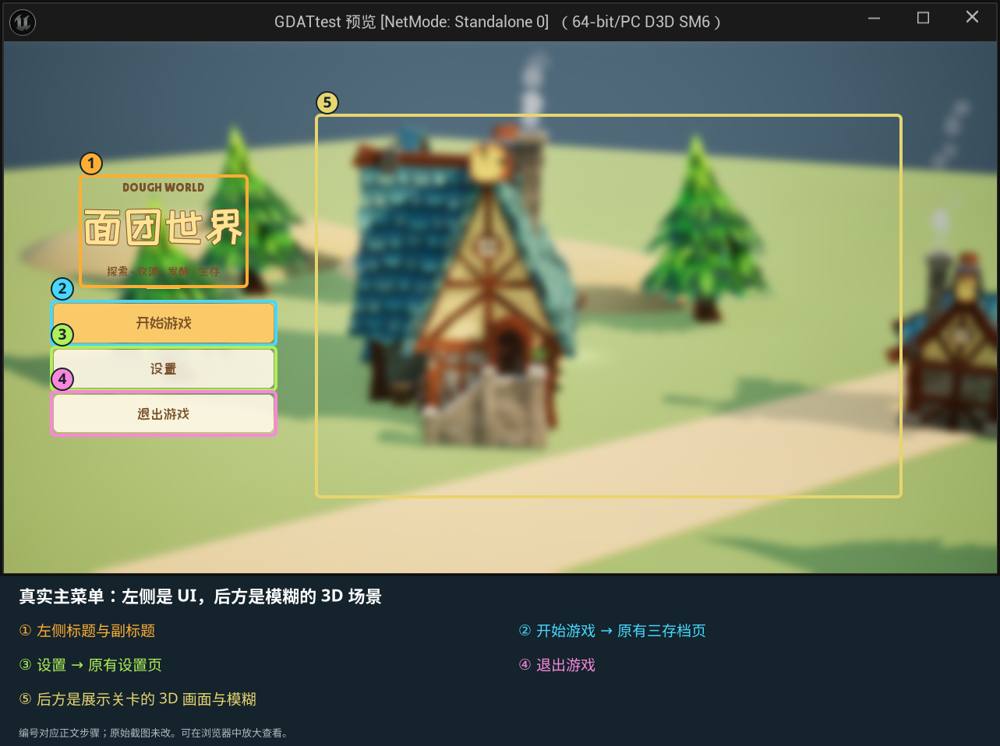
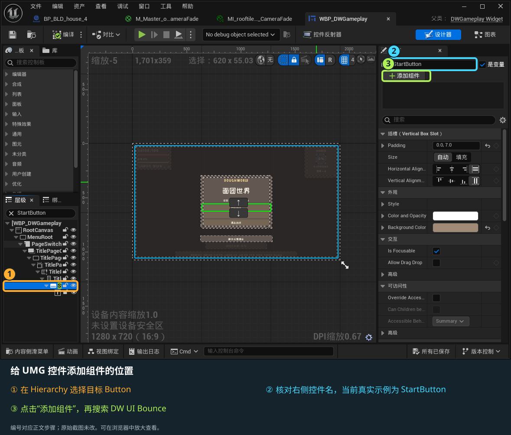
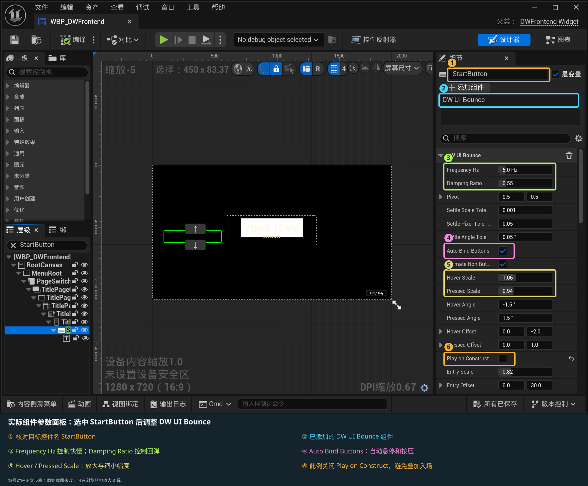

# Dough World 完整操作与修改手册

版本：2026-09-16 · UI 入门与材质图解增补版。对象：当前 `GDATtest` 工程的平面玩法原型和独立主菜单示例。保留之前的完整维护说明，新增材质标注截图、UI 从零入门、黑屏与 Logo 开场、主菜单场景和可挂载 UI 弹跳组件。后续你修改工程后，附录中的数值只是其标注日期的快照，应以编辑器中当前值为准。

## 从这里开始

推荐打开同目录的 `DoughWorld_完整操作与修改手册.html`：左侧是目录，顶部可以搜索中文功能名或英文参数名；支持离线查看与浏览器打印。`DoughWorld_完整操作与修改手册.md` 是可编辑原稿。末尾的参数附录列出自定义可编辑字段；引擎自带的 Transform、灯光、材质、碰撞等按对应章节操作。

这份手册覆盖当前已经实现的系统、替换现有表现的办法和新增内容的接入点。没有实现的系统会标明需要程序开发，不把“预留一个声音/模型槽位”当成完整的新机制。

**如果你现在一点都不会 UI，先打开同目录的 `DoughWorld_UI从零开始_图解教程.html`。** 它从本手册抽出相关章节，按「认识编辑器 → 做第一个按钮 → 替换图片 → 新建页面 → 做动画 → 接开场 → 挂弹跳组件」学习。先完成一个小练习，再做下一步，不需要一次读完全部玩法参数。截图上的彩色框与编号对应紧接着的文字；可以右键在新标签页查看图片以放大。

| 位置 | 当前工程入口 |
|---|---|
| 启动工程 | `E:/Unreal Project/GDATtest/GDATtest.uproject` |
| 本轮玩法资源根目录 | `Content/DoughWorld/Maps/Gameplay` |
| 玩法测试关卡 | `Levels/L_DoughWorld_GameplayPrototype` |
| 全局玩法配置 | `Data/DA_DoughWorldGameplay` |
| 物品 / 配方表 | `Data/DT_DWItems` / `Data/DT_DWRecipes` |
| 玩家 / 控制器 | `Blueprints/BP_DWTopDownCharacter` / `Blueprints/BP_DWPlayerController` |
| GameMode / HUD | `Blueprints/BP_DWTopDownGameMode` / `Blueprints/BP_DWGameplayHUD` |
| 主界面控件 | `UI/WBP_DWGameplay` |
| 新开场 / 主菜单示例 | `Frontend/Levels/L_DWMainMenu_Showcase` 与 `Frontend/UI/WBP_DWFrontend` |
| 新主菜单 HUD / GameMode | `Frontend/Blueprints/BP_DWFrontendHUD` / `BP_DWFrontendGameMode` |
| 通用 UI 弹跳 | 在 UMG Designer 选中控件 → Details 添加 `DW UI Bounce` 组件；详见新增专章 |
| 源码 | `E:/Unreal Project/GDATtest/Source/GDATtest/Gameplay` |
| 工程内文档 | `Content/DoughWorld/Maps/Gameplay/Documentation` |

内容浏览器中的 `Content` 对应资源引用路径 `/Game`。例如关卡资源名写成 `/Game/DoughWorld/Maps/Gameplay/Levels/L_DoughWorld_GameplayPrototype`；它不是 Windows 文件路径。本文在根目录之后写的简短相对路径，都从 `Content/DoughWorld/Maps/Gameplay` 开始找。

## 按你要改的内容找入口

| 我想修改…… | 先打开哪里 | 通常需要什么操作 |
|---|---|---|
| 按键 / WASD / F / Shift / 空格 | `BP_DWPlayerController` | 类默认值里的按键配置；运行时更改后调用应用绑定节点 |
| 血量、移速、疾跑消耗、酒精生成、变身增长与衰减 | `DA_DoughWorldGameplay` | 修改全局参数，停止再开始游戏验证 |
| 空格冲刺距离、时间、冷却 | `BP_DWTopDownCharacter` | 修改继承的 Roll 参数；现在表现为平移冲刺 |
| 酵母变橙、变大、过渡速度 | `BP_DWTopDownCharacter` | `Transformation → Visual` |
| 玩家模型、材质、动画、剑占位 | 玩家蓝图与 `Characters/Hero` | 先确认骨架/动画播放模式，再替换对应引用 |
| 摄像机距离、俯仰、拖拽灵敏度 | 玩家蓝图与 CameraBoom 组件 | 按摄像机章节检查运行时覆盖 |
| 一个物品的名字、图标、使用回复量 | `DT_DWItems` | 编辑原行字段；保持稳定 ItemId |
| 新增一种物品 | `DT_DWItems` | 新增独立 ID，再接资源/配方/图标 |
| 合成材料、数量、产物、形态限制 | `DT_DWRecipes` | 编辑 Inputs / Outputs / bRequiresYeast |
| 新增一种可采集物体 | `Blueprints/Resources` | 从现有资源蓝图派生或复制，并设置 ItemId |
| 单个资源的储量、范围、时间、产量 | 关卡资源实例 | 修改实例 Details；不要误改全部资源类型 |
| 敌人血量、发现距离、攻击和巡逻 | `Combat/BP_DWEnemy` | 蓝图默认值或特定关卡实例 |
| 窝点血量、刷新速度、激活范围、上限 | `Combat/BP_DWEnemyNest` | 敌人类引用及窝点参数 |
| 酒精瓶飞行、毒雾时间、伤害、减速 | `BP_DWAlcoholProjectile` / `BP_DWAlcoholArea` | 分别修改飞行与落地效果参数 |
| 菜单、背包、制作界面、HUD 位置和图片 | `WBP_DWGameplay` 及三个条目 WBP | Designer 修改布局；保留绑定控件类型和名称 |
| 全局字体 | `BP_DWGameplayHUD` 和字体资源 | 修改 GameUIFont；中文字体回退要保留 |
| 新增中英文文字 | 配表英文名或 `DWLocalizationCatalog.inl` | 数据文字优先配表；新增动态句子需程序接线 |
| 头顶提示、弹性、F 键帽、提示音 | `UI/Interaction` | Style 控制外观；组件控制触发/位置 |
| 点击、背包开关、合成、采集声音、BGM | `DA_DoughWorldGameplay → Audio` | 把 Sound Wave / Sound Cue 放进相应槽位 |
| 变身、冲刺、投掷特效或声音 | 玩家/投射物/区域蓝图 | 使用对应槽位或表现事件；避免重复播放 |
| 新关卡、场景白盒、模型植被 | `Levels` 与内容浏览器 | 复制关卡、放置资源/导航、配置游戏入口 |
| 建筑遮挡角色时淡出 | Camera Occluder Fade 组件与材质 | 组件放在需要淡出的建筑/树木 Actor；按组件和材质规则配合 |
| 保存、加载、存档格式、槽位数 | `DWGameInstance` / `DWSaveGame` | 现有按钮可用；改结构/规则需 C++ 和旧档兼容处理 |
| 新敌人攻击、新物品效果、近战、任务、跨地图 | 对应 C++ 基类与蓝图事件 | 属于新增机制，不能只填一个资源引用完成 |

## 每次修改都用这套流程

1. **确定范围。** 只改关卡中的一个物体，就在大纲选它；要改所有同类物体，就打开它的蓝图；要改全体玩家和物品通用规则，就打开 DA 或 DT。
2. **停止运行。** 普通 PIE 里的实例修改通常不会写回正式资源；先结束游戏，再修改编辑状态下的资产。当前进度需要保留时，在游戏菜单使用保存功能。
3. **找到资产。** `Ctrl + Space` 打开内容侧滑菜单，搜索手册中的完整资产名。双击后，数据资产直接显示属性；蓝图点击 `Class Defaults / 类默认值`；界面蓝图切到 `Designer / 设计器`。
4. **显示继承项。** 原生 C++ 暴露的变量可能位于“继承变量”中。类默认值的 Details 搜索英文参数名通常最准确。选中组件后，Details 只显示该组件的属性；切回类默认值才能看到角色整体参数。
5. **小步修改并保存。** 蓝图点击 `Compile / 编译`，再 `Save / 保存`；DA、DT、材质与关卡分别保存。蓝图黄箭头/重置按钮表示该项与继承默认值不同，重置前确认自己是否确实要丢弃这个覆盖值。
6. **从正确入口验证。** 打开平面原型关卡，点击播放，从标题页新建独立测试档。参数验证优先新档；旧档会恢复血量、背包和场景状态，容易掩盖新默认值。
7. **测完整流程。** 不只看数值：例如修改合成，要验证缺材料失败、材料足够成功、背包已满、形态不满足四种情况；修改声音要验证松开/退出菜单后是否停止。
8. **留一个可回退版本。** 团队正式合并前提交版本控制或保留工程备份。`.uasset` 与 `.umap` 是二进制文件，两个人同时改同一个文件通常不能像代码一样逐行合并。

## 为什么我改了参数，游戏里却没变化

| 可能原因 | 当前工程应该怎么查 |
|---|---|
| 改的是旧地图或旧 TopDown 蓝图 | 检查当前关卡 World Settings 的 GameMode，再检查其 Default Pawn / Player Controller / HUD 引用 |
| 改的是玩家蓝图 GameplayConfig，运行时仍读另一份 | 当前玩家从 GameInstance 获取全局配置；检查 GameInstance 的 SoftConfigPath 指向的实际 DA |
| 修改 DA 的 Items / Recipes，却仍看到旧物品配方 | 有效 DT 会覆盖相应数组，优先修改 ItemTable / RecipeTable 对应的数据表 |
| 只改 C++ 初始值，已有蓝图仍保留旧值 | 已序列化的蓝图/组件/实例可能覆盖 C++ 默认值；检查对应 Details，必要时有选择地重置 |
| 蓝图正确，但单个实例不变 | 该实例可能有独立覆盖。检查关卡实例相同字段的重置箭头 |
| 在 PIE 里修改，停止后消失 | 在正式蓝图/数据资产/编辑器关卡中重做；不要把运行实例当作配置源 |
| 换了 UI 字体又被覆盖 | HUD 的 GameUIFont 会统一字体对象；字号等局部属性另按 UI 章节调整 |
| 改了 Mesh Anim Class，动画仍不变 | 目前由 C++ 单节点动画逻辑持续播放；切 AnimBP 需要一起调整播放逻辑 |
| 更改血量/资源数量，加载后还是旧值 | 存档恢复的是上次保存的状态；用专门新测试档比较，勿随便删除正式存档 |
| 只改 Project Settings 输入映射 | 本轮按键来自玩家控制器蓝图配置；不会自动读取旧 Action/Axis Mapping 或 IMC |

普通的默认值优先级可理解为“C++ 初值 → 蓝图默认值 → 场景实例覆盖 → 运行逻辑与存档恢复”。但当前工程还包含 DA/DT 加载等明确的运行覆盖，必须按照上表检查，不能只依据这个通用顺序。

## 蓝图和 C++ 分别负责什么

蓝图适合修改美术引用、布局、参数、声音、效果表现和已开放的事件。数据表适合增加物品与配方。C++ 负责当前库存交易、存档兼容、伤害/形态/采集规则、原生控件刷新和事件入口等底层流程。

“有蓝图事件”表示可以接入那一个事件，不能据此认为整个系统都能在任意蓝图图表中重写。例如剑模型槽位不会自动产生近战伤害；普通 Actor 加提示组件不会自动获得 F 采集；把新名字填进表里也不会自动产生新的药水效果。

需要程序新增功能时，把四项一起交接：**希望玩家做什么、成功/失败条件、要改哪个现有系统、哪些参数必须在蓝图或配表中开放**。附上当前资产路径和复现步骤，比只写“加一个系统”更容易对接。


## 第 2 章 · 玩法、角色与数据修改手册

本章按当前工程源码核对，适用于新玩法平面关卡。文中的“原生默认”是 C++ 初始值；实际蓝图、数据资产和关卡实例可能有覆盖，运行值以本手册的实际资产参数附录及编辑器 Details 为准。后续修改应在 UE 编辑器保存资源，停止并重新开始 PIE 后检查；不要把 PIE 中临时修改的值当作已经保存。

### 1. 先找到正确的修改入口

新玩法资源的 UE 根路径是 `/Game/DoughWorld/Maps/Gameplay`，磁盘对应 `E:/Unreal Project/GDATtest/Content/DoughWorld/Maps/Gameplay`。下表的资源路径相对此根目录。

| 你要修改什么 | 应打开的资源 / 位置 |
|---|---|
| 玩家生命、移动速度、疾跑消耗、变身数值、背包容量 | `Data/DA_DoughWorldGameplay` |
| 每个物品的名字、图标、使用效果 | `Data/DT_DWItems` |
| 配方、材料、产物数量、是否需要酵母形态 | `Data/DT_DWRecipes` |
| 玩家模型、动画、变身颜色/大小、镜头、短冲刺、投掷成本 | `Blueprints/BP_DWTopDownCharacter` |
| 当前按键分配 | `Blueprints/BP_DWPlayerController` → Class Defaults → DoughWorld / Input |
| 水、酵母、面粉、面团资源点 | `Blueprints/Resources/BP_DWResource_Water`、`BP_DWResource_Yeast`、`BP_DWResource_Flour`、`BP_DWResource_Dough` |
| 敌人的数值、AI 规则与表现 | `Blueprints/Combat/BP_DWEnemy` |
| 窝点的生命、刷新范围/周期/敌人类型 | `Blueprints/Combat/BP_DWEnemyNest` |
| 酒精瓶外观、飞行时间、落地特效 | `Blueprints/Combat/BP_DWAlcoholProjectile` |
| 酒精区域的范围、伤害、减速、寿命 | `Blueprints/Combat/BP_DWAlcoholArea` |
| 短冲刺占位拖尾 | `Blueprints/Combat/BP_DWDashTrail` |
| 关卡玩家、控制器、HUD 的组合 | `Blueprints/BP_DWTopDownGameMode` 与关卡 World Settings |
| 三槽存档、地图校验、加载恢复 | 原生 `DWGameInstance`、`DWSaveGame`、玩家的保存/恢复代码 |

操作方式：打开 Content Drawer（内容抽屉），沿文件夹找到资源，双击打开。蓝图里点击 **Class Defaults / 类默认值**，再在右侧 Details 搜索表中的英文字段名。UE 可能把 `SprintSpeedMultiplier` 显示为 `Sprint Speed Multiplier`；布尔字段的 `b` 前缀通常不会显示。

要改变“这一种物件以后所有新实例”的默认行为，在蓝图类默认值修改。要改变“地图中只有这一个”，先选中关卡里的 Actor，再改 Details。实例旁有重置箭头表示它可能覆盖了类默认值；更改蓝图后该实例不跟随时，先检查覆盖，而不是反复改 C++。

#### 参数真正的优先级

1. 玩家在 BeginPlay 取得 `GameInstance.GetConfig()`，所以主入口是 GameInstance 指向的 `DA_DoughWorldGameplay`。在玩家蓝图另填 `GameplayConfig`，正常流程下仍会被这个统一配置替换。
2. DA 的 `ItemTable` 和 `RecipeTable` 指向有效表时，表会**整组替换** DA 的 `Items`、`Recipes` 数组。配了表后，应改表，不要另维护 DA 数组。
3. 表结构错误、内容无效或表为空时，代码保留此前/配置的数组并记警告。将配方表删成零行不会自动禁用全部合成。
4. 普通 Actor 参数遵循原生默认 → 蓝图默认 → 关卡实例覆盖。运行时初始化还会将玩家移速、敌人生命等设为其配置值；只改 CharacterMovement 的 `Max Walk Speed` 会被后续运行逻辑覆盖。
5. 读档时，已保存的生命、背包、资源余量和敌人/窝点生命会覆盖新游戏初值。想测试“新默认值”，用空测试槽新建游戏，勿直接覆盖自己的进度。

有效的 DA 对象在 GameInstance 中缓存。最稳妥的编辑流程是停止 PIE → 修改表/蓝图 → Compile（蓝图）→ Save All → 重新开始 PIE。`RefreshDefinitionsFromTables()` 是可调用节点，但大改 ID/容量时不能把它当成旧档迁移工具。

### 2. 当前全部玩家操作

下表列出默认键。现在可在玩家控制器蓝图改键，运行中的底部说明、形态提示、背包/制作返回提示与资源键帽会使用已生效键位。后文“F采集”“B背包”等写法也指这套默认键，不代表新键仍须按F/B。

| 输入 | 目前行为 |
|---|---|
| W / A / S / D | 相对当前镜头方向移动；斜向不会额外加速 |
| 按住左 Shift 或右 Shift | 持续疾跑；只有角色实际在地面移动时才扣生命并累计产出酒精 |
| 空格 | 沿角色当前面朝方向短冲刺；有位移、时长与结束后冷却 |
| 鼠标右键按住并拖动 | 旋转镜头；WASD 随镜头方向变化 |
| 鼠标左键单击 | 向鼠标指向位置投掷一瓶酒精；按住左键不会自动连续投掷 |
| 靠近后按住 F | 持续采集当前最近的可用资源点 |
| E | 面团形态且变身值已满时进入酵母形态；再次按 E 不会主动退出 |
| B | 打开 / 关闭背包 |
| Tab | 打开 / 关闭制作界面；可以浏览背包和配方 |
| Esc | 游玩时开关暂停界面；背包/制作时关闭面板；设置中返回前页；存档选择中返回标题 |

当前没有跳跃，没有左键寻路移动，也没有已实现的剑近战攻击。手上的长方体仅是 `SwordPlaceholder` 外观；即使播放了带剑动作，也不产生剑碰撞伤害。

**背包与制作页不会暂停世界。** 它们阻止玩家移动、投掷和采集，但敌人、变身衰减等仍继续运行。标题、存档选择、暂停和设置页才暂停世界。死亡页也不暂停，以便死亡动画继续播放。若想把背包变成完全暂停，要改 `DWGameplayHUD.cpp::ShowMenu()` 的暂停规则，并检查制作时的形态衰减和音频行为。

#### 2.1 永久更换项目默认按键，不需要修改C++

1. 停止Play，打开 `Blueprints/BP_DWPlayerController`。
2. 点击 **Class Defaults / 类默认值**，在Details搜索 `Key` 或展开 `DoughWorld / Input`。
3. 在下表字段旁的键选择器选择所需键。例如把 `KeyHarvest` 从 F 改成 R，把 `KeyInventory` 从 B 改成 I。
4. 同一有效键不能分给两项动作。如果你把采集改成 E，要同时将变身换到另一个未占用键；两个Shift也不能填成同一键。
5. Compile → Save → 重新Play。靠近资源，检查键帽变成R，按住R确实采集；原F不再采集。再测试新的背包/制作/返回键以及两个语言。

| 分类 | 字段 | 默认 | 对应动作枚举 |
|---|---|---|---|
| Movement | `KeyMoveForward` | W | MoveForward |
| Movement | `KeyMoveBackward` | S | MoveBackward |
| Movement | `KeyMoveLeft` | A | MoveLeft |
| Movement | `KeyMoveRight` | D | MoveRight |
| Movement | `KeyDash` | SpaceBar | Dash |
| Movement | `KeySprint` | LeftShift | Sprint |
| Movement | `KeySprintAlternate` | RightShift | SprintAlternate |
| Interaction | `KeyHarvest` | F | Harvest |
| Interaction | `KeyTransform` | E | Transform |
| Interaction | `KeyThrow` | LeftMouseButton | Throw |
| Camera | `KeyCameraDrag` | RightMouseButton | CameraDrag |
| UI | `KeyInventory` | B | Inventory |
| UI | `KeyCrafting` | Tab | Crafting |
| UI | `KeyPauseMenu` | Escape | PauseMenu |

输入底层仍由DWPlayerController执行，蓝图字段是统一配置入口。不要另在Event Graph里加同键的Keyboard事件，也不用改旧TopDown的InputAction或Project Settings → Input。修改本蓝图只影响用它的玩法；如果新建了其他GameMode，请确认其PlayerControllerClass仍指向这份蓝图或其子类。

#### 2.2 游戏运行中，通过蓝图修改后应用

如果以后做玩家自定义按键界面：Get Player Controller → Cast to DWPlayerController → Set所需Key字段 → `ApplyInputBindings` → 按返回值处理。

| 接口 | 说明 |
|---|---|
| `ValidateInputBindings(OutError) → bool` | 只校验待应用字段，不修改当前输入 |
| `ApplyInputBindings(OutError) → bool` | true表示接受并排队；下一次Controller输入处理前安全提交 |
| `ResetInputBindingsToDefaults(OutError) → bool` | 将字段恢复本表原始键位并排队应用；不是恢复你另改过的蓝图默认 |
| `GetAppliedActionKey(EDWInputAction Action) → Key` | 获取真正已生效的键，适合菜单输入比较 |
| `GetActionKeyLabel(EDWInputAction Action) → Text` | 获取按项目中英文显示的短标签，适合UI键帽 |
| `bInputBindingsPending` | 只读；仍有一组已接受键位等待提交 |
| `InputBindingsRevision` | 只读；每次成功提交递增，可用于自制UI刷新 |

Apply返回true不是“正在此节点立即修改InputComponent数组”。排队可避免在输入回调中移除当前正在遍历的绑定；等待下一Controller Tick后读取Applied接口。UI应读Applied接口，不应直接显示KeyHarvest等未通过校验的新编辑值。

此运行时接口暂不自动写入存档或偏好文件。设计师在**类默认值修改并保存蓝图**可随工程永久保存；玩家运行中自行改键若要下次启动还保留，需要另增加按键偏好保存/加载与设置界面。

这些 Key 字段也允许在运行实例中编辑，便于调试，但编辑字段之后仍须调用 `ApplyInputBindings`。普通设计工作应修改蓝图类默认值；PIE 临时实例值不会在停止游戏后自动保存回蓝图。已打开菜单会优先处理配置的菜单键，因此把菜单键改成回车或空格时，不会仅因为普通按钮有焦点就触发其默认确认行为；UE 编辑器自身的保留快捷键（例如 Esc 结束 PIE）仍由编辑器设置控制。

#### 2.3 禁用与冲突处理

键设为None会禁用对应动作，标签显示 `--`，但 `KeyPauseMenu` 不能设None，以保留返回菜单入口。所有非空键必须唯一；当前支持普通键盘键与鼠标按钮，不支持AnyKey、鼠标滚轮、模拟轴、触摸或手柄输入。

校验失败返回false与OutError，旧已生效绑定继续工作。首次启动遇到错误的蓝图默认键组，会在Output Log提示并回退原始键位，避免角色完全失控。校验只检查这14项动作之间的冲突，不会改删你在别处额外制作的输入逻辑。底层只卸载自己注册的按键委托，不清空其他蓝图/引擎绑定；反复Apply也不会不断叠加同一动作。

重绑提交时清理旧持续疾跑/采集状态，防止旧键松开事件丢失。两个疾跑键保持独立：按住其中任一个都可以持续疾跑，松开另一个不会错误终止。

下图是本轮运行验证：临时把采集改成 G、变身改成 R、前进改成上箭头，提示和实际操作一起改变。**交付时已恢复原始 WASD / F / E 等默认键位**；这张图用于展示后续改键效果。


### 3. 生命、移动、疾跑与变身数值

打开 `DA_DoughWorldGameplay`。下表默认列只描述原生初值，实际资产覆盖见附录。

| 分类 / 字段 | 原生默认 | 修改后的意义 |
|---|---:|---|
| Player / Health → `MaxHealth` | 100 | 生命上限；新档以此满血出生 |
| Player / Movement → `BaseMoveSpeed` | 600 cm/s | 普通移速；600 cm/s = 6 m/s |
| Player / Sprint → `SprintSpeedMultiplier` | 1.3 | Shift 疾跑倍率；倍率最低按 1 处理 |
| `SprintHealthCostPercentPerSecond` | 2 | 每秒消耗生命**上限**的 2%；不是剩余生命的 2% |
| `SprintAlcoholInterval` | 3 s | 累计实际疾跑多少秒产出一批酒精 |
| `SprintAlcoholAmount` | 1 | 每批酒精数量 |
| Player / Transformation → `MaxTransformation` | 100 | 变身值总量，界面仍按百分比显示 |
| `YeastGainPercentPerItem` | 1 | 每个成功采入背包的 Yeast 增加上限的 1% |
| `AttackGainPercent` | 2 | 每次酒精有效伤害触发所增加的变身上限百分比 |
| `TransformationDecayInterval` | 5 s | 自然衰减周期 |
| `TransformationDecayPercent` | 3 | 每个周期减少变身上限的 3% |

百分比填 `2` 表示 2%，不要填 `0.02`。例如生命上限改成 200、成本仍为 2，则实际每秒扣 4 点。疾跑可以扣到死亡，当前没有“至少保留 1 点血”的保护，也没有额外耐力系统。

疾跑酒精有独立累计秒数：跑 2 秒停下，再跑 1 秒可以凑成一批。原地按 Shift、空中、短冲刺时不新增实际疾跑时间。背包满时保留已完成但尚未交付的周期；腾出空间后可交付，停止疾跑不会删除这部分应得酒精。该累计值和变身衰减的部分周期都会存档。

变身自然衰减在面团与酵母形态都进行。满值按 E 才进入酵母；进入后不会立即清空变身值，归零时自动恢复面团。默认规则不是“100% 自动变身”，也不是“按 E 自由来回切换”。仅需要禁止某区域变身可以用蓝图规则 `CanEnterYeastForm`；改变触发方式/退出方式/消耗算法需要改玩家流程。

酵母的“采集增值”只在成功采集 `ItemId=Yeast` 时触发。直接用背包节点 `TryAddItem(Yeast, 5)` 发奖励不会自动增加变身值；从配方得到 Yeast 也不走资源采集通知。物品的“使用增值”是另一项单独配置，见物品表。

### 4. 空格短冲刺与拖尾

打开玩家蓝图类默认值，搜索 `Roll`。为了兼容旧 TopDown 父类，字段仍叫 Roll，当前表现是短冲刺。

| 字段 | 原生默认 | 用途 |
|---|---:|---|
| `RollDistance` | 400 cm | 无阻挡时的目标位移距离 |
| `RollDuration` | 0.45 s | 完成这段位移所用时间 |
| `RollCooldown` | 0.35 s | **冲刺结束后**才开始计算的冷却 |
| `bBindDefaultActionKeys` | 父类 true；新玩家设 false | 保持 false，避免父类原空格跳跃/Shift翻滚重复绑定 |
| `bUseSomersaultVisual` | 父类 true；新玩家设 false | 保持 false，保留平移冲刺而非翻身旋转 |
| `DashAnimation` | 空 | 可选冲刺动画；空值允许目前的平移表现 |
| `DashNiagara` | 空 | 每次成功开始冲刺时生成一次的 Niagara |
| `DashTrailClass` | 原生空；可由蓝图赋值 | 冲刺中沿途生成的拖尾 Actor 类型 |
| `DashTrailInterval` | 0.055 s | 拖尾 Actor 的生成间隔 |
| 拖尾蓝图 `Lifetime` | 0.28 s | 单个占位拖尾缩小并消失的时长 |

短冲刺方向取角色面朝方向，不是瞬间鼠标方向。位移交给 CharacterMovement 的 Root Motion Source 处理碰撞，遇正面墙会提前结束；这不是穿墙传送。当前没有冲刺无敌帧，也不消耗物品/生命。若要增添这些机制，应做独立规则与结算，不要把它们误认为已有行为。

替换拖尾：导入 Niagara 到本玩法资源目录 → 在 `DashNiagara` 选资源；如果只要 Niagara、不需要几何体残影，将 `DashTrailClass` 清空。反之，要自制残影 Actor，可创建 Actor 蓝图，在其 BeginPlay 启动表现并设置有限寿命，然后赋到 `DashTrailClass`。不要让每个拖尾永久留在关卡。

其他蓝图触发冲刺时调用玩家的 `PerformDash()`，不要直接调用父类 `StartForwardRoll()`；后者会绕过 `CanDash`、采集取消和 `OnDashStarted` 等新玩法入口。

### 5. 主角模型、动画、变身外观与武器占位

#### 5.1 修改动画引用

玩家蓝图的 `DoughWorld / Animation` 中有：`IdleAnimation`、`WalkAnimation`、`AttackAnimation`、`TransformAnimation`、`DeathAnimation`、`DashAnimation`。当前 Hero 资源位于 `Characters/Hero`，已有待机、行走、攻击、变身、死亡片段。

1. 先确认新动画使用同一骨架；不兼容骨架须先重定向，不能仅把任意动画拖进字段。
2. 在对应 Animation 字段选择新片段，Compile、Save。
3. 攻击动作窗口由 `AttackAnimationSeconds` 控制，变身动作窗口由 `TransformAnimationSeconds` 控制。代码根据原片长调整播放速度，在窗口中播完整片段。
4. 测试待机→行走→投掷→变身→短冲刺→死亡的切换，并测试变身结束后保持橙色和大小。

**当前是 C++ 直接 `PlayAnimation` 的单片段驱动。** 播放优先级为死亡 → 变身 → 攻击 → 有独立动画的短冲刺 → 行走 → 待机。只给 Mesh 设置一个 Anim Blueprint，会被当前 `UpdateAnimation()` 再次播放片段覆盖。要做 BlendSpace、完整状态机、分层上半身投掷、Montage、动画通知精确出手，应由程序先改造动画驱动入口，再接 Anim Blueprint。

角色的 `AttackAnimation` 现在是投掷时播放的动作表现，不等于已做剑攻击。调动画时长不会自动添加挥剑伤害窗口。

#### 5.2 替换主角模型

1. 先复制玩家蓝图为新角色变体，保留原 Hero 作为回退。
2. 替换继承的 `Mesh` 上的 Skeletal Mesh；保留胶囊体作为角色碰撞，不要把整个 Actor 旋转 90 度去修正网格导入朝向。
3. 当前模型修正是 Mesh 相对旋转 Pitch=0、Yaw=-90、Roll=0。新模型应按其实际朝向调整 Mesh 的相对 Transform；不要照搬另一骨架的修正。
4. 给 Mesh 分配支持 Skeletal Mesh 的材质。要保留形态染色，材质中必须有名为 **`FormTint`** 的 Vector Parameter，并参与 Base Color 的计算；可使用原贴图颜色乘 `FormTint`。
5. 对新骨架完成动画重定向、武器挂点检查、胶囊高度/半径及网格离地位置检查。
6. 将 GameMode 的 `Default Pawn Class` 指向新变体，再用新档测试。旧玩家蓝图继续保留以便比较。

#### 5.3 改变橙色、大体型与过渡

位置：玩家 Class Defaults → `DoughWorld / Transformation / Visual`。

| 字段 | 原生默认 | 使用说明 |
|---|---:|---|
| `YeastTint` | (1, 0.36, 0.065, 1) | 酵母形态的橙色乘色；保留原贴图细节 |
| `DoughTint` | 白色 | 面团形态乘色；白色通常表示保留原贴图颜色 |
| `YeastFormScaleMultiplier` | 1.36446 | 相对未变身 Mesh 的体型倍数 |
| `bMatchFormEnterBlendToAnimation` | true | 放大/染色过渡使用 `TransformAnimationSeconds` |
| `FormEnterBlendSeconds` | 1.6333333 s | 仅关闭上一开关时，单独控制进入过渡 |
| `FormExitBlendSeconds` | 0.45 s | 退出形态时恢复大小/颜色的时长 |
| `FormBlendExponent` | 2 | 平滑曲线强度；较大通常让过渡更集中于中段 |
| `bCompensateTransformRootScale` | true | 抵消动画根骨自带放大，避免体型倍乘或片段切换跳变 |
| `FormScaleRootBone` | root | 当前动画用于缩放的根骨名称 |

程序记录开始时的 Mesh 基础缩放，再叠加形态倍率并补偿当前实际根骨缩放。因此形态动画播完后仍保持酵母大小。只放大视觉网格，**不会同时扩大胶囊体、攻击范围、采集范围或镜头距离**。想让大体型产生大碰撞，要额外设计并测试胶囊、通道和碰撞，不能只改倍率。

原生只读调试值 `CurrentFormVisualScale`、`CurrentFormBlendAlpha`、`CurrentAnimationRootScale` 可在运行实例观察；不要把它们当作可长期编辑的默认设置。如果换了骨架而根骨名不是 root，应更新 `FormScaleRootBone`。使用新的带根骨缩放动画时应先保留补偿开关，不要再次在蓝图 OnFormChanged 中手动 Set Actor Scale。

变身声音和晃动在 `DoughWorld / Transformation`：`TransformSound`、`TransformCameraShake`，以及内置晃动的 `TransformShakeSeconds`、`TransformShakeMagnitude`、`TransformShakeFrequency`。填入 CameraShake 类时会与内置晃动同时执行；若只希望自制 Shake，将内置 `TransformShakeMagnitude` 设 0。

#### 5.4 把长方体换成真正的剑

1. 导入 Static Mesh 剑到本玩法目录。
2. 打开玩家蓝图，选 Components 中的 `SwordPlaceholder`，替换 Static Mesh，分配材质，调整相对位置/旋转/缩放。
3. `SwordSocket` 默认 `bone_005_R`；代码也兼容探测 `bone.005.R`。可以在 Skeleton 中创建正式手部 Socket，再把该名字填到字段。
4. 检查每种动画的握持位置。骨架找不到所填 Socket 时，程序会隐藏占位武器，先修复挂点而非关闭所有角色可见性。
5. 该组件当前关闭碰撞。仅换模型仍是外观替换；近战连招、命中检测、伤害、攻击冷却与存档装备栏属于待开发功能。

### 6. 摄像机修改

位置：玩家类默认值 → `DoughWorld / Camera`。

| 字段 | 原生默认 | 效果 |
|---|---:|---|
| `CameraDistance` | 1800 cm | SpringArm 长度，数值越大视野越远 |
| `CameraDragSensitivity` | 0.22 | 右键拖镜头灵敏度 |
| `MinCameraPitch` / `MaxCameraPitch` | -80 / -25° | 俯仰范围 |

初始 Yaw 和 Pitch 读取蓝图现有 SpringArm 的旋转；运行时绝对旋转由玩家控制。要改固定开场角度，在蓝图组件树选 SpringArm 修改相对/组件初始旋转，再确认 Pitch 在限制内。只改 SpringArm 的臂长会被 `CameraDistance` 覆盖。

当前右键旋转后不把相机角度写入存档。新增滚轮缩放、边缘滚屏、锁定敌人、镜头区域切换需添加新的控制入口；不要直接每帧改相机角度而与 `DragCamera` 和玩家 Tick 争夺控制。

### 7. 物品、图标、堆叠与物品使用

#### 7.1 每个字段怎么填

打开 `DT_DWItems`。它的 Row Structure 必须是 **DWItemDefinition**。

| 字段 | 作用 |
|---|---|
| Row Name | 表的行名；建议与 ItemId 一致，方便查找 |
| `ItemId` | 逻辑身份，FName；同表唯一。为空时加载器才使用 Row Name |
| `DisplayName` | 中文显示名 |
| `EnglishDisplayName` | 英文显示名；新增物品请明确填写 |
| `Icon` | 此物品独立的 Texture2D 图标，可接入后续 UI 美术 |
| `IconColor` | 没有图标时的占位颜色 |
| `bUsable` | 是否允许在背包中“使用” |
| `HealAmount` | 每次使用恢复的生命点数，非百分比 |
| `TransformationGainPercent` | 每次使用增加变身上限的百分比 |

当前逻辑 ID 是 `Flour`、`Water`、`Dough`、`Yeast`、`Alcohol`。名称可改中文/英文，ID 则应保持稳定。疾跑产出和投掷成本固定查找 `Alcohol`，采集变身奖励固定识别 `Yeast`；单纯把它们的 ItemId 改掉会中断现有流程。Wood 属于历史程序成果，不是本轮面团应继续使用的 ID。

原生默认仅 Dough 可使用并恢复 10 点生命。玩家已满生命且物品也不能补充当前欠缺的变身值时，使用会被拒绝，不消耗物品。有两种使用效果的物品，只要其中一种当前有效就可使用；恢复值会限制在上限内。

#### 7.2 新增一种物品：以 Salt 为例

1. 停止 PIE，打开 `DT_DWItems`，点击 Add（添加行），行名填 `Salt`。
2. `ItemId=Salt`，`DisplayName=盐`，`EnglishDisplayName=Salt`；设置图标或占位色。
3. 只是材料就令 `bUsable=false`。若希望食用恢复生命，可开启并填写 `HealAmount`。
4. 保存数据表。不要删除原五个 ID；重新开始 PIE 使统一配置重新加载。
5. 要让玩家获得它，新增一个 ItemId 同为 Salt 的资源点，或在配方 Outputs 中引用 Salt，或在已明确设计的奖励逻辑中调用背包 `TryAddItem(Salt, 数量)`。
6. 在背包和制作页分别检查名称、图标、堆叠；切英文再检查一次。物品表新增一行本身不会自动在地图生成可采集模型。

#### 7.3 修改容量和堆叠

DA → Inventory → `MaxInventorySlots`（原生 24）和 `MaxStackSize`（原生 40）。当前**所有物品共用同一个堆叠上限**，不是每种物品独立上限。

加物品时优先补满同 ID 现有槽，再开新槽；整批放不下就完全失败，不会悄悄丢弃多余数量。扣完一个槽后会压缩已占用槽数组，UI 的“第 3 格”不应被外部任务系统当作永久物品身份。

背包组件节点：`CountItem(ItemId)`、`TryAddItem(ItemId, Quantity)`、`TryRemoveItem(ItemId, Quantity)`、`GetInventorySlots()`。必须检查 Try 节点返回值，成功后再完成奖励来源的消耗；失败时不要扣另一边的资源。界面刷新可绑定 `OnChanged`，这个广播也会在初始化/读档时触发，不能用于“每次变化都发奖励”。

`ConsumeOneAtSlot()` 只负责消耗可用物品，不应用治疗。实际使用应调用玩家 `UseInventoryItem(SlotIndex)`。同理合成优先调用玩家 `CraftRecipe(RecipeId)`，让通知和形态判断沿现有流程执行。

#### 7.4 哪些物品修改已经超出配表

“使用后治疗/增加变身值”可直接配表。临时加速、持续毒伤、装备、武器耐久、品质词条、每物品堆叠上限、丢到地上、拆分拖动槽位、长按批量使用等没有现成完整规则，需要增加字段、执行接口及必要存档。`OnInventoryItemUsed` 是成功通知，不是可以替代当前可用性判定的通用效果接口；若新物品既不治疗又不加变身，当前玩家使用入口会判定没有必要使用，因此不能只在该通知后接一个任意增益就宣称完成。

### 8. 合成表与新增配方

打开 `DT_DWRecipes`，Row Structure 必须是 **DWRecipeDefinition**。

| 字段 | 作用 |
|---|---|
| Row Name / `RecipeId` | 建议一致；RecipeId 在表中唯一，空值才回退为行名 |
| `DisplayName` / `EnglishDisplayName` | 中英文配方名称 |
| `Inputs` | 原料数组；每个元素有 ItemId 和 Quantity |
| `Outputs` | 产物数组，可有多个不同产物 |
| `bRequiresYeast` | 勾选则必须处于酵母形态才能制作 |

原生默认两条：`CraftDough` 用 Flour×2 + Water×2 → Dough×1；`CraftAlcohol` 用 Dough×3 + Yeast×2 → Alcohol×1。两条都要求酵母形态。

新增配方例子：

1. 先确认所有原料和产物的 ItemId 已在物品表中存在。
2. Add 新行 `CraftSaltDough`，RecipeId 同名；填写“盐面团”和英文名。
3. 展开 Inputs，用加号添加元素，例如 Dough×1 与 Salt×1。
4. 展开 Outputs，填写已有或刚新增的产物 ID 与数量。不要只写显示中文名。
5. 按设计决定 `bRequiresYeast`。取消勾选可以允许面团形态合成这条配方。
6. 保存表并重启 PIE，在 Tab 制作页查看。先验证缺料失败不扣料，再验证材料足够时精确扣料/入包，最后验证背包满时仍无丢料。

Inputs 和 Outputs 都必须至少一项，数量必须是正整数。当前合成是立即执行的一个完整事务：在临时副本中先扣材料，再检查所有产物是否装得下，全部成立才提交。没有制作耗时、队列、工作台距离、解锁科技或批量制作数量字段；这些需要增加规则/流程。表中重复写同种原料会累计消耗，不是任选其一。

制作页直接读取当前配置配方，因此原程序组文件夹的历史合成表不是这套玩法的权威入口。若要复用其配方，先把行转成当前结构并核对 ItemId；不要把不兼容 Row Structure 的表直接替换给 `RecipeTable`。

### 9. 资源点：数量、采集时间、外观、持久化

资源点是可摆放的 **Actor 蓝图**，继承 `DWResourceNode`；里面含 `ResourceMesh`、`InteractionRange`、`InteractionPrompt`。单给普通 Actor 添加提示组件只会获得提示，不会自动成为 F 可采集资源。

#### 9.1 调整现有资源

选中某资源 Actor 或打开资源蓝图类默认值，搜索以下字段。

| 字段 | 用途 |
|---|---|
| `ItemId` | 采入背包的逻辑 ID，必须存在物品表 |
| `HarvestInterval` | 每批产出需要按住 F 的秒数 |
| `HarvestAmount` | 完整一批获得多少个 |
| `bInfinite` | 是否无限获取；开启后 RemainingAmount 不限制采集 |
| `RemainingAmount` | 有限点剩余总数；不足一批时只给剩余数量 |
| `InteractionRadius` | 当前可采集半径，厘米；范围球仅编辑时显示 |
| `bHideWhenDepleted` | 有限点耗尽是否隐藏模型；耗尽会关闭资源模型碰撞 |
| `PersistentId` | 该实例需要保存余量时的稳定身份 |

原生子类默认：Water 为 1秒/1个、无限；Yeast 为3秒/5个、无限；Dough为3秒/3个、总量3；Flour为3秒/2个、总量20。地图上的实例可能已另配总量，须看实际 Details。

模型修改在组件树选 `ResourceMesh`，替换 Static Mesh/材质，调整外观。采集范围使用单独的 `InteractionRadius`，不要把放大模型当作自动扩大范围。

#### 9.2 新增一种可采集资源

1. 先在 `DT_DWItems` 建立物品定义。
2. 在资源蓝图文件夹右键现有 `BP_DWResource_Flour` → Create Child Blueprint Class（创建子蓝图类），或新建 Blueprint Class 并在 All Classes 中选 `DWResourceNode`。用可辨认的名字，例如 `BP_DWResource_Salt`。
3. Class Defaults 填 `ItemId=Salt`、采集时间、单次数量、是否无限和总量。
4. 替换 ResourceMesh；检查 InteractionPrompt 仍使用本项目提示样式/Widget Class。若从原生类直接新建，要按交互章节配置这两个引用。
5. Compile、Save，拖进新玩法地图，放在地面，避免完全埋进地板或卡住出生点。
6. 给每个需要保存的**地图实例**设置不同 PersistentId，例如 `Salt_001`、`Salt_002`。不要在可反复复制的父蓝图默认里给所有实例同一个固定 ID。
7. Play 后靠近，检查物体上方名称、F进度、所得物品图标及准确数量；有限资源采空后保存再加载，确认没有恢复为满资源。

#### 9.3 采集判定目前的边界

玩家约每 `InteractionScanInterval` 秒寻找最近可用资源；原生默认0.12秒。同一时刻只采最近的一个，没有射线瞄准选择。判定采用平面 XY 距离，**当前没有视线阻挡与楼层高度差限制**；资源隔墙或上下楼距离接近时仍可能被选中。现阶段平面地图可直接使用；以后搭多层建筑，应先增加可见性/高度判定再布置。

松开 F、换目标或离开范围会清除当前未完成采集进度；这与疾跑酒精的跨次累计不同。背包装不下一批时不会消耗该点资源，并暂留本次已完成进度待接受；失败音效按一段长按抑制重复。进菜单、死亡、短冲刺或资源耗尽会停止采集反馈。

需要附加采集条件，在子蓝图重写纯函数 `CanHarvest()`，例如返回 `bHarvestEnabled`。不要在此规则里加物品，也不要再创建第二套 F 计时器。`CommitHarvest(ActualAmount)` 仅是背包已接收后由现有流程调用的提交入口；单独调用它不会给玩家物品。

### 10. 敌人：属性、AI、模型和新品种

#### 10.1 敌人字段

打开 `BP_DWEnemy` → Class Defaults。不同地图实例也能覆盖可编辑字段。

| 字段 | 原生默认 | 用途 |
|---|---:|---|
| `MaxHealth` | 100 | 出生生命上限；不要直接编辑只读运行 Health |
| `DetectionRadius` | 1000 cm | 无目标时发现玩家的范围 |
| `LoseTargetRadius` | 1500 cm | 已锁定后，远离到此范围才丢失目标；最小有效丢失范围不小于发现范围 |
| `PatrolRadius` | 450 cm | 以出生位置为中心的巡逻范围 |
| `PatrolWaitTime` | 1.5 s | 一段巡逻完成后的停顿 |
| `MoveSpeed` | 250 cm/s | 敌人基础速度，减速从此值计算 |
| `bRequireLineOfSight` | true | 发现和攻击是否要求 Visibility 视线 |
| `AttackRange` | 150 cm | 近战距离 |
| `AttackDamage` | 8 | 单次攻击生命伤害 |
| `AttackInterval` | 1.2 s | 攻击结算间隔 |
| `DeathDestroyDelay` | 1.5 s | 尸体表现保留时间；有持久化ID者到时隐藏而不销毁 |
| `AttackSound` / `DeathSound` | 空 | 已预留默认攻击/死亡声音 |
| `PersistentId` | 空 | 想保存此已摆放敌人的血量/死亡状态时填写 |

当前状态枚举 `EDWEnemyState` 为 Patrol（巡逻）、Chase（追击）、Attack（攻击）、Dead（死亡）。未发现时会检查发现范围与视线；已锁定后不会因为一时失去视线立刻忘记玩家，会继续追击。受到玩家伤害也可建立追踪。攻击还检查高度差小于200cm，这是当前代码常量，不是表里可改的字段。

AI 有 NavMesh 时请求寻路；无导航时回退为朝目标方向的角色移动，后者不能保证绕墙。新场景应放置并覆盖行走区的 Nav Mesh Bounds Volume，按 P 显示导航检查绿色可走区域。保留敌人的 AIController 与 Auto Possess AI（Placed in World or Spawned），否则会影响导航追击。

#### 10.2 新增一种敌人

1. 右键 `BP_DWEnemy` → Create Child Blueprint Class，命名如 `BP_DWEnemy_Heavy`。
2. 修改该子蓝图 MaxHealth、MoveSpeed、DetectionRadius、AttackDamage等。不需要复制整个C++类。
3. 替换/隐藏 `PlaceholderBody`。若使用骨骼怪物，在继承的 Mesh 上接入合适的 Skeletal Mesh 与自己的 Anim Blueprint，按当前 State/速度切换动画；原生敌人没有替你选择动画片段。
4. 怪物碰撞仍由 CapsuleComponent 负责，调整半径/半高并测试穿门、近战距离与寻路；避免外观碰撞和胶囊体互相阻塞。
5. 如需“发现后发光”或“死后播放粒子”，用下面的通知事件；不要在每帧 Tick 重复 ApplyDamage。
6. 拖一只进入测试图；要让窝点生成此品种，将窝点 EnemyClass 指向该子蓝图。
7. 测试巡逻、首次发现、追击、攻击冷却、受酒精伤害/减速、死亡及读档。当前没有自动掉落物、经验或装备奖励；需要另设计并接入。

敌人减速使用 `ApplySlow(Percent, Duration)`，Percent填0–100。多个未到期效果保留**最强百分比**，不会把30%+30%算成60%；相同强度会延长有效期。酒精不同区域的伤害可以各自结算，减速仍服从最强有效值。

### 11. 敌人窝点：刷新、范围与存档

打开 `BP_DWEnemyNest` 类默认值，或选中一个窝点实例。

| 字段 | 原生默认 | 用途 |
|---|---:|---|
| `MaxHealth` | 500 | 窝点生命 |
| `AggroRadius` | 1200 cm | 玩家进入后开始计时的范围，编辑时有范围球 |
| `SpawnInterval` | 10 s | 范围内每隔多久尝试生成一只敌人 |
| `SpawnRadius` | 220 cm | 围绕窝点挑出生点的距离；当前代码至少使用150cm |
| `MaxAliveEnemies` | 0 | 此窝点生成并仍存活的数量上限，0表示无限制 |
| `EnemyClass` | 原生DWEnemyCharacter；资产可覆盖 | 要生成的敌人子蓝图 |
| `PersistentId` | 空 | 保存窝点剩余生命和被摧毁状态 |

玩家离开范围会将本次 SpawnProgress **清零**，再进入从头计时。达到间隔后尝试出生，满数量上限或位置碰撞失败不会每帧狂刷，等下个周期再尝试。MaxAliveEnemies仅统计由这个窝点生成的敌人，不是地图总敌人数。

创建新窝点变体：创建现有窝点的子蓝图 → 更换 NestMesh/材质 → 设置 EnemyClass 与数值 → 拖进地图 → 给需要保存的实例设置唯一 PersistentId。观察范围球并给 SpawnRadius 周围留足地面与碰撞空间。当前出生点随机绕窝点选择，带导航投影/地面检测与碰撞检查；每次最多尝试8次，这些算法细节不是现成表字段。

窝点死亡后隐藏、停计时、关闭碰撞，保留Actor供存档；它不会自动清除已经刷出的敌人。要让“窝点死后剩余敌人撤退/消失”，须在独立玩法扩展里明确处理，不要用直接 DestroyActor 代替原窝点持久化销毁流程。

### 12. 酒精投掷、持续伤害与特效

它分三层，改错层是“参数改了但没效果”的常见原因：玩家负责成本/目标 → 瓶子负责飞行 → 区域负责伤害。

#### 12.1 玩家层

玩家蓝图 `DoughWorld / Combat`：`AlcoholProjectileClass` 指向瓶子蓝图；`AlcoholCostPerThrow`（原生1）、`ThrowCooldown`（0.65秒）、`MaxThrowRange`（1600cm）、`ThrowOriginOffset`（55,0,65cm）。酒精不足不会生成有效攻击，成功生成后才完整扣除所需酒精。鼠标未打到物体时会尝试投影到玩家附近地面高度的平面。

#### 12.2 瓶子层

`BP_DWAlcoholProjectile`：

| 字段 / 组件 | 原生默认 | 修改用途 |
|---|---:|---|
| `AreaClass` | DWAlcoholArea | 落地生成哪个伤害区域；要切新毒池必须指向新子蓝图 |
| `FlightTime` | 0.65 s | 计算抛物线所用预计飞行时间 |
| `MaxFlightLifetime` | 6 s | 一直未碰撞时的兜底爆开时间 |
| `MaxThrowDistance` | 1200 cm | 瓶子自身限制平面飞行距离 |
| `BottleMesh` | 小圆柱 | 替换瓶子Static Mesh和材质 |
| `ProjectileMovement` | 重力倍率1 | 飞行组件；初速度由发射函数计算 |
| `TrailVFX` | 空 | 随瓶飞行的Niagara |
| `ImpactVFX` / `ImpactSound` | 空 | 爆开/落地的一次效果 |

玩家 MaxThrowRange 与瓶子 MaxThrowDistance 都会限制距离，并非同一个字段；想整体加远射程，应协调两者。瓶子碰撞到其他物体会提前爆开；没有碰撞时不会单凭 FlightTime 到点就强制爆开，而由实际碰撞或 MaxFlightLifetime 兜底触发。爆开后寻找下方 WorldStatic 地面作为区域位置。

#### 12.3 区域层

`BP_DWAlcoholArea`：

| 字段 | 原生默认 | 修改用途 |
|---|---:|---|
| `Duration` | 5 s | 区域持续时间 |
| `DamageInterval` | 0.3 s | 结算周期；创建后等待第一个周期才伤害 |
| `DamagePerTick` | 10 | 每次对每个有效目标的伤害 |
| `Radius` | 220 cm | 平面伤害半径 |
| `VerticalTolerance` | 180 cm | 目标相对区域中心允许的高度差 |
| `SlowPercent` | 30 | 敌人减速百分比 |
| `bGrantTransformationOnEveryDamageTick` | true | 是否每次有效伤害都累计变身值 |
| `AreaVFX` / `AreaSound` | 空 | 持续区域视觉与创建时声音 |

开关为 true 时，每次对每个敌人/窝点造成正伤害都会按 DA 的 AttackGainPercent 给变身值；若同周期伤到3个目标，就可能获得3次奖励。为 false 时，**同一瓶所生区域只在第一次有效伤害奖励一次**，不是“每个敌人各奖励一次”。此开关只影响变身奖励，不关闭后续持续伤害。

当前区域只伤害 `DWEnemyCharacter` 和 `DWEnemyNest` 的存活实例，不自动攻击普通 Actor、玩家或其他程序组怪物。要兼容另一敌人体系，应统一伤害接口/目标筛选；仅加上名为 Enemy 的 Tag 不足以让它被识别。

填 AreaVFX 后，占位圆池自动隐藏；Niagara 自身大小不会自动与 Radius 同步，除非你的效果内部做好参数或蓝图事件明确传入半径。DamageRange 的范围球用于编辑，不负责通过 Overlap 事件伤害；不要给它另接一套重复伤害。

复制新酒精效果时，按顺序创建区域子蓝图 → 在新瓶子子蓝图 AreaClass 指向它 → 在玩家 AlcoholProjectileClass 指向新瓶子。只复制一个 Area 而不改引用，不会被实际投掷使用。

### 13. 存档：保存什么、怎样保持旧进度可用

当前 `DWGameInstance` 提供3个固定槽。界面显示1–3，节点传入的 SlotIndex 是 **0–2**。文件名为 `DoughWorld_Final_Slot_1.sav` 至 `_3.sav`；编辑器项目中的目录是 `E:/Unreal Project/GDATtest/Saved/SaveGames`。打包游戏的保存位置可能受平台和打包设置影响，应在打包验收时另查，勿把编辑器目录硬写进运行蓝图。

#### 已保存

| 对象 | 已保存内容 |
|---|---|
| 玩家 | 位置/旋转/缩放、生命、变身值、当前形态、疾跑产酒累计秒数、自然衰减累计秒数、背包 |
| 已摆放资源且有PersistentId | RemainingAmount；加载后按资源规则刷新可用性 |
| 已摆放敌人且有PersistentId | 剩余生命、死亡状态 |
| 已摆放窝点且有PersistentId | 剩余生命、已摧毁状态 |
| 存档自身 | 名字、UTC时间、地图包路径、版本 |

#### 尚未保存

动态敌人的数量/位置/仇恨/路线，窝点刷新周期的部分进度，瓶子飞行、区域毒池寿命、临时减速，一次正在F采集的部分进度，相机拖拽角度、动画帧、任意自加的蓝图变量，都不在现有保存结构内。给普通蓝图变量勾选 SaveGame **不会让本系统自动遍历保存它**，仍须在 Capture/Apply 流程中明确接入。

窝点生成的敌人默认没有PersistentId，加载地图后不会逐只还原。有固定ID的已摆放敌人死亡后保留隐藏实例，供保存枚举；不要在其死亡事件里再直接 DestroyActor，否则后续保存可能失去这条死亡记录。

#### 节点与具体规则

| GameInstance节点 | 行为 |
|---|---|
| `NewGame(SlotIndex, Name)` | 只允许空槽，写入新档后进入GameplayMap；新档使用地图PlayerStart |
| `LoadGameSlot(SlotIndex)` | 校验后重新打开保存的指定地图并恢复 |
| `SaveCurrentGame()` | 保存当前活动槽，返回成功/失败；死亡时不覆盖上次存档 |
| `DeleteGameSlot(SlotIndex)` | 删除指定槽；不可当成“重置角色属性”的常规步骤 |
| `ReturnToTitle()` | 导航回标题并清活动槽，**本身不保存** |
| `GetSlotSummaries()` | 获取3槽摘要 |
| `HasActiveSlot()` / `GetActiveSlot()` | 检查是否进入存档及当前槽 |
| `LastSaveError` | 最近失败原因，供界面显示 |

自制“保存并返回标题”按钮：取得 DWGameInstance → `SaveCurrentGame` → Branch。只有 true 才 `ReturnToTitle`；false 时显示 LastSaveError，留在当前场景。不要不检查返回值就切图。

#### 更换地图会怎样

DA 的 `GameplayMap` 和 `MainMenuMap` 当前可以同图；标题/游玩由是否有活动存档区分。存档加载要求保存的MapPackage**严格等于当前GameplayMap**，且资源真实存在。把GameplayMap改为另一张图后，旧地图存档会被拒绝而保留原文件，不会自动迁移到新图。若要长期多关卡、传送门、章节存档，应扩展地图白名单、状态归属与存档迁移，不能只加一个 OpenLevel 节点。

#### 避免修改后旧档失效

保留ItemId、RecipeId和场景实例PersistentId。场景身份按 `Resource:ID`、`Enemy:ID`、`Nest:ID`分类，同类ID必须唯一；直接复制Actor后应立即给副本新ID。资源ID与物品ID不是一个概念，多个资源可以产同一种ItemId，但各实例需要不同PersistentId。

缩小槽数/堆叠上限、删除旧物品ID可能让旧背包不再符合校验；现策略是拒绝加载并保留原档，不会自动拆分、截断或丢弃。正式变更时要先备份SaveGames，程序写版本迁移并在独立测试档验证。当前存档版本常量为1，仅增加版本号而不写转换也会使旧档不兼容。

### 14. 蓝图可扩展规则：怎样重写才不破坏底层

打开目标蓝图 → My Blueprint / 我的蓝图 → Overrides / 重写，选择下列带返回值的函数。它们是 **BlueprintNativeEvent + BlueprintPure**：不重写时用C++默认实现；重写后，由你的返回值参与规则判断。

| 类 | 真实函数签名 | 默认行为 / 应用 |
|---|---|---|
| 玩家 | `CanSprint() → bool` | true；可增添“某区域禁止疾跑” |
| 玩家 | `CanDash() → bool` | true；额外许可，不绕过落地/冷却/死亡检查 |
| 玩家 | `CanThrowAlcohol(Vector TargetLocation) → bool` | true；不绕过库存/投掷冷却 |
| 玩家 | `CanEnterYeastForm() → bool` | true；不绕过满值/当前形态限制 |
| 资源 | `CanHarvest() → bool` | true；不绕过剩余量/ItemId等检查；没有采集者参数 |
| 敌人 | `CanDetectTarget(Actor Target) → bool` | 目标有效、发现距离、视线 |
| 敌人 | `CanAttackTarget(Actor Target) → bool` | 攻击距离、高度差、视线 |
| 敌人 | `GetAttackDamage(Actor Target) → float` | 返回AttackDamage |
| 窝点 | `CanSpawnEnemy() → bool` | true；不绕过死亡/EnemyClass/数量上限 |
| 酒精区域 | `CanAffectTarget(Actor Target) → bool` | true；外层仍只处理范围内活敌人/窝点 |
| 酒精区域 | `GetDamageForTarget(Actor Target) → float` | 返回DamagePerTick |
| 酒精瓶 | `CalculateLaunchVelocity(Vector Target) → Vector` | 根据飞行时间、距离和重力返回初速度 |

**父类调用规则：** 想保留原有判断，在重写函数里使用 `Call to Parent Function / 调用父函数`，将父返回值与新增条件用 AND 相与后返回。尤其 CanDetectTarget、CanAttackTarget 包含原有距离/视线逻辑，直接返回true会替换这些函数内部判断。若你明确要完全重新定义距离/视线，才自行给出完整判断。数值函数可先取Parent结果再乘倍率；不要同时在函数中ApplyDamage。

这些规则可能被扫描、UI或同一帧多次查询，必须只计算结果，**不要**在里面发物品、扣血、SpawnActor、播放一次性声音或累计计时。

可照做的“禁止特殊区域疾跑”：玩家蓝图新建bool `bSprintAllowedInCurrentZone=true` → 重写CanSprint → ParentCanSprint AND 此变量 → Return。触发区域Overlap事件只修改这个变量，仍让原玩家流程处理移速、生命与产酒时间。

### 15. 蓝图通知事件：接表现，不重复发奖励

在 Event Graph 右键搜索事件名。以下是实际已暴露的签名，UE图中类型名称会去掉C++的A/F前缀。

| 所属 | 事件签名 | 此时已经完成什么 |
|---|---|---|
| 玩家 | `OnDashStarted()` | 已开始短冲刺、取消采集、启动已配置冲刺效果 |
| 玩家 | `OnSprintAlcoholProduced(int Amount)` | 酒精已完整入包并扣除累计周期 |
| 玩家 | `OnResourceHarvested(DWResourceNode Resource, Name ItemId, int Amount)` | 入包、资源扣除、酵母增值已完成 |
| 玩家 | `OnFormChanged(bool bNowYeastForm)` | 逻辑形态已改变，视觉平滑过渡已启动；false为归零退出 |
| 玩家 | `OnAlcoholThrown(DWAlcoholProjectile Projectile, Vector TargetLocation, int AlcoholSpent)` | 酒精已扣、瓶子已发射、冷却已设 |
| 玩家 | `OnInventoryItemUsed(Name ItemId, float HealthRestored, float TransformationGained)` | 已消耗物品并应用效果；参数是实际上升点数 |
| 玩家 | `OnRecipeCrafted(Name RecipeId)` | 扣料与产物入包已完整提交 |
| 玩家 | `OnPlayerDied()` | 普通死亡已停移动、显示死亡UI并启动死亡动画 |
| 资源 | `OnHarvestCommitted(int ActualAmount)` | 背包已接受，本资源余量/显示已更新 |
| 资源 | `OnAvailabilityChanged(bool bAvailable)` | BeginPlay初始化，或提交/加载后可用状态改变；不是得到物品事件 |
| 敌人 | `OnStateChanged(EDWEnemyState PreviousState, EDWEnemyState NewState)` | 状态已切换，仅变化时通知 |
| 敌人 | `OnEnemyAttack(Actor Victim)` | 原生攻击已尝试并播放配置声音 |
| 敌人 | `OnAttackResolved(Actor Victim, float ActualDamage)` | 一次攻击结算完成；ActualDamage可能为0 |
| 敌人 | `OnEnemyDied()` | 已死亡、停移动、关碰撞，等待尸体处理 |
| 窝点 | `OnEnemySpawned(DWEnemyCharacter SpawnedEnemy)` | 敌人已生成且计入此窝点数量 |
| 窝点 | `OnPlayerRangeChanged(bool bNowInRange)` | 范围状态变化 |
| 窝点 | `OnNestDestroyed()` | 窝点已隐藏、停刷新、关闭碰撞 |
| 区域 | `OnAreaActivated()` | 寿命/伤害计时/已有VFX声音已启动 |
| 区域 | `OnTargetDamaged(Actor Target, float ActualDamage)` | 对一个目标的正伤害、减速、变身奖励已处理 |
| 区域 | `OnAreaTickCompleted(int DamagedTargets, float TotalDamage)` | 此周期全部目标已处理，可能为0个 |
| 瓶子 | `OnProjectileLaunched(Vector RequestedTarget, Vector InitialVelocity)` | 速度已赋给ProjectileMovement |
| 瓶子 | `OnProjectileBurst(DWAlcoholArea SpawnedArea, Vector BurstLocation)` | 地点与区域已处理，事件返回后瓶子立即销毁 |

例如敌人警觉：添加OnStateChanged → 对NewState用Switch on EDWEnemyState → Chase显示感叹号，Patrol隐藏。血量仍交原流程处理。死亡粒子可放OnEnemyDied。玩家新增成功合成粒子可用OnRecipeCrafted，但不要再把产物TryAddItem一次。

这些通知为BlueprintImplementableEvent，原生没有额外“Parent扣血/入包”让你再次调用；核心动作是在通知前执行的。若你从一个已经写有事件图的现有子蓝图再派生子类，重写该事件时需要保留它的蓝图父实现才不会丢失父蓝图的额外表现。BeginPlay/Tick等生命周期事件同理：保留已有父蓝图事件逻辑；C++重写生命周期必须维护Super调用。不要认为“没调用通知事件的Parent就能阻止已发生的伤害”。

Resource/Projectile/SpawnedArea引用可能为空，蓝图使用前先IsValid。瓶子的OnProjectileBurst之后瓶子立刻销毁，不能在瓶子自己身上接Delay再指望持续表现；延时逻辑应交给生成的Area或独立Actor。

读档恢复不会重放玩家发奖/合成/变身通知，也不会重放敌人/窝点死亡奖励。新UI/特效要在初始化时读取IsYeastForm、GetHealth、GetTransformation等刷新，不能靠手动调用成功事件补状态。资源OnAvailabilityChanged和背包OnChanged在加载时仍可能发生，应只用于展示刷新。

玩家动作、资源提交、区域结算等有调用栈重入保护。在成功通知里立刻再次调用同一类行动，可能被拒绝；不要用递归事件来批量发奖。确实需要串联独立动作时，应在当前事件返回后由明确的新触发调度，并核对成本。

### 16. 哪些需求可以直接蓝图改，哪些需要程序

| 修改类型 | 当前可用方式 |
|---|---|
| 数值、图标、中英文物品名、配方材料、资源数量 | DA/DT/蓝图默认/关卡实例即可 |
| 新一种遵循同规则的资源、敌人、窝点、酒精效果 | 现有蓝图的子类 + 替换模型/参数/引用 |
| 一次成功时加音效、粒子、镜头或UI反馈 | 已有插槽/通知事件；避免重复结算 |
| 禁止特定区域疾跑/采集/变身，调整某类敌人的伤害倍率 | 已暴露的纯规则重写 |
| 改现有14项键盘/鼠标动作的默认键 | BP_DWPlayerController类默认值；运行时修改后ApplyInputBindings |
| 完整玩家改键设置页、按键偏好持久化 | 现有Apply/Validate/Applied接口已可接蓝图UI，偏好保存与页面仍需制作 |
| 手柄、触屏、组合键、角色多输入方案 | 扩展DWPlayerController输入方案或迁移到Enhanced Input |
| 完整Anim Blueprint/蒙太奇、连招、动画通知出手 | 改玩家UpdateAnimation与动作接口，再交蓝图动画系统 |
| 剑近战、伤害窗口、攻击模式切换、投掷多种物品 | 新动作/消耗/命中规则；当前只有酒精投掷 |
| 跳跃重新加入、冲刺无敌帧/成本、自动变身或主动退出 | 改玩家行动与形态流程，不能只改外观字段 |
| 多种堆叠上限、通用物品效果、装备、持续Buff | 扩展物品结构、执行系统及存档 |
| 制作时间/队列/工作台/配方解锁/批量制作 | 新增制作规则与UI，不在现有FDWRecipeDefinition字段内 |
| 多层资源视线、复杂AI行为树、远程敌人 | 扩展对应查找/AI/动作实现；当前不是通用AI编辑器 |
| 多关卡存档、动态对象全量恢复、超过3槽、旧档迁移 | 改DWGameInstance/DWSaveGame/玩家Capture与Apply，更新UI及版本校验 |
| 多人联网、服务器权威、复制库存与战斗 | 当前为本地单玩家流程，需独立网络架构改造 |

### 17. 每次修改后的最小自查

改数据表：新档进入 → 获得物品 → B看图标/堆叠 → Tab核对配方 → 缺料/满包失败不扣料 → 保存加载。改玩家外观：待机/移动/投掷/变身/退出/冲刺/死亡各看一次，确认材质和尺寸稳定。改战斗：发现、追击、攻击间隔、酒精持续伤害、减速到期恢复、窝点生怪和死亡各检查一次。改关卡实例ID：采空资源/击杀目标 → 保存 → 回标题读档，核对各自状态没有串到另一实例。

测试应使用明确标记的空测试槽，保留自己的正式进度。当前的验证报告证明报告所记版本，不会自动替你证明后续每次改动都正确。

### 编写核对记录（供项目维护者审核）

本章直接检查的源码根为 `E:/Unreal Project/GDATtest/Source/GDATtest/Gameplay`。可编辑按键部分来自本轮维护包最终同步的 `DWPlayerController.h/.cpp` 及UI联动修改；其引擎API另核对 `E:/Unreal/UE_5.8/Engine/Source/Runtime/Engine/Classes/Components/InputComponent.h` 与 `Runtime/InputCore/Classes/InputCoreTypes.h`。菜单输入阻断来自 `DWGameplayHUD.cpp::ShowMenu`；配置优先级来自 `DWGameInstance.cpp::GetConfig`、`DWPlayerCharacter.cpp::BeginPlay`、`DWGameplayConfig.cpp::RefreshDefinitionsFromTables`。资源、背包、配方、AI、窝点、瓶子与区域行为分别核对同名 `.h/.cpp`；事件签名按头文件逐项记录。存档字段与边界来自 `DWSaveGame.h`、`DWGameInstance.cpp::ValidateSave/NewGame/SaveCurrentGame` 和玩家 `CaptureSaveData/ApplySaveData`。短冲刺还检查了模块根 `E:/Unreal Project/GDATtest/Source/GDATtest/TopDownActionCharacter.h/.cpp`。旧 `程序对接与参数配置.md` 的绿色YeastTint已过时，本章采用当前源的橙色与根骨补偿行为；旧文档不作为本章最终运行参数依据。本章列出的测试步骤是后续维护步骤，按键改造本轮是否已编译与运行通过请以主交付验证记录为准。


## 第 3 章 · UI、交互提示、字体、语言与音频修改手册

本章依据 2026-09-16 当前工程 `Source/GDATtest/Gameplay` 实际代码编写。下列 `/Game/...` 是 UE 内容浏览器中的资源路径，对应工程 `Content/...`；参数的当前保存值以本手册资产清单和编辑器详情面板为准。标题与按钮的外观、排版、贴图、配表和声音通常可在蓝图或数据资产中修改；新菜单状态、新增输入动作或规则，以及未开放的显示行为需要改 C++。现有十四项动作的按键已经可以在玩家控制器蓝图配置。

### 1. 先找到正确的编辑入口

所有下列资源位于 `/Game/DoughWorld/Maps/Gameplay/` 下。

| 要改什么 | 资源及入口 |
|---|---|
| 主 HUD、开始页、设置页、背包页、制作页、暂停页、死亡页 | `UI/WBP_DWGameplay` → Designer（设计器） |
| 每一个背包格子的外观 | `UI/WBP_DWInventorySlot` → Designer |
| 每一条配方的外观 | `UI/WBP_DWRecipeEntry` → Designer |
| 每一个存档条目的外观 | `UI/WBP_DWSaveSlot` → Designer |
| 主界面背景、主 UI 字体、标题文字、部分面板贴图 | `Blueprints/BP_DWGameplayHUD` → Class Defaults（类默认值） |
| 物品图标和中英文名称 | `Data/DT_DWItems` |
| 配方名称、材料与数量 | `Data/DT_DWRecipes` |
| UI 点击、面板、合成、采集音效，以及 BGM | `Data/DA_DoughWorldGameplay` → Audio |
| 物体上方提示的排版 | `UI/Interaction/WBP_DWInteractionPrompt` |
| 上方提示字体、颜色、弹性参数、出现音 | `UI/Interaction/DA_DWInteractionPromptStyle` |
| 整套组合字体 | `UI/Interaction/Fonts/F_DWHandDrawn` |
| 单个物体提示的高度和出现距离 | Actor 蓝图的 `InteractionPrompt` / `DWInteractionPromptComponent` 组件 |
| 变身音效 | `Blueprints/BP_DWTopDownCharacter` → `TransformSound`，独立于 UI 音效表 |

通用操作顺序：停止游戏 → 在内容浏览器打开资源 → 修改 → Compile（蓝图时）→ Save → 重新运行。运行中改动不一定会被当前界面重新读入，特别是模板、字体、BGM 和布局；以重新进入 PIE 的结果为准。

### 2. 修改布局、按钮、底板和 UI 美术

#### 2.1 调整位置、尺寸、颜色

1. 打开 `WBP_DWGameplay`，切到 Designer。
2. 在 Hierarchy（层级）选中要修改的控件或外层容器。左上状态区可从 `StatusCard` 找起；右上疾跑酿造区为 `BrewingCard`；底部操作说明为 `ControlsCard`。
3. 顶层控件用 Canvas Slot 的 Anchors、Alignment、Position、Size 控制定位。容器内控件主要用 Padding、Horizontal/Vertical Alignment 和 Size Box 控制排版。放大文字后，也要增加所在容器的空间。
4. 在预览尺寸中检查 1280×720 和 1920×1080，切换中文、英文再运行查看。英文通常更长，避免只看中文预览。
5. 保存并进入游戏检查。`HealthValueText` 等动态文字会被运行时数据覆盖；排版和字号可以保留，预览文字不是最终数据来源。

装饰图片建议设为 `Not Hit-Testable (Self & All Children)`；装饰容器内有按钮时，应使用只让容器自身不参与命中的模式。不要让透明的全屏 Image 盖在按钮上方并保持可命中，也不要把包含可点按钮的整个菜单设成全体不可命中。主 HUD 是显示层，现有代码把 `HUDLayer` 设成不可命中；要加可点击技能按钮，应放到独立的交互层并同步输入设计。

**不要改变 `PageSwitcher` 的现有顺序。** 当前索引固定为：0 标题、1 存档、2 背包、3 制作、4 暂停、5 设置、6 死亡。仅在 Designer 拖动页面顺序，会让按钮打开错误的页面。

#### 2.2 换背景和状态条美术

1. 将完成的 PNG 等贴图导入 `UI` 下你自己新建的美术子目录，保持原图尺寸和透明通道。
2. 打开 `BP_DWGameplayHUD` 的类默认值，找到 `Dough World | UI | Artwork`。
3. 按用途填写下表。编译、保存，重新进入游戏。

| 参数名 | 当前实际用途 | 注意事项 |
|---|---|---|
| `TitleBackgroundTexture` | 写入 `TitleBackgroundImage` | 这是现有标题页容器里的 Image，不保证天然铺满整个屏幕。想做全屏背景，要同时调整 Designer 的层级和铺满锚点。 |
| `InventoryPanelTexture` | 写入 `InventoryCard` 的 Border Brush | 有贴图时运行时把 Brush Color 设为白色，避免贴图被原占位颜色染色。 |
| `CraftingPanelTexture` | 写入 `CraftingCard` 的 Border Brush | 同上。 |
| `HealthFrameTexture` | 写入 `HealthBar` 的 Background Image | 只接入进度条背景；不会自动生成独立的精致外框或改变填充形状。 |
| `TransformationFrameTexture` | 写入 `TransformationBar` 的 Background Image | 同上。 |
| `GameUIFont` | 主 UI、动态背包格、配方条目、存档条目和设置下拉选项的字体总入口 | 会覆盖这些 TextBlock 在 Designer 单独指定的字体资产，但保留已有字号。 |
| `UIAccentColor` | 当前有字段，但没有对应的运行时消费代码 | 修改这个字段目前不能实现全局换色。要改颜色，改 Designer；若要统一主题系统，由程序接入此参数。 |

`GameTitle` 和 `GameSubtitle` 在 HUD 类默认值中修改。标题运行时取这两个字段；只改 Designer 中 `TitleText` / `SubtitleText` 的预览文字会被覆盖。新的中文标题需要补上英文对照，具体见语言章节。

按钮皮肤直接在 Designer 选中 Button，修改 Style 中 Normal、Hovered、Pressed、Disabled 的画刷、Padding 和文字布局。主 UI 通常保留这些外观；**背包 `SlotButton` 的 Background Color 目前会在刷新时被原生代码按“选中/未选中”写入**。要定制格子选择颜色，使用该条目的 `OnItemPresentationUpdated` 事件最后覆盖颜色，或修改 `DWUIEntryWidgets.cpp` 中的选择颜色逻辑。

#### 2.3 进度条、环状条怎样修改

生命条和变身条是普通 Progress Bar，Designer 可改 Fill Image、Background Image、填充方向、颜色、尺寸。`Percent` 由玩家属性持续更新，不能靠修改 Designer 预览百分比改变游戏数值。

右上 `SprintRing` 是 `Dough World Progress Ring` 自定义 UMG 控件：

| 可改字段 | 用途 |
|---|---|
| `Tint` | 已完成弧线颜色 |
| `Diameter` | 控件期望直径；外层 `RingDimensions` 尺寸也要一起调整 |
| `Fraction` / `SetFraction` | 0～1 的显示进度；现有主界面由疾跑累计逻辑覆盖 |

环的线宽 7、分段 96、底环颜色和从顶部顺时针绘制目前写在 `SDWRingProgress.h` 中，没有独立的蓝图参数。换成你做好的环形 UI 材质时，可以添加自己的 Image + UI 材质，并在 `OnHUDValuesChanged` 中用 `SprintProgress` 设置材质标量；保留原控件名与类型，或由程序同步修改绑定。把 `SprintRing` 直接换成同名普通 Image 不会兼容原有绑定。

#### 2.4 修改背包列数和格子模板

`WBP_DWGameplay → Class Defaults → UI | Layout → InventoryColumns` 决定运行时创建格子时的列数。背包总格数来自玩法配置 `MaxInventorySlots`，不是这个列数。

现有 Designer 中有预览用格子。要让新的列数或模板可靠生效：

1. 复制 `WBP_DWInventorySlot`，按需要改外观。父类保持 `DWInventorySlotWidget`。
2. 在主 WBP 的 `UI | Templates → InventorySlotClass` 选择新模板，设置 `InventoryColumns`。
3. 在主 WBP Designer 中保留 `InventoryGrid` 和 `CraftingInventoryGrid` 本身，清除它们下面旧的预览格子。运行时会按新模板和列数补建。
4. 检查格子宽高与容器宽度，再编译保存。只改列数或模板引用而保留同数量的旧预览格子，当前代码可能直接复用旧控件，不会重新排布或换类。

更换 `RecipeEntryClass`、`SaveSlotClass` 同理：保留 `RecipeList`、`SaveSlotList` 容器，清空旧预览条目，让运行时重建。直接改原来的四个 WBP 外观则通常不需要换模板。

### 3. 所有必须保持的控件名和类型

下面是当前 C++ 的完整 `BindWidgetOptional` 绑定表。可以移动控件、换画刷、调字号、添加装饰；**名字和类型不要随意改变**。`Optional` 的含义是缺少控件时不强制报编译错，不代表该功能仍能正常显示或点击。要改名或换类型，程序必须同步修改声明、使用位置和资产，再编译。

#### 3.1 `WBP_DWGameplay`，父类 `DWGameplayWidget`

| 功能 | 控件名 | 类型 |
|---|---|---|
| HUD 层 | `HUDLayer` | Canvas Panel |
| 菜单总容器 | `MenuRoot` | Border |
| 页面切换 | `PageSwitcher` | Widget Switcher |
| 生命、变身 | `HealthBar`、`TransformationBar` | Progress Bar |
| 疾跑酿造 | `SprintRing` | DWProgressRing |
| 玩家状态文本 | `HealthValueText`、`TransformationValueText`、`FormText`、`RingValueText`、`AlcoholCountText` | Text Block |
| 旧底部交互提示 | `InteractionText` / `InteractionContainer` | Text Block / Border |
| 临时通知 | `ToastText` / `ToastContainer` | Text Block / Border |
| 标题文字 | `TitleText`、`SubtitleText` | Text Block |
| 标题背景 | `TitleBackgroundImage` | Image |
| 背包、制作面板 | `InventoryCard`、`CraftingCard` | Border |
| 标题按钮 | `StartButton`、`TitleSettingsButton`、`QuitButton` | Button |
| 存档列表与返回 | `SaveSlotList` / `SlotsBackButton` | Vertical Box / Button |
| 背包格子容器 | `InventoryGrid` | Uniform Grid Panel |
| 背包详情 | `InventoryDetailsText`、`InventoryCapacityText` | Text Block |
| 背包操作 | `InventoryUseButton`、`InventoryCloseButton` | Button |
| 制作页内背包 | `CraftingInventoryGrid` | Uniform Grid Panel |
| 制作页详情与状态 | `CraftingDetailsText`、`CraftingStatusText` | Text Block |
| 制作页物品使用 | `CraftingUseButton` | Button |
| 配方容器 | `RecipeList` | Vertical Box |
| 制作页返回 | `CraftingCloseButton` | Button |
| 暂停操作 | `ContinueButton`、`SaveButton`、`PauseSettingsButton`、`SaveAndTitleButton`、`NoSaveTitleButton` | Button |
| 死亡操作 | `DeathLoadButton`、`DeathTitleButton` | Button |
| 主音量 | `VolumeSlider` / `VolumeValueText` | Slider / Text Block |
| 设置下拉框 | `ResolutionCombo`、`WindowModeCombo`、`QualityCombo`、`LanguageCombo` | Combo Box String |
| 垂直同步 | `VSyncCheck` | Check Box |
| 设置操作 | `ApplySettingsButton`、`SettingsBackButton` | Button |

`BrewingTitle`、`BrewingHint`、`LanguageLabel`、各按钮的 `*_Label`、页面标题等是普通 Designer 文本，不属于上表的原生绑定；它们仍会被全局字体与静态翻译扫描。改变它们的文字后要更新语言对照。页面容器虽然部分没有同名绑定，也不能破坏 `PageSwitcher` 的索引结构。

此外，`ControlsHint`、`Inventory_Description`、`Crafting_Description` 三个 Text Block 会按名字查找，用于实时显示已应用的按键。它们虽没有 `BindWidgetOptional` 声明，仍应保留名字；如果改名，程序也要同步改 `DWRefreshInputLabels` 的查找键。

#### 3.2 `WBP_DWInventorySlot`，父类 `DWInventorySlotWidget`

| 控件名 | 类型 | 自动写入内容 |
|---|---|---|
| `SlotButton` | Button | 选择当前槽位，刷新选中状态 |
| `ItemIcon` | Image | 从物品定义的 `Icon` 读取贴图；未填时画占位颜色 |
| `ItemNameText` | Text Block | 对应语言的物品名 / 空槽 |
| `QuantityText` | Text Block | 当前数量 |

#### 3.3 `WBP_DWRecipeEntry`，父类 `DWRecipeEntryWidget`

| 控件名 | 类型 | 自动写入内容 |
|---|---|---|
| `RecipeNameText` | Text Block | 配方中英文名称 |
| `IngredientsText` | Text Block | 需要的材料、数量和当前拥有数量 |
| `OutputsText` | Text Block | 输出物品及数量 |
| `RequirementText` | Text Block | 形态条件 |
| `CraftButton` | Button | 触发制作；条件不足时禁用 |
| `CraftButtonText` | Text Block | 可制作 / 条件不足提示 |

#### 3.4 `WBP_DWSaveSlot`，父类 `DWSaveSlotWidget`

| 控件名 | 类型 | 自动写入内容 |
|---|---|---|
| `SlotNameText`、`SlotDateText` | Text Block | 槽位名与保存时间 |
| `LoadButton`、`NewButton`、`DeleteButton`、`CancelDeleteButton` | Button | 加载、新建、两步删除和取消 |
| `DeleteButtonText` | Text Block | 删除 / 确认删除 |

删除确认由条目维护，改皮肤时保留确认与取消按钮。单击删除不会立即删除；第二次确认才执行。

#### 3.5 `WBP_DWInteractionPrompt`，父类 `DWInteractionPromptWidget`

| 控件名 | 类型 | 自动行为 |
|---|---|---|
| `PromptVisual` | Size Box | 弹性缩放、位移、摇摆的容器 |
| `PromptTitle`、`ActionText`、`KeyText` | Text Block | 物品名、动作提示、按键标签 |
| `Keycap` | Border | 按键底板颜色 |
| `HarvestProgress` | Progress Bar | 当前一轮采集进度 |

### 4. 给每个物品接入你制作的 UI 图标

图标接口已经接入实际显示，背包页和制作页左侧背包共用同一套物品定义。

1. 导入图标贴图到 `UI/Items` 等自建子目录。
2. 打开 `DT_DWItems`，选择对应行，例如 `Water`。
3. 在 `Icon` 中选择贴图，填写 `DisplayName`（中文）和 `EnglishDisplayName`（英文）。`IconColor` 是缺图时的占位颜色，不是正式图标的色调乘数。
4. 保持 `ItemId` 不变；修改显示名称不需要改 ID。语言切换也不改变 ID。
5. 确认 `DA_DoughWorldGameplay.ItemTable` 指向这张表；保存，重新进入游戏，采集该物品后打开背包和制作界面检查。
6. 想改变图标尺寸，编辑 `WBP_DWInventorySlot` 的 `ItemIconSize` / `ItemIcon` 排版。已接入贴图用白色显示，避免被 `IconColor` 染色。

配方条目目前用文字展示输入、输出，**没有独立 Recipe Icon 字段，也不会自动显示输出物图标**。如果想把配方改成“材料图标 + 数字 → 成品图标”，保留现有条目父类，在 Designer 新增 Image 控件，通过 `OnRecipePresentationUpdated` 按 `RecipeId` 从玩法配置的 `Recipes`、`Items` 数组中查找图标并赋给 Image；或者由程序增加配方展示数据接口。新建配方不能只在 Designer 多放一个条目，必须写入实际配方表。

现有物品说明文字是程序按 `HealAmount`、`TransformationGainPercent`、`bUsable` 拼接的。当前没有任意“物品描述”字段；若要策划填写长描述，需要在 `FDWItemDefinition` 增加中英文描述，再同步 `RefreshSelection` 和存量表结构。仅在 Designer 改 `InventoryDetailsText` 会被刷新覆盖。

### 5. 加 UI 动画、事件和新页面

#### 5.1 优先用已开放事件补充表现

在 WBP 的 Graph 中，通过 Overrides 或右键搜索以下事件，添加 UMG Animation、闪光、描边等。它们大多是**原有逻辑完成后的通知**，不是让你再执行一遍消耗、发物品或保存的命令。

| 类 / 事件 | 参数与时机 | 适合做什么 |
|---|---|---|
| 主界面 `OnMenuPageChanged` | 当前 `EDWMenuPage`，页面应用时通知 | 对目标页面播放进入动画 |
| 主界面 `OnHUDValuesChanged` | HealthFraction、TransformationFraction、bYeast、SprintProgress | 更新自定义材质、状态图标；当前会随刷新反复调用，不是只在数值改变时触发 |
| 主界面 `OnInventorySelectionChanged` | SlotIndex、ItemId | 详情区动效、选中装饰 |
| 主界面 `OnItemUseResult` | ItemId、bSuccess | 使用成功/失败视觉反馈 |
| 主界面 `OnRecipeCraftResult` | RecipeId、bSuccess | 合成完成动画 |
| 主界面 `OnLanguageChanged` | 当前语言 | 刷新自建文本 |
| 主界面 `OnUIAction` | Action 名称 | 记录或补充 Start、Settings、Quit、LoadSlot、NewSlot、DeleteSlot、Save、SaveAndTitle、ReturnToTitle、ApplySettings、ChangeLanguage 等反馈；并非所有点击都对应此事件 |
| 背包格 `OnItemPresentationUpdated` | bSelected | 覆盖选中样式；会在数据刷新时重入 |
| 配方条目 `OnRecipePresentationUpdated` | bCanCraft | 设置可制作/锁定外观 |
| 存档条目 `OnSavePresentationUpdated` | bConfirmingDelete | 强调删除确认状态 |
| 提示 WBP `OnPromptAppeared` / `OnPromptDisappeared` | 显示目标状态发生变化 | 额外的入场装饰 |
| 提示 WBP `OnProgressChanged` | Progress，0～1 | 进度对应的装饰 |

不要把播放声音直接接在每帧 `OnHUDValuesChanged` 或无去重的 `OnItemPresentationUpdated` 后面，否则会连续重播。数值变化动画可在蓝图记录上一次值，比较发生变化后再播放。

#### 5.2 换按钮行为时的实际边界

主 WBP 的 `bBindDefaultButtonActions` 默认开启。它控制主界面中普通 Button 的原生 `OnClicked` 绑定。如果只是改外观，保持开启；同一按钮再用蓝图重复调用合成、保存等，会造成双触发。

想完全重写主按钮行为，可关闭该开关，然后自己绑定按钮并调用真实业务入口，但要注意：

- 该开关**不关闭**设置页下拉、滑条、勾选框事件绑定。
- 该开关**不关闭**背包格、配方条目和存档条目的原生按钮绑定。
- `OnUIAction` 等事件是通知，不能替代完整的原生流程。

目前可直接从蓝图调用的主要入口：

| 接收对象 | Blueprint Callable 入口 | 用途 |
|---|---|---|
| `DWGameplayHUD` | `ToggleInventory`、`ToggleCrafting`、`TogglePause`、`ShowTitle`、`ShowDefeat`、`ShowMenu`、`ClosePanels` | 切换现有页面，维护焦点、输入模式与暂停状态 |
| `DWGameplayHUD` | `ShowToast` / `Notify`、`PlayClickSound` | 显示临时通知、播放通用点击声 |
| `DWGameplayWidget` | `SelectInventorySlot`、`CraftRecipe`、`LoadSlot`、`NewSlot`、`DeleteSlot` | 执行已有界面操作；有返回、刷新或音效的差异，避免额外重复调用 |
| `DWGameplayWidget` | `GetPlayer`、`GetInventory`、`GetGameplayConfig`、`GetDWGameInstance`、`GetDWHUD` | 取得真实数据对象 |
| `DWGameplayWidget` | `RefreshFromHUD`、`ApplyWidgetPresentation`、`PlayClick` | 刷新数据、给自建文本应用字体/翻译、点击声 |
| `DWAudioLibrary` | `GetEventSound`、`PlayEvent`、`CreateGatherLoop` | 读取/播放声音；不会执行游戏操作 |
| `DWLocalizationLibrary` | `GetLanguage`、`SetLanguage`、`TranslateLabel`、`GetItemDisplayName`、`GetRecipeDisplayName` | 双语显示 |

`HUD.OpenSettings`、`ReturnFromSettings`、`SetSessionStarted` 当前没有 `UFUNCTION` 暴露，不能直接当蓝图节点使用。现有标题与暂停设置按钮会通过原生处理器记录设置页返回目标；自制设置入口若要完整复用这一行为，请程序暴露这几个入口或增加包装函数。直接 `ShowMenu(Settings)` 不会记录“从哪个页面进设置”。

`ApplyMenuPage` 只更新界面表现；不要从普通按钮直接用它代替 `HUD.ShowMenu`，否则可能出现 UI 已开但输入、暂停或声音状态没有同步。

#### 5.3 新增一个独立功能页

只新增装饰或当前页中的子面板，可以在 Designer 和蓝图完成。如果新增“任务”“地图”“成就”等独立状态页，当前工程需要程序同步以下位置：

1. 在 `DWGameplayHUD.h` 的 `EDWMenuPage` 增加枚举值。
2. 在主 WBP 的 `PageSwitcher` 加新页面，并在 `DWGameplayWidget::ApplyMenuPage` 增加索引映射。
3. 在 HUD 的页面切换、暂停条件、返回路径和快捷键处理处，确定新页面的行为。现有背包/制作页阻止玩家操作但不暂停世界；暂停/标题/存档/设置页会暂停世界。不能假设所有面板都暂停敌人。
4. 接入按钮、文本、数据刷新、语言对照。如果要加专属开关声音，扩展 `EDWAudioEvent`、玩法配置字段和 `PlayPanelTransitionSound` 映射；否则可明确采用现有 Menu 开关兜底。
5. 重新编译 C++ 与 WBP，检查打开、返回、死亡时切页、ESC/B/Tab 焦点和长按采集的取消。

现有页面切换立即隐藏旧页，不能只添加一个退出动画就指望它完整播放。想做“先播完退出动画再切页”，需要增加等待动画完成的流程；入场动画可以直接在新页显示后播放。

`DWUIAuthoringLibrary.CreatePrototypeUIAssets(true)` 会重建这些默认 UI 的 WidgetTree，可能覆盖手工改好的皮肤。它是初始化/修复工具，不是日常保存按钮；美术迭代时不要用替换模式重跑旧生成脚本。

#### 5.4 改按键后，界面怎样跟随

按键入口在 `BP_DWPlayerController` 类默认值，详见本手册的输入章节。此次已经把底部操作说明、左上变身键、制作页变身条件、背包/制作页返回键、资源上方采集键与旧交互提示接到 Controller 的实际生效按键。

- 类默认值中修改按键并保存，重新开始游戏即可应用。
- 运行时蓝图改 `Key...` 字段后，要调用 `ApplyInputBindings`，检查返回结果与 OutError；本次变更会排队到输入处理安全时机提交，提交后显示自动更新。
- 自制 UI 通过 `GetActionKeyLabel(EDWInputAction)` 获取已经应用的中英文短标签，通过 `GetAppliedActionKey` 获取实际 FKey。不要直接显示待应用的 Key 字段，否则重绑失败或尚在排队时，屏幕会显示与实际操作不同的按键。
- 语言切换后标签也会更新。普通 Actor 提示的 `GenericPromptKey` 仍是你自己填写的显示字段，不自动假设它执行“采集”；自制门、箱子和 NPC 应让其标签与真实交互动作对应。
- `WBP_DWGameplay` 的菜单键处理会使用已应用的背包、制作和暂停键，避免玩家在改键后只能用旧 B/Tab/Esc 关闭页面。UMG 按钮或下拉框自身仍可能消耗鼠标/键盘输入；自制 UI 要测试焦点与按键传播。

这里增加的是**开发者在蓝图里配置按键**，没有新增玩家设置页的“点击等待改键”界面，也没有迁移到 Enhanced Input。自制运行时键位设置页需要继续实现按键捕获、冲突提示与持久化。

UE 编辑器可能将 Esc 用作停止 PIE。若默认暂停键在编辑器被抢先拦截，请在独立游戏窗口检查，或在编辑器 Keyboard Shortcuts 中调整 Stop Play 的快捷键；也可以把游戏暂停键改成一个未冲突的键。游戏的暂停键配置与编辑器自己的快捷键是两套系统。

### 6. 修改字体与双语显示

#### 6.1 全部 UI 换字体

当前方案用 `F_DWHandDrawn` 组合字体：英文、数字由 Lilita One 提供，中文使用站酷快乐体；FontFace 与字体授权保留在 `UI/Interaction/Fonts` 及其 `Licenses` 文件夹。

1. 导入有相应使用授权的 TTF/OTF 字体，创建可运行时使用的 FontFace 和 Font 资产。
2. 中文、英文需要不同字体时，建立 Composite Font：Default Typeface 放英文字体；Chinese/CJK 子字体和 Fallback 放覆盖中文的字体。测试你的实际文字与标点，不能仅凭字体文件名判断覆盖范围。
3. 把组合字体赋给 `BP_DWGameplayHUD.GameUIFont`。
4. 把同一字体赋给 `DA_DWInteractionPromptStyle.TitleFont` 和 `KeyFont`。按键可配置后，中文标签可能为“空格”“左键”等，因此按键字体也必须覆盖中文。
5. 逐个检查所有页面和动态列表；主 UI 字号仍在各自 Designer 中设置，提示字号在 Style 中设置。

主界面运行时统一覆盖 Font Object。若希望某个标题独用另一字体，需要在 `ApplyWidgetPresentation` 的统一逻辑中添加例外，或在统一刷新后专门应用标题字体；只改单个 TextBlock 的 Designer 字体通常会被覆盖。设置下拉选项由 `GenerateComboOption` 动态生成，字号 18 与深棕色当前写在 `DWGameplayWidget.cpp`，改 Combo 本身的字体不一定会改变所有动态选项。

当前扫描对象是普通 `TextBlock`。你后加的 Rich Text Block、自定义 Slate 控件或独立 WBP，不会自动保证得到同一字体和翻译；需要在自己的样式表/蓝图中接入。

#### 6.2 修改现有物品和配方的中英文

- `DT_DWItems`：`DisplayName` 填中文、`EnglishDisplayName` 填英文。
- `DT_DWRecipes`：同样填写两个名称字段。
- `ItemId`、`RecipeId`、输入输出物品 ID 保持稳定。不要通过改 ID 实现翻译。
- 新物品的英文名未填时，英文界面会显示 ItemId；新配方可能显示 RecipeId。默认五种物品及两种配方有兼容兜底，但新增内容应明确填写英文名。

#### 6.3 新增固定 UI 文本

当前采用项目自己的双语表和蓝图可调用语言库，没有配置成“修改任意中文就自动翻译”的系统，也不是仅靠 UE Localization Dashboard 就能覆盖现有字符串。

**有程序协作的做法：** Designer 中保留稳定的中文源文本；在 `Source/GDATtest/Gameplay/DWLocalizationCatalog.inl` 添加一行对应项，例如 `{TEXT("任务"), TEXT("Quests")},`；重新编译。已有中文源文本如果改字，也要同步这个精确匹配键。动态状态句子还可能位于 C++ 的 `DWText(Context, 中文, 英文)` 中，需同时改两份。

**完全蓝图的新增小界面：** 用 `DWLocalizationLibrary.GetLanguage` 判断当前语言，分别设置中文/英文 FText；在初次创建和语言变更时更新。独立 WBP 可以获取 `DWLocalizationSubsystem`，绑定它的 `OnLanguageChanged` 委托；在销毁时解除自建绑定。主 WBP 已提供 `OnLanguageChanged` 事件。

主 UI 会缓存最初的 Designer 文字作为翻译源。运行中修改这份静态源文本，不会自然替换缓存；临时动态文本应由你自己的刷新流程管理。不要把已经翻译过的英文再次当成中文源塞回静态翻译表。

`ControlsHint` 和已有背包/制作页按键说明现在由已应用的绑定动态生成；不要仅修改其 Designer 预览内容。后加的控件不会自动知道哪个输入动作，应用 `GetActionKeyLabel` 和语言刷新接口生成。标题副标题、自定义 Toast、新增设置名仍需要对照项。

#### 6.4 语言与其他设置的保存

游戏内在“设置 → Language / 语言”选择后立即应用并保存，不必点应用。

- 语言文件：项目运行时 `Saved/Config/DoughWorldPreferences.ini`，`[Language] Code=en` 或 `zh-Hans`。
- 没有偏好文件时默认简体中文；它独立于三份游戏存档，也不修改 UE 编辑器语言。
- 玩家自定义存档名保留原文；仅自动生成的“存档 N / Save N”会按语言显示。
- 主音量拖动即时生效，但要点“应用并保存”才写入 `GGameUserSettingsIni` 的 `DoughWorld.UserSettings.MasterVolume`。分辨率、显示模式、画质、VSync 也由应用按钮保存。
- 新增第三种语言需要扩展枚举、持久化代码、下拉选项、翻译来源与字体覆盖；不是仅加一个下拉选项。

### 7. 物体上方提示：复用、排版和动效

#### 7.1 修改已有采集物的提示

水、酵母、面粉、面团的 `DWResourceNode` 已自动创建 `InteractionPrompt` 组件。打开资源蓝图并选中继承组件即可；不要再手动加第二个。

- 标题来自实际 `ItemId` 对应的物品表。
- 出现距离改资源 Actor 的 `InteractionRadius`；资源提示与玩家真实采集焦点一致。组件 `GenericDetectionRadius` 对资源不生效。
- 提示高度改组件 `WorldOffset.Z`，单位厘米；偏移按世界空间设置，不跟随模型缩放。默认构造值为 145。
- 当前动作文字“长按采集 / Hold to gather”在资源分支代码中设置，按键标签来自 Controller 已应用的 Harvest 按键，不取 Generic 文本字段。
- 采集速度与一轮发放量仍由资源逻辑决定，提示只是读取真实进度。

#### 7.2 给新箱子、门或 NPC 添加靠近提示

1. 打开 Actor 蓝图，Add Component 搜索 `DW Interaction Prompt`。
2. 将组件挂在已有 Scene Root 或模型下，不要把提示组件作为 Actor 根节点。
3. 填中文 `GenericPromptTitle` / `GenericPromptAction`，英文 `GenericEnglishPromptTitle` / `GenericEnglishAction`。英文为空时回退到对应中文字段。
4. `GenericPromptKey` 填显示按键，如 F；`GenericDetectionRadius` 调水平距离，`HeightTolerance` 调高度差限制，`WorldOffset` 调显示位置。
5. `Style` 指定共享 Style；`Widget Class` 指定 `WBP_DWInteractionPrompt` 或你的兼容副本。正式交付时显式引用资产更方便保证依赖进入打包。
6. 编译保存，放入地图并开始游戏，在靠近、离开和暂停时检查。

**这个组件只增加显示和出现音，不自动接入 F 输入、开门、领取奖励、对话或保存。** `GenericPromptKey` 只是文本。普通 Actor 的实际动作要另接玩家交互系统；不要拿“提示出现”事件发物品。当前普通 Actor 各自按距离显示，附近多个普通 Actor 可能同时出现提示，没有统一的最近目标选择器；资源则使用玩家单一采集目标。

组件蓝图接口为 `SetPromptEnabled`、`RefreshWorldPlacement`、`GetPromptWidget`，通知为 `OnPromptShown`、`OnPromptHidden`。它们只反映显示状态。组件关闭、暂停、阻挡菜单或死亡时会立即隐藏；正常距离变化有退出过渡。

#### 7.3 调整共享提示的全部可改字段

以下为代码字段名；默认值及当前实际资产值见资产参数附录。

| 分类 | 字段 | 作用 |
|---|---|---|
| Typography | `TitleFont`、`KeyFont` | 名称/动作与按键字体 |
| Typography | `TitleFontSize`、`ActionFontSize`、`KeyFontSize`、`OutlineSize` | 字号与描边 |
| Colors | `TextColor`、`OutlineColor`、`KeycapColor`、`ProgressColor` | 文字、描边、按键底板、进度颜色 |
| Motion | `AppearDuration`、`DisappearDuration` | 进入/退出时间 |
| Motion | `FloatDistance` | 动画内像素位移；不是物体上方厘米高度 |
| Motion | `InitialScale`、`OvershootAmount`、`WobbleDegrees` | 起始大小、弹性越过幅度、摆动角度 |
| Motion | `bUseNativeMotion` | 是否使用原生弹性运动 |
| Audio | `AppearSound`、`SoundVolume`、`SoundPitch`、`SoundCooldown` | 出现声音、倍率、音高和冷却 |

单个组件还可改 `bPromptEnabled`、`bPlayAppearSound`、`bOverrideSoundCooldown` 与 `SoundCooldownOverride`。要只让一种物体用特殊风格，复制 Style 并赋给其组件；改原共享 Style 会影响所有引用者。

提示整体画布构造尺寸为 320×150。增加很长的名字或字号后，同时检查组件 Draw Size、WBP 容器尺寸和字体大小。组件仍是 Screen Space 显示，不是场景中的 3D 文字网格。

#### 7.4 用自己的提示动画

最简单的修改是继续使用原生运动，只改 Style 参数，在 `PromptVisual` 内添加装饰动画。需要蓝图控制时，可关闭 `bUseNativeMotion`，用 `OnPromptAppeared` 等事件播放你自己的子控件动画。

原生逻辑仍控制整个 Widget 的显示透明度；关闭原生运动后会按显示状态立即设透明度，不会等待你的退出动画。它也不会自动替你把上一次的 `PromptVisual` 变换恢复到你期望的姿态，因此自制动画应明确设置子容器的初始缩放/位移。想完全接管根透明度和退出完成时机，要由程序调整 `AdvancePresentation` / 可见性流程，不能仅在 Designer 动画里与原生逻辑同时争用根透明度。

### 8. 所有现成音效槽位和填写方式

#### 8.1 接音效的操作

1. 把 WAV 等声音导入 `Audio` 下你建立的文件夹，得到 Sound Wave；需要随机音高、随机样本或混音时创建 Sound Cue。
2. 打开 `DA_DoughWorldGameplay`，按下表搜索英文参数名并赋值。Sound Wave / Sound Cue 都可作为这些 `USoundBase` 槽位的资源。
3. 调整该组音量/音高，保存，重新运行对应操作。
4. 单次点击、完成、失败等用短促一次性声音，不要将无限循环声音填入一次性槽位。需要消除同帧过多声音时，可在声音资产中设计合适的并发规则。

当前键盘声已用于 `UIClickSound` 和提示的 `AppearSound`；多数专属槽位仍为空，等待你导入成品。空槽通常静音，页面开关存在下述专门的 Menu 兜底规则。

#### 8.2 28 个事件槽位，逐项对应

| 序号 | 配置字段 | 何时触发 |
|---:|---|---|
| 1 | `UIClickSound` | 已绑定的普通按钮、设置下拉打开/用户选择、VSync 点击、音量拖动开始；不是每一帧滑条变化 |
| 2 | `UISelectionSound` | 当前实际接在选择背包槽位；制作页左侧背包也共用该行为 |
| 3 | `UIFailedSound` | 存档新建/加载/删除/保存等普通 UI 操作失败 |
| 4 | `InventoryOpenSound` | 打开背包页 |
| 5 | `InventoryCloseSound` | 离开背包页 |
| 6 | `CraftingOpenSound` | 打开制作页 |
| 7 | `CraftingCloseSound` | 离开制作页 |
| 8 | `MenuOpenSound` | 某页面未填专属打开声时的兜底 |
| 9 | `MenuCloseSound` | 某页面未填专属关闭声时的兜底 |
| 10 | `TitleOpenSound` | 进入标题页 |
| 11 | `TitleCloseSound` | 离开标题页 |
| 12 | `SaveSlotsOpenSound` | 进入存档选择页 |
| 13 | `SaveSlotsCloseSound` | 离开存档选择页 |
| 14 | `PauseOpenSound` | 进入暂停页 |
| 15 | `PauseCloseSound` | 离开暂停页 |
| 16 | `SettingsOpenSound` | 进入设置页 |
| 17 | `SettingsCloseSound` | 离开设置页 |
| 18 | `DefeatOpenSound` | 进入死亡页 |
| 19 | `DefeatCloseSound` | 离开死亡页 |
| 20 | `ItemUseSuccessSound` | 从现有背包/制作页使用按钮使用物品成功 |
| 21 | `ItemUseFailedSound` | 上述使用尝试失败 |
| 22 | `CraftSuccessSound` | 现有界面制作成功 |
| 23 | `CraftFailedSound` | 实际调用制作接口失败 |
| 24 | `GatherStartSound` | 有效长按采集开始一次 |
| 25 | `GatherLoopSound` | 有效长按采集中持续播放 |
| 26 | `GatherSuccessSound` | 完成一轮采集，物品成功加入背包后一次 |
| 27 | `GatherStopSound` | 已开始的采集结束/取消/失去目标时一次 |
| 28 | `GatherFailedSound` | 采集入包失败，例如背包无空间；同一阻塞长按不会每帧重播 |

没有单独“点击选中配方”的当前操作，配方直接显示制作按钮，因此 `UISelectionSound` 目前不会因浏览配方行自动播放。禁用按钮也不会执行点击或失败音；例如材料不足时 CraftButton 被禁用，`CraftFailedSound` 只在一次真实制作请求被拒绝时触发。若要禁用按钮仍给解释音/悬停提示，需要专门增加外层交互方案。

页面从 A 切换到 B，可能会播 A 的关闭声及 B 的打开声；点击按钮还可能有一次 UIClick。这是不同事件。每个页面事件只选“专属音”或“Menu 兜底音”中的一个，不会两者都播。已有声音返回到同一页、列表刷新或语言刷新时不会因此重复播打开声。

**“所有交互都有槽位”指目前列出的内置流程。** 后续新增按钮、悬停、对话、装备、任务、商店等，不会因为放了一个 Button 就自动接好音效。按需要调用 `PlayClick` / `PlayEvent`，或者新增专属事件；不要假设普通 UMG Hover 已绑定声音。

#### 8.3 音量和音高的覆盖关系

| 音频组 | 音量字段 | 音高字段 |
|---|---|---|
| 通用点击 | `UIClickVolume` | `UIClickPitch` |
| 选择、页面切换、使用/合成结果、UI 失败 | `UIEventVolume` | `UIEventPitch` |
| 5 种采集声音 | `GatherSoundVolume` | `GatherSoundPitch` |
| BGM | `MusicVolume` | 当前 HUD 播放固定 1.0；没有独立 BGM Pitch 参数 |
| 上方提示出现声 | Style 的 `SoundVolume` | Style 的 `SoundPitch` |
| 变身声 | 玩家 `TransformSound` 对应声音资产自身设置 | 当前该播放调用未开放单独角色音量/音高字段 |

最终听到的响度还受声音资产自身音量、Sound Cue 内处理、游戏主音量及引擎音频设置影响。三个 UI/采集组在声音库中将音量限制到 0～1、音高限制到 0.5～2；提示组音量允许 0～2。当前没有独立“音乐音量滑条”和“音效音量滑条”，设置里只有总音量。要做两条独立滑条，需要增加保存字段与各组的应用逻辑。

#### 8.4 BGM 怎样切换和循环

- `MenuBGM`：尚未开始游戏会话时使用，例如标题和开始前的设置。
- `GameplayBGM`：会话已开始时使用；游戏中的背包、制作、暂停和设置仍保持这首音乐。
- 同一音乐不因反复刷新页面而重启。声音播放结束时 HUD 会再次播放；也可使用合适的循环音源，但不要在蓝图再另开一个循环播放器造成两份 BGM。
- 音乐组件在 HUD 销毁时停止并释放。当前切换音乐是停止旧曲并启动新曲，没有淡入淡出或分区域 BGM 混合参数。
- 运行中改同一个正在播放的 MusicVolume 不一定立即更新现有组件；编辑资源后重新开始测试。要做实时音乐滑条或跨区混音，由程序补充 AudioComponent 音量更新、Sound Class/Mix 等逻辑。

#### 8.5 长按采集声音的生命周期

有效 F 长按开始时，玩家播 Start 并持有一个 Loop AudioComponent。若源声音不是无限循环，它播放结束后仅在采集仍有效时重新播放。每轮事务成功入包播放 Success；松键、离开/切换目标、冲刺、暂停或打开阻挡菜单、死亡、载入/离开会话都会清理采集反馈。

失败不是每帧循环音。背包满等失败会停止持续声并锁住这次失败反馈；松开再开始或目标条件变化后可重新触发。移动到仍在有效范围的位置不一定停止采集，离开有效目标才会取消。

自定义普通 Actor 长按流程若直接调用 `DWAudioLibrary.CreateGatherLoop`，必须保存返回的 AudioComponent，并在释放、取消、死亡和 EndPlay 时解除完成委托、Stop、Destroy。它只是创建声音，不会替你的新系统维护生命周期。已有资源采集无需再手工创建第二份 Loop。

#### 8.6 上方提示声音是独立接口

`DA_DWInteractionPromptStyle.AppearSound` 不属于那 28 个配置事件。它只在隐藏→显示时播一次，受组件本地及同一世界共享冷却约束；默认共享冷却为 0.65 秒。改音效类型用 Style，单个物体静音用组件 `bPlayAppearSound=false`。在许多物体之间快速切换时部分出现声被冷却抑制，是设计行为。

### 9. 出问题时按此表排查

| 现象 | 首先检查 |
|---|---|
| 点击没有反应 | 透明 Image 是否挡住鼠标；菜单层命中设置；绑定控件是否改名/换类型；主按钮绑定开关是否关闭；是否本来就是禁用按钮 |
| 一个按钮执行两次 | 是否保留原生绑定后，又在蓝图 OnClicked 执行了同一业务操作 |
| Designer 改的字运行时恢复 | 是否为动态值、HUD 标题字段或缓存的翻译文本，应去对应数据源修改 |
| 改了某个字体运行时又变回去 | 主 UI 被 HUD.GameUIFont 覆盖，提示被 Style 覆盖 |
| 中文方框或缺字 | Composite Font 的中文子字体/fallback、对应标点和字形覆盖；新增 RichText 自己的样式表 |
| 换了格子模板没效果 | 同数量的旧 Designer 预览条目被复用；清空两处 Grid 的旧子控件再测试 |
| 背包图标只有色块 | ItemTable 引用是否正确、物品 Icon 是否已填、是否重新开始会话 |
| 配方没有图标 | 当前配方是文字布局，尚需新增 Image 和图标读取流程 |
| 提示文字有了，但 F 不执行 | 普通 Actor 组件只负责提示；采集资源则检查真实资源焦点、库存与状态 |
| 一件物体两份提示 | 资源已继承组件，又手动新增了一份 |
| 提示太低 | 调 WorldOffset.Z，不是 FloatDistance |
| UI 和底部重复提示 | 保持 HUD.bUseLegacyInteractionPrompt=false |
| 新文字在英文界面仍是中文 | 补静态对照或动态双语逻辑；物品/配方填写 EnglishDisplayName |
| UI 没声音 | 槽位是否为空、对应组音量及主音量是否为 0、按钮是否被禁用、当前事件是否真正发生 |
| 出现音偶尔不响 | 共享/本地冷却仍有效；检查组件 bPlayAppearSound 和 Style |
| 长按声音松开仍播放 | 自建循环组件是否正确持有并清理；是否另加一套蓝图音效和原生 Loop 重叠 |
| 面板从 A 到 B 两个声 | A 关闭和 B 打开是两个事件；配音时分别设计或有意留空 |
| 暂停音乐还在响 | BGM 使用 UI Sound，当前设计允许菜单中继续播放 |
| 打开背包时世界仍运行 | 背包/制作阻止玩家输入但不暂停世界，是当前明确实现；要改暂停规则需改 HUD.ShowMenu |
| 设置返回错页 | 自制按钮是否直接 ShowMenu(Settings)，绕过原有记录返回页的处理器 |
| 改键后屏幕仍显示旧键 | 是否已调用并成功提交 ApplyInputBindings；自制文本是否使用 GetActionKeyLabel；是否改掉 ControlsHint 等原生查找控件名 |
| 提示上的“空格/左键”显示方框 | 提示 Style.KeyFont 也要选覆盖中文的组合字体，不能继续仅用拉丁字体 |
| Esc 直接结束编辑器游戏 | 检查编辑器 Stop Play 快捷键与游戏暂停键冲突 |
| 保存后字体/语言资源在打包中丢失 | 检查实际蓝图硬引用、FontFace 和组合字体依赖是否进入 Cook；编辑器正常不等于打包验证 |

### 10. 程序维护定位与修改后的检查

| 文件 | 改动范围 |
|---|---|
| `DWGameplayHUD.h/.cpp` | 菜单状态、输入/暂停配合、UI 创建、BGM、页面音效、4 秒 Toast 生命周期 |
| `DWGameplayWidget.h/.cpp` | 主界面绑定、动态文字、设置、列表刷新、按钮业务入口、全局字体 |
| `DWUIEntryWidgets.h/.cpp` | 背包图标与选中表现、配方行、存档确认 |
| `DWProgressRing.h/.cpp`、`SDWRingProgress.h` | 原生环状进度控件及绘制 |
| `DWGameplayTypes.h`、`DWGameplayConfig.h/.cpp` | 图标/中英文配表结构、音效字段、数据表读取 |
| `DWLocalizationLibrary.h/.cpp`、`DWLocalizationCatalog.inl` | 语言选择、保存、静态对照、名称显示 |
| `DWAudioLibrary.h/.cpp` | 28 个声音事件到槽位的映射和播放分组 |
| `DWInteractionPromptStyle.h` | 提示样式可编辑参数 |
| `DWInteractionPromptComponent.h/.cpp` | 提示目标判定、世界位置、出现声与隐藏时机 |
| `DWInteractionPromptWidget.h/.cpp` | 提示绑定、文字样式、原生弹性表现 |
| `DWPlayerCharacter.cpp` | 真实采集进度、采集声音生命周期与变身声 |
| `DWUIAuthoringLibrary.cpp`、`DWInteractionAuthoringLibrary.cpp` | 编辑器资产创建工具；不是运行时每帧生成 UI |

修改 UI 后至少检查：标题开始→三槽存档→进入游戏；B 开关背包、Tab 开关制作、Esc 开关暂停；设置从标题进入和从暂停进入都能正确返回；中文/英文切换后所有页面、列表和新文本正常；采集提示、长按进度、入包和物品使用正常；合成按钮禁用/可用与结果正确；菜单期间没有遗留采集循环；窗口尺寸改变后没有被裁切的重要按钮。声音只填了槽位还要自己试听响度、循环接缝和同帧叠加，接口测试不能代替成品听感检查。

新增页、新控件类、音频事件或配表结构属于代码接口变更，应由程序执行完整编译，再重新编译相关蓝图并用新会话检查。仅换贴图、调布局、填音效和改现有数据表一般不需要改 C++。


## 第 4 章 · 场景、美术替换与工程维护

本章按 2026-09-16 工程的源码、配置、资产路径和现有交付记录核对。`Content` 在 UE 内容浏览器中对应 `/Game`；例如磁盘上的 `Content/DoughWorld/Maps/Gameplay` 对应 `/Game/DoughWorld/Maps/Gameplay`。下文缩写 `Gameplay/` 均指这个目录。

### 1. 先认清当前正式入口和旧成果

当前工程文件是 `E:/Unreal Project/GDATtest/GDATtest.uproject`，本机引擎目录是 `E:/Unreal/UE_5.8`。`.uproject` 的 EngineAssociation 为 `5.8`；此前项目运行核验使用 5.8.2。

| 内容 | 当前路径 / 作用 |
|---|---|
| 当前功能测试关卡 | `/Game/DoughWorld/Maps/Gameplay/Levels/L_DoughWorld_GameplayPrototype` |
| 当前主要玩法和 UI | `/Game/DoughWorld/Maps/Gameplay` |
| 旧大地图 | `/Game/DoughWorld/Maps/DoughWorldDepth/Levels/L_DoughWorld_Depth` |
| 风格化环境包 | `/Game/DoughWorld/Stylized_Scene`、`/Game/DoughWorld/Fantastic_Village_Pack`，以及 `/Game/DoughWorld/Fab` 中已导入内容 |
| 程序组导入成果 | `/Game/Programming`；其演示图是 `/Game/Programming/TopDown/Lvl_TopDown` |
| 当前玩法 C++ | `Source/GDATtest/Gameplay`；其 TopDown 移动父类仍在 `Source/GDATtest/TopDownActionCharacter.*` |
| 遮挡淡出 C++ | `Source/GDATtest/CameraOccluderFadeComponent.*` |
| 程序组 C++ | `Source/Programming/ArtTechCollaboration`，原生模块名仍是 `ArtTechCollaboration` |

旧迁移文档中写“默认地图是 Depth”的段落属于当时记录。**现在默认入口已改为 GameplayPrototype。** 修改当前玩法请打开带 `DW` 的新蓝图；`Programming` 和旧 `TopDown` 文件夹里的相似名字并不是当前玩家的配置入口。

新做的玩法资产继续放在 `Gameplay` 内的对应分类文件夹中。为大规模环境制作可以在这里新增 `Environment`、`Foliage`、`VFX` 等子文件夹；这些是后续建议目录，不表示当前都已存在。原商城资产保留原件，新材质实例和适配蓝图放到自己的目录。

#### 旧 Depth 类与工具的历史索引

这些仍保留在 `Source/GDATtest`，用于旧 Depth 地图和已有工具接口；当前平面玩法的入口仍是 `DW...` 系列。

| 旧类 / 工具 | 已有作用 | 在新玩法中使用前要注意 |
|---|---|---|
| `DepthEnvironmentActor` | 包含 `EnvironmentMesh` 和 `CameraFadeComponent` 的环境遮挡 Actor | 可以作为普通环境表现参考；树干、门、地面与上部遮挡几何分开处理。`SpawnTransientValidationActor` 只是在 PIE 生成临时验证物体。 |
| `DepthInteractionFocusActor` | 在指定 `ProtectedInteractionAnchors` 中按距离找空间焦点，发布给淡出组件 | 它不采集、不发物品，也不是新的 `DWResourceNode` 交互系统；不要让两个全局焦点发布者互相覆盖。 |
| `DepthAbyssPortalProxy` / `DepthAbyssPromptWidget` | 旧深渊入口的两阶段确认与位置代理 / 提示 | 旧流程使用 E 请求、Enter 确认等键，与当前 E 变身可能冲突；没有接入本轮控制器的按键配置和存档扩展。复用前需要重新接线。 |
| `DepthLandscapeTools.ImportVisibilityMask` | 编辑器中将可见性遮罩导入 Landscape，红色 0 为实体、1 为孔洞 | 只允许旧 `/Game/DoughWorld/Maps/DoughWorldDepth/` 编辑器地图；不是通用高度图导入，也不自动保存。当前无地形平面图不需要运行它。 |

旧 `Content/.../Source/NativeCodeReference` 或作者交接中的源码副本是参考资料；真正参与编译的仍是工程根目录 `Source`。不要编辑参考副本后期待游戏改变，也不要为了复用旧素材重跑创建整张地图的 setup 脚本。

### 2. 地图怎样连上角色、输入、UI 和存档

#### 2.1 正确的类链

在内容浏览器打开 `Gameplay/Blueprints/BP_DWTopDownGameMode`，点击 **类默认值 / Class Defaults**，保持以下四项匹配：

| 属性 | 使用的蓝图 | 原生父类 |
|---|---|---|
| Default Pawn Class | `BP_DWTopDownCharacter` | `DWPlayerCharacter`，继续继承 `TopDownActionCharacter` |
| Player Controller Class | `BP_DWPlayerController` | `DWPlayerController` |
| HUD Class | `BP_DWGameplayHUD` | `DWGameplayHUD` |
| GameMode 自己的父类 | `DWGameplayGameMode` | 负责上述默认类链 |

然后检查 `BP_DWGameplayHUD → 类默认值 → Widget Class` 指向 `Gameplay/UI/WBP_DWGameplay`。改成其他 UI 必须继承 `DWGameplayWidget` 并保留其绑定控件契约，不能直接填任意空 Widget Blueprint。

**项目设置 / Project Settings → Maps & Modes** 当前配置如下：

| 设置 | 当前值 |
|---|---|
| Game Default Map | `L_DoughWorld_GameplayPrototype` |
| Editor Startup Map | `L_DoughWorld_GameplayPrototype` |
| Default GameMode | `BP_DWTopDownGameMode` |
| Game Instance Class | 原生 `DWGameInstance`，配置路径 `/Script/GDATtest.DWGameInstance` |

每张地图还可在 **世界设置 / World Settings → GameMode Override** 覆盖项目默认值。当前功能关卡的创建记录指定了 `BP_DWTopDownGameMode`；复制或接入旧图时应再检查此项。关卡级覆盖优先于项目默认值。

GameInstance 负责三个存档槽和跨关卡加载待恢复数据。不要为了接入同学的角色，把项目 GameInstance 换成无关类，否则标题、背包配置及存档流程会断开。

#### 2.2 最稳妥的新关卡制作流程

1. 停止游玩，保存当前关卡和资产。
2. 在内容浏览器复制 `L_DoughWorld_GameplayPrototype`，例如命名为 `L_DoughWorld_Playground`，保存在 `Gameplay/Levels`。这是你要新建的示例名。
3. 打开副本，再确认顶部关卡名称，之后只在副本中改地面、建筑和点位。
4. 保留一个可用的 `PlayerStart`、正确的 GameMode、可行走地面、灯光和覆盖活动范围的 `NavMeshBoundsVolume`。
5. 角色默认由 GameMode 在 PlayerStart 生成。通常不用再拖一份玩家蓝图到场景里，也不要给第二个 Pawn 开启 Auto Possess Player 0，否则会出现重复角色或控制到错误角色。
6. 编译改过的蓝图，保存关卡。若只想做美术预览，可先在编辑器中检查；**当前标题的“新建存档”仍会进入配置指定的玩法地图，不会自动进入你刚打开的副本**。
7. 当副本准备成为实际游玩图，再按下一节修改地图入口。

新关卡完全从空白创建也可以，但复制现有平面测试图更容易保留上述运行连接。当前要求不需要 Landscape；普通有碰撞的地面网格即可。

#### 2.3 改标题“新建 / 加载”的实际地图

打开 `Gameplay/Data/DA_DoughWorldGameplay → Maps`：

| 字段 | 作用 | 填写格式 |
|---|---|---|
| `GameplayMap` | 新建存档进入的地图；也是当前允许保存和加载的唯一玩法地图 | `/Game/DoughWorld/Maps/Gameplay/Levels/L_DoughWorld_Playground` |
| `MainMenuMap` | 点击返回标题时重新打开的地图 | 同样使用完整包路径 |

这里是**字符串字段**，请填 `/Game/.../关卡名`，不要填磁盘 `E:/...`，也不要带 `.umap`、对象后缀 `.关卡名` 或 `World'...'` 包装。当前两个字段都指向原型图，标题菜单叠加在该图上显示。

本次已经新增独立标题背景关卡 `Frontend/Levels/L_DWMainMenu_Showcase`；具体资产和接线见新增「开场与主菜单示例」章。`MainMenuMap` 和项目的 **Game Default Map** 使用标题图，`GameplayMap` 仍使用实际游玩图。标题图要提供匹配的 HUD / Controller / GameMode，否则新建、加载和设置界面不会自动出现。不要在所有游戏地图都强制打开 `Show Title On Start`，否则新建 / 加载后仍可能回到标题 UI。

**重要的现有边界：当前不是多关卡通用存档系统。** `DWGameInstance::ValidateSave` 明确要求存档中的地图等于 `GameplayMap`；`SaveCurrentGame` 也拒绝从其他地图覆盖存档。因此：

- 改 `GameplayMap` 后，旧地图的已有存档会提示地图不匹配；原存档仍保留。
- 测试新图使用空槽位，先备份有价值的存档。不要为测试随手删除自己的正式档。
- 如果需要旧存档转新地图、多个场景自由往返、关卡切换后分别保存世界状态，需要程序扩展存档和关卡旅行逻辑，不能只多填一个地图名字。
- 同一地图移动 PlayerStart 只影响新建角色。已有存档会恢复保存的位置；若地形已改变，需要用新档测试，或由程序设计安全重定位 / 存档升级。

### 3. 在地图中摆资源、敌人和窝点

#### 3.1 四类可采集资源

直接拖 `Gameplay/Blueprints/Resources` 中的 `BP_DWResource_Water`、`BP_DWResource_Yeast`、`BP_DWResource_Flour`、`BP_DWResource_Dough` 到场景。它们已经继承采集、进度提示和存档接口。

改某一个点：选中场景实例，在详情中调整。改今后该类的统一默认值：打开蓝图修改 **类默认值**。实例上已经覆盖过的属性不会自动跟随新默认值；旁边的重置箭头可清除该项覆盖。

| 调整目标 | 实际属性 / 组件 |
|---|---|
| 换模型和材质 | 组件 `ResourceMesh` 的 Static Mesh 和 Materials |
| 给出什么物品 | `ItemId`，必须是物品表中存在的稳定 ID |
| 采集速度 / 每批数量 | `HarvestInterval` / `HarvestAmount` |
| 是否无限、有限总量 | `bInfinite` / `RemainingAmount` |
| 交互范围 | `InteractionRadius`；不要只缩放显示球 |
| 耗尽后隐藏 | `bHideWhenDepleted` |
| 上方文字和动画 | 子组件 `InteractionPrompt` 及它引用的样式资产，详见 UI 章节 |
| 场景存档身份 | `PersistentId`，给需要记住状态的每个实例一个稳定且不重复的名字 |

资源的 `InteractionRange` 球仅帮助编辑时看范围，代码用实际距离选择交互目标，并不依赖该球的 Overlap 事件。不要因为“球没有碰撞”而将它改成 BlockAll。实际挡路的模型是 `ResourceMesh`，当前默认 `BlockAll`。

换成很大的水池或树后，注意资源逻辑以 Actor 位置计算距离。把 Actor 原点放在玩家能够接近的位置，并实际测试四周采集；仅将模型放大不会自动扩大 `InteractionRadius`。也不要让装饰碰撞把玩家挡在交互半径之外。

复制节点后务必修改 `PersistentId`，例如 `Water_Well_01`、`Water_Well_02`。空 ID 的节点不会写入世界状态；重复 ID 会触发存档验证失败。ID 用于程序识别，显示文字另行修改，避免改了名字就丢失旧档对应关系。

#### 3.2 敌人和刷新窝点

拖 `Gameplay/Blueprints/Combat/BP_DWEnemy` 放独立敌人，拖 `BP_DWEnemyNest` 放窝点。窝点的 `EnemyClass` 应指向当前敌人蓝图或其子类。

| 对象 | 常调参数 |
|---|---|
| 敌人 | `MaxHealth`、`MoveSpeed`、`PatrolRadius`、`PatrolWaitTime`、`DetectionRadius`、`LoseTargetRadius`、`AttackRange`、`AttackInterval`、`AttackDamage`、`bRequireLineOfSight` |
| 窝点 | `MaxHealth`、`AggroRadius`、`SpawnInterval`、`SpawnRadius`、`MaxAliveEnemies`、`EnemyClass` |

敌人的 `DetectionRange` 和窝点的 `AggroRange` 在游玩时隐藏；编辑时选中对象查看范围。不要靠缩放范围球代替改对应半径参数。`MaxAliveEnemies=0` 表示不设上限，正式场景可以根据性能和设计改成有限数量。

敌人当前有 C++ 巡逻、追击、攻击和死亡状态，导航有效时调用 AIController 的 MoveTo；没有 NavMesh 时会退回直线移动。**能动不等于会绕墙。** 场景开始有障碍物后必须给 NavMesh 正确的地面和范围。

1. 在关卡放置 / 调整 `NavMeshBoundsVolume`，覆盖地面和窝点附近的出生区域。
2. 编辑器视口按 `P` 查看导航显示。保证玩家活动区、敌人初始位置和窝点周围可生成位置有连通的导航面。
3. 检查地面碰撞和台阶 / 通道宽度。实际以敌人胶囊能否通过为准，装饰空隙不一定可通行。
4. 窝点周围留出空间。生成逻辑会尝试投影到导航地面，并使用“可调整但碰撞时不强行生成”；位置全部被墙或模型占用时可能不出生。
5. 当前项目 RecastNavMesh 配置为 Dynamic，但新场景仍应实际检查导航结果和代价，不能把 Dynamic 当成碰撞设置的替代品。

给场景中手工放置、需要保存死亡状态的敌人 / 窝点填写稳定 `PersistentId`。当前保存资源余量、已摆放敌人与窝点的生命 / 死亡状态；不保存所有运行时生成敌人的完整出生清单、巡逻目标或窝点刷新计时。若需要读档后完全复原战场，属于存档功能扩展。

#### 3.3 统一碰撞检查

- 地面必须能够阻挡 Pawn；玩家与敌人的胶囊要落在地面上方，不能起始穿墙。
- 装饰网格应按需要禁用碰撞，不能让草和小石子都成为挡路障碍。
- 敌人的视线测试使用 `Visibility` 通道。应该遮挡视线的墙需要阻挡此通道；透明特效或不挡视线的小装饰不应误挡。
- 冲刺仍使用实际移动碰撞，不是穿墙传送。替换墙和模型后从正面、侧面、角落各测试一次。
- 遮挡淡出只改变外观，不会解除墙体碰撞。

### 4. 替换主角模型、材质、动画和武器

#### 4.1 保留玩家类，只更换表现资源

当前角色资源位于 `Gameplay/Characters/Hero`：

- 骨骼模型 `SK_DoughHero`，骨架 `SK_DoughHero_Skeleton`。
- 材质 `Materials/M_DoughHero`，贴图 `Textures/T_DoughHero`。
- `Animations/Pose_MT_idle`、`Anim_MT_Walk`、`Anim_MT_attack`、`Anim_MT_Transform`、`Anim_MT_Death`。

打开 `BP_DWTopDownCharacter`，在组件树选择 Mesh，可换 Skeletal Mesh / Materials。先复制角色蓝图或保留修改前版本。新资源先导入独立子目录，确认骨架和材质后再接入。

**不要用商城包附带的角色蓝图整个替换 Default Pawn Class。** 那通常会丢失当前玩家的背包、变身、采集、疾跑累计和存档行为。需要使用新的玩家类时，应继承 `DWPlayerCharacter` 或 `BP_DWTopDownCharacter` 并保留相关父类调用。

当前修复后的 Mesh 相对旋转是 **Pitch 0 / Yaw -90 / Roll 0**。这是对当前 FBX 的正确朝向，不是所有未来模型都通用的规则。新模型躺倒时应检查骨骼预览和 Mesh 相对旋转，优先修正网格本身，避免转动整个人物胶囊去“扶正”它。检查脚底与地面、网格相对位置、胶囊大小，以及移动时朝向。

#### 4.2 材质替换必须保留变身参数

当前代码每帧给角色网格的各个动态材质写入 **Vector Parameter `FormTint`**。新材质需要具有这个精确名字的向量参数，并实际参与输出，例如：

`原 Base Color 结果 × VectorParameter(FormTint，默认白色) → Base Color`

仅新增参数却不连接输出，不会变色。还要检查材质的 **Usage → Used with Skeletal Mesh**，所有实际材质槽是否分配齐全。导入后灰色或棋盘格时先看槽位、贴图引用、母材质编译和 Skeletal Mesh 使用标记。

当前 `DoughTint` 是白色乘数，保留原贴图；`YeastTint` 为橙色乘数。它是对原颜色的乘法染色，不保证任意原贴图都得到纯橙色。如果未来只想变身体颜色、保留围巾和背包原色，需要在材质中增加遮罩混合：`Lerp(原色, 原色×FormTint, 身体遮罩)`，或给不变色部件使用不响应该参数的材质。

#### 4.3 更换动画时要知道当前播放方式

在角色 **类默认值 → DoughWorld → Animation** 中配置：

| 字段 | 用途 |
|---|---|
| `IdleAnimation` / `WalkAnimation` | 静止 / 移动循环 |
| `AttackAnimation` / `AttackAnimationSeconds` | 投掷时表现及播放时间窗口 |
| `TransformAnimation` / `TransformAnimationSeconds` | 变身动画及时间窗口 |
| `DeathAnimation` | 死亡表现 |
| `DashAnimation` | 短冲刺专用动画；空缺时使用当前其他表现 |

新动画必须与当前骨架兼容。不同骨架的动画先通过重定向获得适配结果，再填到这些槽位；不要只凭文件名认定兼容。

**当前使用 C++ `UpdateAnimation → Mesh.PlayAnimation` 的单动画模式。** 若你给 Mesh 填入一个 Anim Blueprint，运行逻辑仍可能将它切回单动画播放。想改为 Blend Space + 状态机 + Montage，需要程序调整这段播放入口，同时保留动作状态、投掷、死亡和变身外观更新。它不是只换一个 Anim Class 就能完成的改动。

现有动画优先级为死亡、变身、攻击、冲刺专用动画、移动、静止。`AttackAnimationSeconds` / `TransformAnimationSeconds` 会影响序列播放速率；换动画后应一起检查这些时间值。

#### 4.4 变大 / 变橙的安全修改方法

在角色 **DoughWorld → Transformation → Visual** 调整：

- `YeastFormScaleMultiplier`：当前约 `1.36446`。
- `YeastTint`、`DoughTint`：酵母 / 面团颜色乘数。
- `bMatchFormEnterBlendToAnimation`：开启时进入外观过渡跟随 `TransformAnimationSeconds`。
- `FormEnterBlendSeconds`：关闭上述开关后，自定进入过渡时长。
- `FormExitBlendSeconds`：当前 `0.45` 秒。
- `FormBlendExponent`：过渡缓动程度。
- `bCompensateTransformRootScale`：当前开启。
- `FormScaleRootBone`：当前是 `root`。

当前变身动画自己的 root 骨骼也会变大。代码根据**实际骨骼姿势**抵消这部分缩放，再应用持续形态倍率，防止动画结束缩回去或切换时放大两次。换骨架后检查 root 名称，必要时修改 `FormScaleRootBone`。若新骨架根本没有缩放动画，可以保留补偿并验证，或在确认不需要时关闭。

不要额外在 `OnFormChanged` 中再调用整个 Actor 的 `Set Actor Scale 3D` 来实现同一放大效果，否则可能重复缩放并改变胶囊、相机或交互范围。当前变大仅作用于视觉 Mesh，碰撞胶囊、移动速度和交互范围不跟随变大；若玩法要求大体型真的挤不过窄路，需要单独设计胶囊变化和防卡墙处理。

换完动画至少查看变身开始、结束前一帧、结束后待机、变大后走路和退出形态，不能只看一张静止截图。

#### 4.5 把长方体换成剑

角色自带 Static Mesh 组件 `SwordPlaceholder`。选择它，把 Static Mesh 换成剑模型，再调相对位置、旋转和尺寸。

`SwordSocket` 当前是 `bone_005_R`；代码还兼容 `bone.005.R`。换骨架时，在 Skeleton 中为手部建立合适 Socket，并将其精确名称填入 `SwordSocket`。没有找到有效 Socket 时，代码会隐藏武器占位；因此“剑不见了”应先检查 Socket 名称和对应骨架。

此组件目前没有武器碰撞和近战命中系统，替换模型只改变外观。要实现挥剑伤害、攻击范围、连招或武器切换，需要新增战斗逻辑，不能仅把长方体换成剑就获得攻击。

### 5. 场景美术、植被和区域效果

#### 5.1 先在副本中完成一段可玩样例

保留当前功能平面图用于回归。在场景副本中先做玩家出生点、一条通路、一个资源点和一个窝点，实际走一遍，再批量铺整个区域。建筑尺寸、通道、碰撞、镜头高度和交互距离应一起看，不要等美术摆满后才测试角色能否进入。

`Stylized_Scene` 和 `Fantastic_Village_Pack` 可以作为来源。按资产名字筛选后，还要实际打开看网格、尺寸、材质槽和依赖；名字相似不保证适合直接替换。优先用材质实例调整颜色，保留商城母材质和贴图原件。

#### 5.2 给每个区域刷不同颜色的草，不使用 RVT

这是继续当前“暂不使用 RVT”的制作路线，不要求开启或建立 Runtime Virtual Texture 系统。

1. 找到草 Static Mesh，复制 / 新建其材质实例，分别调成麦谷暖黄、酵母区橙色或其他已确认区域颜色。母材质没有可改颜色参数时，先复制母材质并添加参数，再建实例。
2. 为不同区域建立独立的 Static Mesh Foliage Type，明确命名，例如 `FT_Grass_Wheat`、`FT_Grass_Yeast`；这些是建议新建名。
3. 为每种 Foliage Type 指定对应网格和 Override Materials。若该资产工作流没有可用的覆盖材质设置，就用网格副本绑定对应材质，不要直接修改所有区域共用的原草材质。
4. 在 Foliage 模式勾选要绘制的类型，调整密度、大小随机范围、坡度 / 高度限制，分区域刷草；边界用低密度过渡。
5. 地面若是普通 Static Mesh，确认绘制过滤器允许 Static Mesh。刷不出来时也检查地面碰撞、选择的类型是否启用、坡度 / 高度限制是否把地面排除。
6. 草通常不需要阻挡玩家，也不应大量影响导航。检查 Foliage Type 的碰撞、阴影、裁剪距离与实际运行帧率。

这种分区域着色通过不同类型 / 材质实现，不会自动根据玩家位置改变所有草色。植被绘制出的 ISM/HISM 也不支持本工程当前的普通网格遮挡淡出组件，详见下一节。

#### 5.3 后处理如何加、什么时候需要程序

全局色调可以在关卡新增 Post Process Volume，开启 **Infinite Extent / Unbound**，调曝光、色彩、暗角等，并用低强度开始测试。当前 UI 和角色可读性优先，特别检查橙色形态与地面的分离程度。

小区域滤镜可以放有限范围的 Post Process Volume，调 Blend Radius / Blend Weight 和 Priority。这种标准体积主要按**摄像机所在位置**混合。当前是俯视相机，镜头离玩家较远，因此不能把它直接等同于“玩家脚一踏进区域就切换”。

若设计明确要求按玩家脚下区域触发，应新增区域触发 Actor：玩家进入 / 离开时通知一个统一的视觉控制器，用 Timeline 或插值平滑修改相机后处理权重 / 材质参数，并处理区域重叠优先级。此区域控制器尚不是当前现成功能；需要蓝图或 C++ 新增，避免每个区域独立修改镜头互相打架。

### 6. 给自己的蓝图添加遮挡淡出 / 透视

这项功能计算由 C++ 完成，但已经封装为可添加的蓝图组件，普通接入无需改 C++。旧地图的 `DepthEnvironmentActor` 自带名为 `CameraFadeComponent` 的原生子组件；普通新建 Actor 蓝图则按下述步骤添加。组件位于负责遮挡的物体上，不要求加到主角身上。

#### 6.1 给建筑、屋顶或树添加

1. 打开负责遮挡物的 **Actor 蓝图**，点击添加组件，搜索 `Camera Occluder Fade`。
2. 选中要变淡的 **Static Mesh 组件**，在详情的 **Component Tags** 添加 `CameraFade`。这是网格组件的标签，不是整个 Actor 的 Tags。
3. 检查该网格每个需要淡出的材质槽是否有标量参数 `CameraFade`，默认值为 1，并接入实际透明输出。
4. 组件上保留 `Protect Player` 开启，编译、保存蓝图；把蓝图放入地图，进入游玩后让建筑挡在镜头和角色之间观察。
5. 屋顶、树冠和墙体最好分为不同 Mesh 组件，只给希望变淡的部分加标签。

参考母材质：`/Game/DoughWorld/Maps/DoughWorldDepth/Materials/M_DepthOrganic_Fade`。可以给一个测试物体用它的实例确认效果；正式素材应在自己的材质副本里接入相同淡出部分，保留原来的颜色和贴图。

#### 6.2 材质节点怎么接

现有参考采用 Masked 与 DitherTemporalAA：

`ScalarParameter(CameraFade，默认 1) → DitherTemporalAA → 乘以原有透明遮罩 → Opacity Mask`

没有原透明遮罩时可视为 1。Blend Mode 必须支持相应输出；仅在 Opaque 材质里加一个同名参数不会让它透明。叶片原有 alpha cutout 不能被新淡出结果直接覆盖，应保留两者相乘。抖动效果还要在当前抗锯齿和实际镜头距离下看是否稳定。

#### 6.3 参数与排错

| 属性 | 默认 | 作用 |
|---|---:|---|
| `ComponentTag` / `ParameterName` | `CameraFade` | 网格筛选标签 / 材质参数名 |
| `OccludedVisibility` | 0.2 | 遮挡时剩余可见度 |
| `FadeOutSeconds` / `FadeInSeconds` | 0.18 / 0.3 秒 | 变淡 / 恢复速度 |
| `ClearHoldSeconds` | 0.2 秒 | 避免遮挡边缘反复闪烁 |
| `ScanInterval` | 0.08 秒 | 检测间隔 |
| `BoundsPaddingCm` | 10 | 包围盒扩张 |
| `TargetEndInsetCm` | 8 | 在目标前结束检测线段，减少脚下支撑面误判 |
| `AdditionalTargetMaxDistanceCm` | 650 | 附加受保护目标的距离范围；0 表示无限制 |

可调用的蓝图节点：

- `Refresh Fade Meshes`：运行时更换模型、材质或组件标签后重新绑定。
- `Add Protected Target` / `Remove Protected Target` / `Clear Protected Targets`：加入 / 移除玩家以外的受保护目标。
- `Set Interaction Target For World`：交互目标变化时更新本世界淡出组件的附加目标；传空清除，只在目标变化时调用。它会替换这些组件的附加目标列表，不要与独立维护列表的逻辑混用。
- `Get Managed Mesh Count`、`Get Skipped Slot Count`、`Get Fade Status`、`Evaluate Occlusion Now`：检查网格有没有被接管、是否跳过材质槽、当前是否检测为遮挡。

没效果时按“组件放在正确 Actor → 网格组件标签 → 材质参数与输出 → 游玩时摄像机与玩家”依次检查。当前只管理同一 Actor 内的普通 Static Mesh；**跳过 ISM / HISM 植被实例，不支持骨骼网格的同等接管**。未游玩时不自动运行遮挡检查，淡出也不会改变碰撞。

### 7. 导入、替换、移动资产时怎样保留引用

#### 7.1 收到同学的新成果

美术源文件（FBX、PNG、WAV）可以导入预定子目录。收到 UE 的 `.uasset / .umap` 时，优先让同学在原工程的内容浏览器中选择资产，使用 **Asset Actions → Migrate**，把依赖一起迁移到当前项目的 **Content 根目录**。先要求来源工程具有独立根文件夹，避免同名路径覆盖现有资源。

Migrate 的目标不是 `Content/Programming` 这样的任意子目录；先选正确 Content 根，再在 UE 内管理目录。对含 World Partition 的地图，其外部 Actor / Object 数据也要完整保留。

程序组现有 `Programming` 目录是独立演示成果。不要用他们的 `BP_GameMode`、`BP_Character`、旧输入映射直接覆盖当前 `BP_DW...`。复用其中的数据或表现资源时，通过当前玩法的表结构 / 事件接入，先确认数据字段、ItemId、父类和输入是否匹配。

#### 7.2 导入后最低限度检查

| 现象 | 优先查看 |
|---|---|
| 整片灰色 / 棋盘格 | 母材质是否为空、材质是否编译、贴图是否丢失、模型材质槽是否正确 |
| 风格化包材质报错 | 材质父级、Material Function、Texture Parameter、RVT / VT 依赖；不要只重导模型 |
| 角色躺倒 | 骨骼预览、导入轴向、Mesh 相对旋转 |
| 动画不动 / 错位 | 骨架兼容、当前动画播放方式、动画槽与时长 |
| 物体巨大 / 极小 | 导入单位、网格尺寸、Actor 与组件缩放是否叠乘 |
| 玩家穿地或卡住 | 简单碰撞、Collision Preset、胶囊位置、地面厚度 |
| 编辑器看得到，打包缺失 | 运行关卡是否 Cook、资源引用是否只是字符串、依赖目录和插件是否包含 |

RVT 当前不作为场景制作要求。如果导入的包依赖 RVT，应使用包里可用的非 RVT 变体，或复制材质并移除 / 替换该采样分支，同时保留必要的普通贴图与混合。不要将“不用 RVT”理解为可以删除所有名字含 Virtual 的引擎设置；Virtual Shadow Maps 等并不是同一个功能。

#### 7.3 重命名和移动

在 **UE 内容浏览器中**重命名、移动 `.uasset / .umap`，保存受影响资产，再使用目录的 **Fix Up Redirectors / 修复重定向器**。查看 Reference Viewer，确认没有缺失依赖，再清理确定不用的副本。

不要在资源管理器中批量改 UE 资产文件夹名。`__ExternalActors__`、`__ExternalObjects__` 是引擎管理目录，不要强行塞进 DoughWorld 或 Programming。

本工程还有**字符串形式的路径**：例如地图字段、`DWGameInstance::SoftConfigPath`、HUD 默认 UI / 字体加载路径。重定向器不能替代检查这些路径。移动重要入口资产后，需要同时检查 `Config` 和 `Source` 中的完整旧路径，并测试独立运行；否则编辑器已有加载缓存时可能暂时看不出问题。

### 8. 哪些在 Content 改，哪些需要程序

| 想改的事情 | 常用位置 / 方式 |
|---|---|
| 数值、配方、已有物品字段、声音和图标槽 | Data Asset / Data Table / Blueprint 类默认值，详见玩法与 UI 章节 |
| 某一实例位置、数量、范围、外观 | 关卡中的实例详情 |
| UI 布局、按钮外观、动画和可见部件 | 现有 Widget Blueprint Designer，保留绑定名字和类型 |
| 成功后额外播特效 / 动画、额外判断 | 已开放的 Blueprint 事件 / Native Event，保留核心事务约束 |
| 当前操作换键 | `BP_DWPlayerController` 的按键配置；运行时修改后调用 `Apply Input Bindings`，操作细节见玩法章节 |
| AnimBP 状态机替代、全新物品行为、新增一种输入动作 | 视当前入口是否开放，通常需要扩展 C++ 或新增蓝图逻辑 |
| 新的战斗类型、近战系统、任务 / 对话、复杂状态效果 | 新玩法开发，不能靠填写现有参数自动获得 |
| 多地图存档、版本迁移、跨关卡世界状态、联机 | 架构扩展，需要程序设计、实现和测试 |

`Source` 是源码和模块构建定义，`Content` 是 UE 编辑器资产；把 `.cpp` 复制进 Content 不会让它参与编译。当前 `GDATtest` 和 `ArtTechCollaboration` 是两个 Runtime 模块；删除后者前必须先检查 Programming 蓝图对其类的引用，不能因当前主角不用它就直接删模块。

后续让程序同学修改时，优先交接“哪个蓝图 / 表 / 类、希望什么时候发生、现行为是什么、验收操作是什么”，并要求保留原生类名、稳定 ItemId / RecipeId / PersistentId，以及 UI 控件绑定。若确实需要改名或字段类型，先做兼容 / 迁移方案。

### 9. C++ 如何编译、怎样避免旧脚本覆盖新成果

只改蓝图默认值、材质、UI 布局、表格和资源槽，通常编译蓝图并保存即可。修改 C++ 后才需要 C++ 构建。

建议流程：

1. 停止 PIE，保存所有关卡与资产，记录当前修改。
2. 关闭 Unreal Editor。尤其新增 UPROPERTY / UFUNCTION、改继承、改结构体或构造函数时使用完整关闭构建；不要依赖热重载保证资产结构正确。
3. 在已配置的 Visual Studio 中选择 **Development Editor / Win64**，构建 `GDATtest`；或使用下面的本机命令。
4. 构建成功后重新打开 `.uproject`，编译受影响蓝图，确认父类和引用正常，再运行回归。

本机 PowerShell 命令，供需要源码编译时手动执行：

```powershell
& 'E:/Unreal/UE_5.8/Engine/Build/BatchFiles/Build.bat' GDATtestEditor Win64 Development '-Project=E:/Unreal Project/GDATtest/GDATtest.uproject' -WaitMutex -NoHotReloadFromIDE
```

如果接手电脑尚未生成解决方案，可在 `.uproject` 上生成 Visual Studio 项目文件；缺少 C++ 工具链时需补齐 UE 对应的编译环境。不要把其他同学工程的 `.Target.cs`、主模块入口或 `.uproject` 原样覆盖当前工程。

**交付目录中的 `setup_gameplay.py`、`setup_interaction.py`、UI Authoring 工具和 Staging 目录是当时搭建 / 修复工具，不是每次开工程要执行的启动脚本。** 它们可能写入蓝图、材质、数据表、地图或重建控件。后续已经做了手工美术和 UI 修改时，不能为“修一下编译”重跑全套初始化，更不能把旧 `FinalGameplay_20260915/Staging` 同步回当前 Source。

遇到“缺少 WBP，运行 CreatePrototypeUIAssets”的日志时，先检查是否路径 / 引用错误并恢复正确资产，只有确认确实要重建原型 UI 时才使用对应工具。

### 10. 版本管理、备份与同学对接

每次大修改前至少保留 `.uproject`、`Config`、`Source`、`Content` 和项目依赖的 `Plugins`。有价值的玩家存档另外备份 `Saved/SaveGames`。当前三个存档文件名为 `DoughWorld_Final_Slot_1.sav` 到 `_3.sav`。

交接可编辑工程时说明：引擎版本、入口关卡、两个源码模块、必须的插件、是否需重新编译、当前测试结果、已知缺失资产。通常不需要分发可再生成的 DerivedDataCache、Intermediate 和大日志缓存；不要把自己的正式存档混入团队默认交付。

蓝图、地图和 `.uasset` 为二进制资产，多人不宜同时修改同一文件。按“UI、角色、关卡、数据表、C++ 模块”明确负责人；合并前列出新增 / 修改文件，先处理代码再编译，最后合并资产并运行对应场景。不要把“整个 Content 复制覆盖”当成日常协作方式。

### 11. 打包 Windows EXE 的检查顺序

当前最近交付验证覆盖 Editor 编译、自动化检查和 PIE；**不能由此推断完整 Cook / Windows EXE 已验证**。制作对外运行版本时需另外完成以下流程。

1. 保存所有资产；确认 `Game Default Map`、`GameplayMap`、`MainMenuMap` 是最终入口，路径有效。
2. **项目设置 → Packaging** 中检查 Build Configuration，初次使用 Development，便于排错；正式发布再选择适合的配置。
3. 检查 **List of maps to include in a packaged build**（底层 `MapsToCook`），包含真正使用的标题图和玩法图。特别是字符串加载的地图，不应假设任意关卡都会被自动收集。
4. 检查动态加载 / 纯字符串引用资产的 Cook 收集。需要时用项目设置的额外 Cook 目录（`DirectoriesToAlwaysCook`）精确包含正式运行内容；避免为了省事把所有旧演示图、备份和未使用商城内容都打入包。
5. 从编辑器 **Platforms → Windows → Package Project** 选择项目外的空输出目录。以当前 UE 菜单显示名称为准，等待 Build、Cook、Stage、Package 全部成功。
6. 在输出目录直接运行 EXE，测试启动、三档新建 / 加载 / 删除、完整 UI、中英文重启保持、采集、合成、音效、变身、敌人、存档恢复和退出。
7. 将整个打包输出目录一起交付，不能只发最外层一个 EXE；它通常依赖旁边的游戏内容和运行库。

字体资源已经存在项目 Font / FontFace 资产中；仍应在打包版检查中文缺字、English 版按钮和右上角面板宽度。编辑器能显示字体不等于打包结果一定正确。

### 12. 修改后如何自己定位问题

编辑器 **Output Log** 和 `E:/Unreal Project/GDATtest/Saved/Logs` 是运行日志入口。源码构建看 Build 输出中第一条实质错误，打包看 Cook / UAT 日志中实际失败项；最后一句“失败”通常不是根因。

| 问题 | 排查顺序 |
|---|---|
| 播放后不是当前角色 / 没有 UI | 当前地图、World Settings 的 GameMode Override、四项类链、GameInstance、HUD Widget Class |
| 点击新建跳回原平面图 | `DA_DoughWorldGameplay.GameplayMap` 仍指向原图 |
| 旧存档无法载入 | 地图路径与当前 GameplayMap、存档版本、物品 ID / 容量、重复 PersistentId |
| 改 PlayerStart 但出生位置没变 | 是否加载旧档；旧档保存了玩家位置 |
| 变身又忽大忽小 | 是否额外缩放 Actor / Mesh、根骨骼名、root 缩放补偿、动画结束后的实际姿势 |
| 新材质不变橙 | `FormTint` 拼写、类型、是否接入输出、实际网格所有材质槽 |
| F 提示显示但采集不了 | 使用的是 ResourceNode 子类还是纯提示 Actor、物品 ID、库存是否满、交互距离、节点是否耗尽 / 被规则禁止 |
| AI 冲墙 / 不出生 | NavMesh 连通、碰撞、敌人控制器、窝点 EnemyClass、周围生成空间、最大存活数 |
| 加了透视组件仍没效果 | 网格 Component Tag、同 Actor、普通 Static Mesh、CameraFade 参数和材质遮罩、是否正在游玩 |
| 中途打开 UI 后持续采集声不停止 | 是否通过当前 HUD 的 ShowMenu 等入口打开；自建菜单需在暂停前调用玩家 CancelHarvestInteraction |

#### 每轮修改的最小回归清单

- [ ] 标题能进入新游戏，加载正确地图；旧档没有被测试误覆盖。
- [ ] WASD、右键拖镜头、Shift 疾跑、空格短冲刺、左键投掷、F 采集、B 背包、Tab 制作、E 变身、Esc 菜单仍可用。
- [ ] 移动碰撞正常；新地面不漏人，冲刺不穿墙，敌人能够绕过主要障碍。
- [ ] 每类资源至少采集一次；物品进背包；耗尽和读档恢复正确；复制点位没有重复 ID。
- [ ] 酵母形态可以合成，扣料 / 得物数量正确；满背包和材料不足不会吞物品。
- [ ] 变身动画前后体型连续，保持橙色大体型，退出恢复；新模型有材质、朝向和正确手持点。
- [ ] 敌人巡逻、发现、攻击、死亡与窝点刷新能正常进行。
- [ ] 打开 / 关闭背包和制作、暂停 / 返回、采集开始 / 结束等音效不会重复刷屏或残留循环。
- [ ] 中英文切换即时更新，没有缺字 / 截断；关闭并重开游戏仍记住语言。
- [ ] 保存、返回标题、重新加载后，生命 / 形态 / 背包 / 累计进度和已登记世界对象状态符合预期。
- [ ] 改过的蓝图编译通过，Output Log 无本次新增的错误。
- [ ] 对外发包时另外完成真实 EXE 回归，注明构建日期、入口和已知限制。

#### 本章核实依据

实际配置：`Config/DefaultEngine.ini`、`GDATtest.uproject`。

实际源码：`DWGameplayGameMode.cpp`、`DWGameplayHUD.h/.cpp`、`DWGameplayConfig.h`、`DWGameInstance.h/.cpp`、`DWSaveGame.h`、`DWPlayerCharacter.h/.cpp`、`DWResourceNode.h/.cpp`、`DWEnemyCharacter.h/.cpp`、`DWEnemyNest.h/.cpp`、`CameraOccluderFadeComponent.h/.cpp`。

实际资产目录与既有资产配置记录：`FinalGameplay_20260915/GameplaySetup.json`、`FinishSetup.json`、`HeroVisualFix.json`、`setup_gameplay.py`，以及后续 `InteractionFeedback_20260915` 的交付报告。记录用于说明已建立的类链；手工修改后以编辑器保存的当前蓝图默认值为准。

打包字段名称已对照本机 UE 源码 `Engine/Source/Developer/DeveloperToolSettings/Classes/Settings/ProjectPackagingSettings.h`。历史迁移边界对照 `ContentMigration_20260915/迁移完成说明.md` 和 `ProgrammingMerge_20260915/合并说明.md`，旧文档中的“当时默认地图”已按当前配置纠正。


## 第 5 章 · 材质与遮挡：零基础截图实操

本章先教你找到并更换材质，再用已经修好的 `BP_BLD_house_4` 演示“房屋挡住玩家时淡出”。截图来自当前 UE 工程，彩色框和编号只是额外标注，原界面和数值没有改画。看不清时打开 [截图放大指引](assets/MaterialUIBasics/截图放大指引.html)，点击大图；其中也保留了未标注原图。

### 1. 先分清四种东西

| 名称 | 在这个工程中是什么 | 日常需要做什么 |
|---|---|---|
| Texture / 贴图，通常以 `T_` 开头 | 一张颜色图、法线图或遮罩图 | 双击检查图片；必要时重新导入 |
| Material / 母材质，通常以 `M_` 开头 | 决定贴图和参数怎样计算、最终怎样显示的节点图 | 只有要改变计算方式时才修改 |
| Material Instance / 材质实例，通常以 `MI_` 开头 | 继承母材质，保存这一个外观的贴图和参数 | 换木材颜色、墙面贴图、透明模式等通常从这里改 |
| Mesh 的 Material Slot / 材质槽 | 模型的某部分实际使用哪一个材质 | 在模型或蓝图网格组件上分配正确的实例 |

前缀是命名习惯，不是功能开关。把名字改成 `_CameraFade` 不会自动得到淡出功能。运行时生成的 **Dynamic Material Instance / 动态材质实例**是程序临时控制参数的对象；停止游戏后应回到保存的材质实例，不要把它当成需要保存的正式资源。

本项目的关系是：**母材质计算 → 材质实例保存外观 → 房屋网格的各个材质槽引用实例 → 淡出组件在运行时调整参数。**

### 2. 第一次更换房屋材质，按这六步做

1. 停止 Play。在关卡中选中房屋，点击“编辑蓝图 / Edit Blueprint”。找不到该房屋时，在内容浏览器依次打开 `Content → DoughWorld → Fantastic_Village_Pack → blueprints → buildings`，双击 `BP_BLD_house_4`。
2. 在蓝图左侧“组件 / Components”点击 `SM_BLD_body_v05_01`。不要选最上面的“自身”，也不要选灯光组件。
3. 在右侧“细节 / Details”的搜索栏输入 `Materials`，展开材质槽。
4. 看清每一项：同一主体有木材、墙、屋顶、石砖等多个槽。换其中一个槽只影响对应部分，不能把所有槽都换成同一张木材。
5. 点击槽位右侧资源选择下拉框，搜索并选择需要的实例；也可以先在内容浏览器选好实例，再用槽位旁“使用当前选中资产”的按钮。放大镜用于在内容浏览器定位当前资源，不是替换按钮。
6. 编译并保存蓝图，回到关卡运行检查。只在蓝图窗口改完但不保存，不代表下次打开工程还保留。



**改在哪里，影响范围不同：**在静态网格资产中修改默认槽，会影响继承该默认值的使用者；在房屋蓝图组件中改槽，会影响使用该蓝图默认值的房屋；在关卡中某一个房屋实例上覆盖，只影响这个实例。若蓝图改了但某一栋房屋没变，先检查那栋房屋是否保存着自己的槽位覆盖，不要直接重置整栋房屋。

### 3. 修改一个材质实例的外观

1. 从刚才的槽位定位并双击一个 `MI_` 资源。如果打开后看到的是大片节点图，说明你打开了母材质；返回找到对应实例。
2. 实例详情中，每个可覆盖参数左侧有勾选框。**先勾选，再改值**，表示这个实例覆盖父级的该项参数；不勾选就继续继承父级。
3. 颜色参数打开颜色选择器；纹理参数选择另一张贴图；标量参数输入数值。参数名称取决于作者的母材质，不同资产包不一定叫 `Color` 或 `Roughness`。
4. 一次改一项，观察预览。想恢复这一项，可以取消它的覆盖或使用该属性的重置箭头；别把整个实例所有参数一起清空。
5. 保存实例，回关卡检查真实光照下的效果。实例预览球上的纹理比例与模型 UV 不一定相同。

若只想做一栋不同颜色的房屋，先在内容浏览器右键实例 → Duplicate / 复制，再改副本并分配给那栋房屋。直接修改共享实例，会影响其他正在引用它的房屋。

普通颜色图一般接 Base Color，法线图接 Normal，黑白数据图可能接 Roughness 或其他遮罩。不要把颜色图填到 Normal，或把法线图当 UI 图标。换贴图时对照原槽位用途；出现紫色、反光异常或表面凹凸倒置时先检查这一点。

### 4. 房屋淡出需要三件事同时成立

| 必需项 | 负责什么 | 单独具备能否生效 |
|---|---|---|
| Actor 上的 `CameraOccluderFade` 组件 | 检测遮挡，逐步写入参数 | 不能；还要找到目标网格和兼容材质 |
| 目标网格的 Component Tags 含 `CameraFade` | 标记哪些网格允许淡出 | 不能；标签不是材质效果 |
| 接好遮罩的兼容材质实例 | 真正让像素按参数淡出 | 还需要正确实例覆盖和前两项 |

你此前的标签大部分已经填对了。最初 34 个网格中仅房屋主体漏标，另外 13 个实例没有兼容参数。配置补齐后仍出现屋顶实心，进一步发现了材质的有效混合模式问题；**最终的关键设置在第 7 节：13 个兼容实例明确勾选 Blend Mode 覆盖为 Masked。**

### 5. 添加组件与设置网格标签

#### 5.1 在 Actor 蓝图添加或选中淡出组件

打开 `BP_BLD_house_4` 后，左侧已经有 `CameraOccluderFade`，直接选它，不要再加一份。如果是你自己的新 Actor 蓝图，点击左上“添加组件”，搜索 `Camera Occluder Fade` 添加一次。

按图中编号检查：

1. 选中左侧的淡出组件。
2. `Component Tag` 与 `Parameter Name` 都填写 `CameraFade`。
3. 勾选 `Protect Player`，`Local Player Index` 为当前单人玩家 `0`。`Occluded Visibility` 越小，遮挡时越不明显；当前使用 `0.2`。组件应启用 `Auto Activate`。
4. `Fade Out Seconds`、`Fade In Seconds` 分别调整淡出和恢复用时，数值越大变化越慢；`Clear Hold Seconds` 是离开遮挡后的短暂保持时间。



#### 5.2 在每个网格上加标签

1. 左侧选 `SM_BLD_body_v05_01`，右侧搜索 **Component Tags**。
2. 点击数组旁 `+`，在新的一项填 `CameraFade`。已有就不用重复。
3. 对需要淡出的屋顶、墙、门重复；不需要淡出的网格可以不加。
4. 编译、保存。



标签加在**网格组件**上，不是 Actor Tags，也不是淡出组件自身的标签数组。父网格的标签不会自动传给下面的子网格。

### 6. 母材质怎样获得淡出能力

**已经存在 `_CameraFade` 副本时，优先复用，不必重新搭图。** 本批兼容资源位于：

```text
/Game/DoughWorld/Maps/Gameplay/Materials/CameraFade/FantasticVillage/
  Masters/    兼容母材质
  Instances/  兼容材质实例
```

要学习节点，打开 `Masters/M_Master_opaque_CameraFade`。图中的四个框分别是：

1. `CameraFade`：Scalar Parameter / 标量参数，默认值 `1`。
2. 参数连到 `DitherTemporalAA` 的 `Alpha Threshold` 输入。
3. 函数结果连到最终材质节点的 **Opacity Mask / 不透明蒙版**。
4. 母材质的 `Blend Mode` 配置为 **Masked**。



如果是另一个资产包的普通不透明母材质，先复制母材质，再在副本中增加以上参数与连接。右键空白处搜索节点，按住输出引脚拖到输入引脚连接；不要删除原来的 Base Color、Normal、Roughness 线。连接后点击 Apply / 应用并保存，再制作对应实例。仅摆出一个没有连接到输出的 `CameraFade` 节点不起作用。

原材质类型不同，接法也不同：

| 类型 | 应保留和连接的内容 |
|---|---|
| Opaque / 不透明墙和屋顶 | 兼容副本改 Masked，`DitherTemporalAA(CameraFade)` 接 Opacity Mask |
| 已有 Masked / 镂空叶片 | 原有叶片遮罩乘以 `DitherTemporalAA(CameraFade)`，再接 Opacity Mask；不能抹掉叶片原来的镂空 |
| 真正使用 Translucent / 半透明玻璃 | 保持 Translucent，让“原 Opacity × CameraFade”接 Opacity；没有原 Opacity 输入时以 1 为原值 |

这是普通 Surface 材质图的接法。使用 Material Attributes 的材质要在对应属性中合并遮罩，不能随意替换整组属性。UI 材质属于另一种用途，不把这个房屋 Surface 材质直接拿去当 UMG 背景。

本房屋 CLR 发光材质是已处理的特例：原实例 `MI_CLR_emission_yellow` 的父材质是 Translucent，但实例强制覆盖为 Opaque。**当前 CLR 兼容母材质已经改为 Masked + DitherTemporalAA → Opacity Mask，对应兼容实例也显式覆盖为 Masked。** 不要把它当作通用 Translucent 示例。

### 7. 最关键的界面：实例勾选 Blend Mode → Masked

这一步解决了“组件判定遮挡、参数也下降，但屋顶仍然实心”的问题。只把母材质面板改成 Masked 不够。

1. 在 `Instances` 文件夹打开当前材质实例。图中示例是屋顶实例；木材可以打开 `MI_wood_05_CameraFade`。
2. 在右侧细节搜索 `Blend Mode`，展开 **Material Property Overrides / 材质属性重载（或材质属性覆盖）**。
3. **勾选 Blend Mode 左侧小方框**。
4. 在下拉框明确选择 **Masked**，保存。不要取消覆盖，也不要选回 Opaque。



本批 13 个兼容实例已经全部完成这个设置。之后制作新外观，优先复制对应兼容实例，再替换贴图和外观参数。若复制原资产实例后再换 Parent，必须确认 Parent 是对应兼容母材质，并明确打开上述 Masked 覆盖。

例如木材的完整实例路径：

`/Game/DoughWorld/Maps/Gameplay/Materials/CameraFade/FantasticVillage/Instances/MI_wood_05_CameraFade`

**此开关不能替代第 6 节的有效遮罩连接。** 未接 `CameraFade` 的普通母材质，只勾 Masked 也不会获得遮挡淡出；真正需要半透明的玻璃不能机械地改用这一模式。

技术原因供程序对接：旧包的 `bCanMaskedBeAssumedOpaque` 仍为 True，没有被清除。最终通过实例的 `override_blend_mode=True`、`blend_mode=Masked` 绕过父材质的有效 Opaque 状态。无需你修改隐藏属性或写 C++；原资产包的材质保持不变。

### 8. 分配实例并在真实玩家视角验收

1. 回蓝图，按第 2 节为每个被标记网格的各个槽分配对应 `_CameraFade` 实例。
2. 编译、保存，进入能控制玩家的 Play。
3. 走到房屋后，让游戏摄像机到玩家的视线穿过房屋。
4. 看实际画面：遮挡部分出现抖动淡出，玩家能被看见。Masked 抖动可能有细点，并不是玻璃一样连续半透明。
5. 离开遮挡，观察它恢复实心。换一个视角再检查屋顶、墙与装饰是否有漏换的材质槽。


这次真实同机位验证已看见角色；退出遮挡后 82 个已管理槽的数值恢复为 1、遮挡状态为 false。此前临时保护目标验证的 `1 → 0.2 → 1` 只证明检测和参数写入，不能单独证明画面透明；后续验收应同时看画面与状态。没有宣称所有资产、所有视角都已经逐一检查。

### 9. 没效果时怎样定位

| 看到的现象 | 应做的检查 |
|---|---|
| 编辑器中绕着房屋看，没有变化 | 正常；组件在运行世界工作。进入有玩家和游戏摄像机的 Play |
| 部分屋顶/墙不淡出 | 逐个检查 Component Tags，以及该网格所有材质槽是否都用了兼容实例 |
| 参数下降，画面仍实心 | 检查图5-5的实例覆盖是否勾选 Masked、图5-4的 Opacity Mask 是否接线；不要只看母材质显示的模式 |
| 新副本外观变成另一种木头/墙 | Parent 是否换错，贴图覆盖是否保留，材质槽是否填错 |
| 切换材质后突然不受控制 | 运行时替换后调用淡出组件的 `Refresh Fade Meshes` 一次，不要每帧调用 |
| 整栋大范围一起淡出 | 当前按网格组件包围盒判断；把屋顶/上墙等拆为独立组件可细化范围 |
| 草或实例化树木不工作 | 当前组件跳过 ISM/HISM；植被系统需要专门的逐实例方案，不能只复制普通网格步骤 |

程序排查节点可从蓝图中的 `CameraOccluderFade` 组件引用拖线搜索：`Get Managed Mesh Count`、`Get Skipped Slot Count`、`Evaluate Occlusion Now`、`Get Fade Status`、`Get View Snapshot`。输出日志中的 `lacks scalar CameraFade` 说明槽位不兼容；`Skipping ISM/HISM` 说明组件类型不支持。

本实现只扫描同一个 Actor 内的普通 StaticMeshComponent；Child Actor 有自己的 Owner，需单独配置。它依据视线与包围盒检测，不靠碰撞射线通道，因此不必关闭房屋碰撞来“修复透明”。

本章依据：当前 `CameraOccluderFadeComponent` 接口、专项使用说明，以及实际 `ExplicitMaskedFix.json`、`VisualRepairResult.json`、`VisualRestored.json` 记录。后续修改会影响结果，应按第 8 节重验。


## 第 6 章 · UI 从零入门：先会操作，再改现有界面

本章按“第一次打开 UE 的 UI 编辑器”来讲。先用项目里已有的界面认识位置和做小修改，再学习自建界面的通用连接方式。现有工程的全部控件绑定、音效槽和程序接口，以前面的《UI、交互提示、字体、语言与音频修改手册》为准；这里不把教学步骤说成已经替你新建了页面。

### 1. 先知道自己正在编辑什么

- **UMG**：UE 制作游戏界面的系统。
- **Widget**：一个界面元素，可以是文字、图片、按钮，也可以是一组组合好的元素。
- **Widget Blueprint / 控件蓝图，通常以 WBP 开头**：可保存、复用的界面资产。里面有外观布局，也可以有蓝图逻辑。
- **Designer / 设计器**：摆放控件、修改尺寸和皮肤。
- **Graph / 图表**：连接“按钮点击后做什么”“数据变化后怎样更新”等逻辑。
- **HUD**：游戏中管理屏幕界面的对象。本项目已有 HUD 负责创建主 WBP、切换页面、处理输入与声音。

你的现有界面采用“C++ 管理游戏数据和流程，WBP 负责可视化布局，并提供蓝图表现事件”的方案。**换图、排版、字号和现成声音槽通常不用改 C++；增加一个完整游戏状态页或新业务规则可能需要程序接入。**

### 2. 第一次打开本项目 UI

1. 停止游戏。打开内容浏览器，依次进入 `Content → DoughWorld → Maps → Gameplay → UI`。
2. 双击 **WBP_DWGameplay**。不要误开 `BP_DWGameplayHUD`；它是管理界面的 Actor 蓝图，不是拖控件的设计器。
3. 点击右上 **Designer / 设计器**。若只看到节点，当前是在 Graph，切回来即可。
4. 先在左下 Hierarchy / 层级的搜索栏输入 `StartButton`，选中它，观察右侧详情随选择变化。
5. 清空层级搜索后可以重新看到完整控件树。右侧详情的搜索栏也是独立的；如果某个属性找不到，先清空那里的过滤词。



图中七个位置分别是：①控件板，用来找新控件；②控件树，用来选中和组织控件；③设计预览；④当前选中控件的详情；⑤外观/逻辑切换；⑥是否变量；⑦动画抽屉。界面布局可以被用户拖动调整，因此以面板名称为准，不必与你屏幕上的像素位置完全一致。官方也按这些区域说明 Widget 编辑器。[Epic：Widget Blueprints](https://dev.epicgames.com/documentation/en-us/unreal-engine/widget-blueprints-in-umg-for-unreal-engine)

#### 2.1 先记住这些真实入口

以下都在 `/Game/DoughWorld/Maps/Gameplay/` 下：

| 你想改的内容 | 打开的资产 |
|---|---|
| 游戏内 HUD、背包、制作、暂停，以及旧标题/设置页面 | `UI/WBP_DWGameplay` |
| 本轮新增独立开场与主菜单、它自己的存档/设置页面 | `Frontend/UI/WBP_DWFrontend`，具体步骤见第七章 |
| 一个背包格子的外观 | `UI/WBP_DWInventorySlot` |
| 一条合成配方的外观 | `UI/WBP_DWRecipeEntry` |
| 一个存档条目的外观 | `UI/WBP_DWSaveSlot` |
| UI 总字体、标题文字、部分图片接口 | `Blueprints/BP_DWGameplayHUD` 的 Class Defaults |
| 每件物品的图标和中英文名称 | `Data/DT_DWItems` |
| 合成内容和配方名称 | `Data/DT_DWRecipes` |
| 点击、打开界面、合成声音和 BGM | `Data/DA_DoughWorldGameplay` |
| 物体上方采集提示的布局 | `UI/Interaction/WBP_DWInteractionPrompt` |

注意现在有两份主界面资产：游玩中的 UI 继续由 `WBP_DWGameplay` 负责，新展示关卡的开场和标题菜单由 `WBP_DWFrontend` 负责。要改当前启动时看到的主菜单，应打开后者；只改旧 WBP 不会自动改变新 Frontend。新菜单的 HUD 类默认值入口是 `Frontend/Blueprints/BP_DWFrontendHUD`。不要因为名字接近而同时修改两份再猜哪份生效。

#### 2.2 学习时怎样保留原版

在内容浏览器右键 WBP → Duplicate / 复制，可得到一个练习副本。复制保留原来的 C++ 父类，比新建一个无关父类的 WBP 再硬换上去更适合练习换皮。

**改副本不会自动改变游戏。** 只有现有 HUD 或主界面的模板引用指向它，游戏才会使用；具体替换入口见第 3 章。只想先学 Designer，可以在副本中练习，不急着替换正式引用。不要运行旧的“重新创建全部默认 UI”脚本来保存界面，它可能重建并覆盖手工布局。

### 3. 控件树与容器：拖进去之前先选对父级

Hierarchy / 层级是一棵树，缩进表示“谁装在谁里面”。点击小三角展开；拖控件到指定父级下面改变关系。拖放前看清高亮目标，避免不小心把整页移进一个按钮。

**控件本身和它占用的 Slot 是两件事。** 控件决定“它是什么”，Slot 决定“父容器怎样安排它”。所以同一个 Button 放进 Canvas 后有锚点，放进 Vertical Box 后则主要有 Padding、Size 和对齐；不是属性丢了。[Epic：UMG Slots](https://dev.epicgames.com/documentation/unreal-engine/umg-slots-in-unreal-engine)

| 容器 | 适合用途 | 选中子控件后优先看什么 |
|---|---|---|
| Canvas Panel | 屏幕角落状态区、居中弹窗等外层定位 | Anchors、Position/Offsets、Size、Alignment、Z Order |
| Vertical Box | 从上到下排列标题、按钮或配方 | Padding、Auto/Fill、高宽方向对齐 |
| Horizontal Box | 从左到右排列图标、名称、数量 | Padding、Auto/Fill、对齐 |
| Overlay | 底图、文字、角标叠放 | 子项顺序、Padding、对齐 |
| Size Box | 给一个内容指定宽高或范围 | Width/Height Override 是否勾选及对应数值 |
| Border | 一张底板包着一组内容 | Brush、Padding；它本身只装一个直接子控件 |
| Scroll Box | 内容超过面板时滚动 | 外层尺寸是否受约束，滚动方向 |
| Uniform Grid Panel | 背包格子 | 行、列和单元格布局 |
| Widget Switcher | 同一位置一次显示其中一页 | 当前 Active Widget Index 与页面顺序 |

Button、Border、Size Box 这类单内容控件若要放图标加文字，先放一个 Horizontal Box 或 Overlay，再把多个控件放进那个容器，不能硬把多个独立子控件塞给它。

#### 3.1 跟着做：调整已有按钮间距

1. 打开 `WBP_DWGameplay`，在层级选中 `StartButton`。
2. 右侧最上方的 Slot 显示 **Vertical Box Slot**，说明它由竖排容器安排位置。
3. 展开 Padding，分别观察上、下间距；先只改一边，看看预览中按钮与相邻按钮之间是否变化。
4. 想让按钮占满可用宽度，检查 Horizontal Alignment 是否为 Fill。想改按钮组整体位置，应该选它的外层容器，而不是在按钮上找不存在的 Canvas X/Y。
5. 编译、保存，运行后确认按钮仍能点击。若只是在副本上练习，预览变化即可，不会自动替换正式界面。

不要把 `PageSwitcher` 的页面随意上下拖动。现有索引固定为：0 标题、1 存档、2 背包、3 制作、4 暂停、5 设置、6 死亡；交换顺序会让原有按钮打开错误页面。

### 4. 锚点、对齐、尺寸：解决换分辨率就跑偏

**Anchor / 锚点**决定相对父 Canvas 的哪个位置定位；**Alignment / 对齐枢轴**决定用控件自身的哪个位置贴到该锚点；Position/Offsets 是与锚点之间的偏移。位置单位是 UI 的 Slate 单位，不能直接当作场景厘米；屏幕上的结果还受 DPI 缩放影响。[Epic：UMG Anchors](https://dev.epicgames.com/documentation/en-us/unreal-engine/umg-anchors-in-unreal-engine-ui)

#### 4.1 做一个始终居中的面板

1. 先选中**直接放在 Canvas 下的外层面板**，确认右侧是 Canvas Panel Slot。
2. 把 Anchors 设为屏幕中央：Min 和 Max 都是 `(0.5, 0.5)`。
3. 把 Alignment 设为 `(0.5, 0.5)`。否则控件的左上角可能贴着中心，看上去就偏到右下方。
4. 位置偏移先设为 0，再通过 Size 或外层 Size Box 设置想要的宽高。
5. 在 Designer 的屏幕尺寸/预览设置切换 1280×720、1920×1080，再检查一个较窄比例；进入游戏拉动窗口确认。

#### 4.2 做铺满屏幕的背景

1. 将背景 Image 放在合适的外层 Canvas 下，作为按钮面板的下层。
2. Anchors 设为 Min `(0,0)`、Max `(1,1)`，四边偏移先设为 0。拉伸锚点下应理解成边距，而不是仍用固定宽高的思路。
3. 把背景设置为不接收鼠标命中，避免它遮住按钮点击。
4. 检查图片比例：铺满可能拉伸图片；要保比例，可用 Scale Box/合适容器处理，或者让美术准备适合宽屏裁切的背景。

#### 4.3 为什么 Size Box 设了大小还不对

1. 检查 Width Override / Height Override 左边是否勾选；只输入未启用的数值可能不生效。
2. 看父容器给它多少空间，Auto/Fill 是否和预期一致。
3. 检查子 Image 的对齐与图片尺寸。设置 Desired Size 不等于强行突破父级限制。
4. 检查是否用了 Render Transform 缩放。它主要改变绘制表现，不会让周围控件自动按新体积重新排版；正常布局先用容器和 Slot。

### 5. Image、Text、Button：三种最常用控件

#### 5.1 Image：放贴图，不等于可点击按钮

1. 从 Palette 搜索 Image，拖到你选好的父容器。现有主界面换图优先使用已有 Image，不必新盖一层。
2. 选中 Image，在 Details 展开 Brush，给 Image/资源指定 Texture。
3. 将 Color and Opacity 设为白色、Alpha 为 1，先看原图。这里的颜色会与贴图相乘；黑色会把图染黑。
4. 通过外层 Size Box 或合适 Slot 定大小。透明像素仍属于图片矩形范围，图像文件留了很宽的透明边，视觉内容就会显得小。
5. 仅作装饰时，Visibility 选择不参与命中。需要点击效果时通常用 Button 包住图，而不是期待 Image 自动获得 OnClicked。

#### 5.2 Text Block：预览文字与游戏文字分开看

1. 选中 Text Block，在 Content → Text 改预览文字。
2. 在 Font 调字号，在 Color and Opacity 调颜色；需要可读性可加适量 Outline。
3. 长段文字勾选 Auto Wrap Text 或设置明确换行宽度，并给容器足够高度。
4. 进入游戏后如果文字又变回去，先检查它是否由 C++ 或数据表写入，不要反复修改同一个预览字段。

本项目 `HealthValueText`、`TransformationValueText`、`QuantityText` 都会被实际数据刷新。标题来自 `BP_DWGameplayHUD.GameTitle` / `GameSubtitle`；物品名称来自数据表。改变显示文本不等于改变血量、物品数量或标题数据源。

#### 5.3 Button：皮肤与行为分别处理

1. 在层级中选中 **Button 自身**，而不是它里面的 Text。
2. 在 Style 分别设置 **Normal、Hovered、Pressed、Disabled**。只改 Normal 时，鼠标放上去可能仍显示旧皮肤。
3. 调整 Content Padding，让文字或图标离边框合适；再检查按钮内部 Text 的字体和对齐。
4. 边框图需要伸缩但不想拉坏四角时，可考虑 Brush 的 Box 绘制方式与 Margin；Margin 按原图比例定义，不是直接填像素。先小范围调整并对照原图。
5. 测试四个状态，尤其是不可制作时的 Disabled。

现有背包 `SlotButton` 的选中/未选中背景色会被 C++ 刷新。若运行时盖掉你在 Designer 设的颜色，可在条目的 `OnItemPresentationUpdated` 通知里补选中装饰，或让程序改选择颜色逻辑。不要以为换一张 Normal 图就已经改掉所有运行时状态。

### 6. 导入自己的 UI 美术，并真正替换进游戏

#### 6.1 导入前准备

优先准备带透明通道的 PNG，保留可编辑源文件。SVG 可以保留作美术源，但当前项目这些 `Texture2D` 图标槽应使用导出的位图，不要把 SVG 文件名直接填进去。JPG 没有透明通道，不适合需要透明背景的图标。

按钮四态、底板、图标、进度条底图/填充图应按用途分开。把整张含文字的界面截图导成一张 Image，不能自动得到按钮点击、双语文字或动态数值。

#### 6.2 导入与透明检查

1. 在 `/Game/DoughWorld/Maps/Gameplay/UI/` 下建立自己的美术目录，点击 Import / 导入，选择 PNG；或者从资源管理器拖入这个目录。
2. 双击贴图，在纹理编辑器检查 RGB 和 Alpha 通道。**Alpha 白色代表显示，黑色代表透明**；如果 Alpha 是全白，先回绘图软件确认有没有真正导出透明通道。
3. 在 Details 搜索 `Texture Group`，屏幕 UI 贴图可设为 **UI**。颜色图通常保留 sRGB；数据遮罩按数据用途处理，不要把所有贴图一律关闭 sRGB。
4. 在 Compression Settings 保留支持所需颜色/Alpha 的格式，先观察边缘质量。旧教程的 `UserInterface2D (RGBA)` 在本机 UE 5.8 源码中对应的显示名已改为 **Uncompressed (RGBA8)**；它显存开销较高，不要把所有大背景无条件改为无压缩。出现明显压缩块再按用途选择 BC7 或无压缩，并复查大小与显示质量。
5. 保存贴图，在实际 Image/按钮上查看，而不只看纹理窗口。透明边缘发白也可能来自导出时白底残留；仅把 UI 颜色调暗不能修好源图边缘。

上面的压缩名称已核对本机 UE 5.8 `TextureDefines.h`，避免照旧教程寻找不存在的同名选项。引擎会对导入贴图进行类型识别，识别错误时应在贴图资产中校正，特别是被误判为法线图的 UI 图。[Epic：贴图导入与压缩说明](https://dev.epicgames.com/documentation/unreal-engine/importing-content-into-unreal-engine-from-maya)

#### 6.3 给“水”换上真实图标

1. 打开 `Data/DT_DWItems`，选择 `Water` 行。
2. 在 `Icon` 选择刚导入的图标。中文填 `DisplayName`，英文填 `EnglishDisplayName`；**不要改 ItemId 来改显示名**。
3. 保存表。检查 `DA_DoughWorldGameplay.ItemTable` 仍指向这张表。
4. 重新运行，采集水，按当前背包键打开背包，再打开制作页左侧背包。两处都应显示同一图标。
5. 图标需要变大时，打开 `WBP_DWInventorySlot`，调整 `ItemIconSize` / `ItemIcon` 所在布局；不要改 QuantityText 来控制图标大小。

当前 `IconColor` 是缺图占位色；有正式图标时按白色显示，不是用 IconColor 给图标染色。配方行目前主要是文字，没有独立的 Recipe Icon 字段；美术做出了配方图标，也仍需新增 Image 与读取图标的展示逻辑。

#### 6.4 背景和底板为什么不能只在 Designer 随便换

本项目已有以下运行时图片入口：

| 在 `BP_DWGameplayHUD` 类默认值填写 | 实际写入位置 |
|---|---|
| TitleBackgroundTexture | 标题页 `TitleBackgroundImage` |
| InventoryPanelTexture | 背包 `InventoryCard` 底板 |
| CraftingPanelTexture | 制作 `CraftingCard` 底板 |
| HealthFrameTexture | HealthBar 的背景画刷 |
| TransformationFrameTexture | TransformationBar 的背景画刷 |

设置资源后编译保存，重新 Play。背景图片不一定自动铺满全屏，还要按第 4 节调整对应容器；进度条背景贴图也不会自动创建独立外框或改变填充轮廓。

同一张图片更新美术时，可在纹理资产右键 Reimport / 重新导入，保持引用不变；导入一个新名字的文件不会自动把旧引用全换过去。更新后重新检查尺寸、Alpha 和按钮四态。

### 7. 是否变量、Graph 和事件：让按钮真的做一件事

#### 7.1 “Is Variable / 是否变量”是做什么的

在 Designer 选中控件，右侧名称附近勾选 **Is Variable / 是否变量**。编译后，这个控件可以在 Graph 的 My Blueprint 中被引用；拖出来选择 Get，再从引脚找 `Set Text`、`Set Visibility`、`Set Brush from Texture` 等操作。

它不表示“玩家可以输入”，不会自动保存，也不会给 Image 增加点击事件。现有 C++ 绑定控件的名字和类型不要改；完整名单见第 3 章，例如 `StartButton` 必须仍是 Button，`ItemIcon` 必须仍是 Image，`HealthBar` 必须仍是 Progress Bar。

#### 7.2 在练习副本里接一个点击反馈

1. 选中一个你自己新加的 Button，确保不是现有业务按钮。
2. 在 Details 找到 **Events / 事件**，点击 **On Clicked** 旁的 `+`；编辑器会切到 Graph，放置该按钮的点击事件。
3. 从白色执行引脚拖线，搜索 **Print String**。在文本里写一句测试消息，编译。
4. 把这个练习 UI 按下一节的方式显示到游戏中，实际点击一次，确认只出现一次反馈。Designer 预览里点按钮不是完整的运行测试。
5. 反馈正确后，再用真实功能节点替换打印。白色连线表示执行顺序；彩色引脚传递数据，不能只放两个节点不连白线就期待它们依次运行。

**本项目现有 Start、Craft、Save 等按钮已经有原生绑定。** 不要又在同一个 OnClicked 里执行一遍新建存档、扣材料或制作，这会双触发。改皮肤保留 `bBindDefaultButtonActions` 开启；要改变既有业务流程，按第 3 章的真实入口与边界处理。

#### 7.3 现有界面优先用这些“通知事件”加表现

在 Graph 的 Overrides 或右键搜索中找事件；它们发生在原有逻辑完成后，不代表要你再做一遍业务：

| 已有事件 | 适合连接 |
|---|---|
| OnMenuPageChanged | 对刚进入的页面播放入场动画 |
| OnInventorySelectionChanged | 改详情装饰、选中框 |
| OnRecipeCraftResult | 合成成功/失败的视觉反馈 |
| OnItemUseResult | 使用物品反馈 |
| OnLanguageChanged | 刷新你新增的双语文本 |
| OnHUDValuesChanged | 更新自定义血量/变身图像，不要无判断地反复播放音效 |

### 8. 创建、显示、关闭 UI：只对你自建的独立界面操作

现有 `WBP_DWGameplay` 由 HUD 创建并管理。**不要在角色 BeginPlay 再 Create 一次相同主界面**，否则会叠两层、重复按钮与声音。背包、制作、暂停用已有 HUD 的 `ToggleInventory`、`ToggleCrafting`、`TogglePause` 或 `ClosePanels` 等入口。

下面是自建独立界面的通用流程，具体示例资产由后续实操章提供：

1. 在内容浏览器选择 **Add → User Interface → Widget Blueprint**。普通练习页可选择 UserWidget 父类；现有项目条目换皮则复制兼容 WBP，保留其原 C++ 父类。
2. 由负责打开它的蓝图执行 **Create Widget**，Class 选自己的 WBP，Owning Player 传本地 Player Controller。
3. 把 Return Value 提升为变量保存起来。再次打开前先检查这份引用是否有效，避免每按一次都创建一份叠在屏幕上。
4. 对这份引用调用 **Add to Viewport**，它才会出现在屏幕上。
5. 关闭时对同一份引用调用 **Remove from Parent**。只把引用改为空不会自动把仍在屏幕上的界面移走。
6. 需要把子条目放进一个列表时，使用容器的 **Add Child**；子条目通常不再单独 Add to Viewport。

这些是显示对象的生命周期，不会自动处理暂停、库存或存档。[Epic：创建和显示 Widget](https://dev.epicgames.com/documentation/unreal-engine/creating-widgets-in-unreal-engine?lang=en-US)

`Construct` 不是永久只发生一次的“游戏开始”：移除后再次加入等情况可能重新构造显示。不要在这里无条件重复绑定委托、创建循环声音或发奖励。自己的循环声音/定时器应在关闭和结束时清理；现有 HUD 已管理自己的这部分生命周期。

### 9. 鼠标、焦点与“按钮按不了”

#### 9.1 三个输入模式的区别

| 输入模式 | 理解方式 | 新手常见问题 |
|---|---|---|
| Game Only | 主要交给游戏控制 | UI 已出现却没有正确进入菜单交互状态 |
| Game and UI | UI 先处理，未处理输入可能继续给游戏 | 点击界面同时触发攻击，需要明确阻止游戏动作 |
| UI Only | 只让 UI 接收输入 | 玩家控制器上的关闭键可能不再收到输入 |

创建 UI 和显示鼠标是两件事。独立菜单通常由 Player Controller 配置 Set Input Mode，并设置 Show Mouse Cursor；焦点应交给合适的 Widget。关闭后应恢复之前的游戏输入状态，不是无条件隐藏鼠标——本项目俯视操作本来就可能需要鼠标指针。[Epic：输入模式与鼠标光标](https://dev.epicgames.com/documentation/unreal-engine/creating-widgets-in-unreal-engine?lang=en-US)

现有 HUD 已处理菜单焦点和输入。不要一边调用 `ToggleInventory`，一边又从另一个蓝图强制设置 UI Only 或抢焦点；优先走现成入口。

#### 9.2 按钮不能点，按这五项检查

1. **点对对象了吗？** OnClicked 要绑在 Button 上，不是里面的 Text 或 Image。
2. **是否被禁用了？** Details 的 Is Enabled 为 false，或原逻辑因材料不足禁用按钮，点击不会执行。
3. **上面是否盖着东西？** 一张全屏透明 Image 即使看不见，也可能挡住鼠标。装饰图用 `Not Hit-Testable (Self & All Children)`；装饰容器内部还有按钮时用仅 Self 不参与命中的模式。
4. **父层是否把孩子也禁用了？** 把整页设为 Self & All Children 不可命中，会连按钮一起关掉。本项目 `HUDLayer` 是显示层，添加交互按钮应放到正确交互层。
5. **焦点和输入模式是否正确？** 新弹窗用了 UI Only，却把关闭动作留在 Player Controller 里，可能打不开关闭键；给菜单自身接关闭处理或交由统一 HUD 管理。

Visibility 的 **Hidden** 隐藏但通常保留布局空间，**Collapsed** 不占布局空间；**Visible** 可显示且参与命中。这些与“移出屏幕”不是同一种状态。

默认 Esc 可能被 UE 编辑器用来停止 PIE。排查游戏暂停键时可用独立游戏窗口，或调整编辑器 Stop Play 快捷键；不要因此误判游戏没有绑定暂停。

### 10. 血条、列表与数据：不要只改预览数字

#### 10.1 进度条

Progress Bar 的 Percent 使用 0～1。要显示一个属性，通常计算“当前值 / 最大值”，最大值必须大于 0，再限制在 0～1；通过 `Set Percent` 更新。

现有 `HealthBar`、`TransformationBar` 已由程序持续刷新。你可以改样式、方向、尺寸和颜色，但不能在 Designer 把 Percent 改成 1 就让玩家加满血。右上 `SprintRing` 是项目自己的 `DWProgressRing`，不要把它删除后换成同名普通 Image，类型不符会断开原绑定。

#### 10.2 一份格子模板，不等于一份背包数据

`WBP_DWInventorySlot` 描述“一个格子长什么样”；背包里有多少格、每格什么物品，是数据与逻辑决定的。改这一份模板会影响使用它的所有格子。

1. 先只改原模板的外观，保留 `SlotButton`、`ItemIcon`、`ItemNameText`、`QuantityText` 的名字和类型。
2. 想换另一套模板时，在主 WBP 类默认值的 `InventorySlotClass` 指定兼容副本。
3. 主 WBP 的两个容器 `InventoryGrid` 与 `CraftingInventoryGrid` 保留，清掉它们下面旧的预览格子，让运行时按新模板补建。
4. 列数改 `InventoryColumns`，总槽数改玩法配置的 `MaxInventorySlots`，二者不是一回事。
5. 在背包页和制作页分别查看；只检查一页可能漏掉另一份旧预览条目。

配方和存档条目同理。只在 Designer 加一行文字不会增加真实合成配方或存档槽。新增配方要写真实数据表；完整配表步骤见数据章节。

### 11. 加一个弹性入场动画

先在副本或自己新增的装饰容器上练习，避免与原生动画同时控制同一属性。

1. 在 Designer 底部打开 **Animations / 动画**抽屉，点击 `+ Animation` 添加一个动画并选中它。
2. 选中要运动的外层容器，把时间线停在开头，对 Render Transform 的 Scale、Translation 或 Render Opacity 添加关键帧。
3. 将播放头移动到后面的时刻，设置结束值并再次加关键帧。例如从略小、稍偏下到正常大小和位置；想有弹性，可在结束前安排一个略微放大的过冲帧，再回到 1。
4. 拖动时间线预览。确认两个时间点确实都有关键帧；只是移动控件而没加键，可能只改了静态布局。
5. 回 Graph，把动画引用连到 **Play Animation**。现有页面入场可从 `OnMenuPageChanged` 判断相应页面后触发。
6. 连续打开、关闭几次，确认从期望初始状态开始，不会停在上次中途的位置。

UMG 动画由动画轨道和属性关键帧组成，图表负责何时播放。[Epic：Animating UMG Widgets](https://dev.epicgames.com/documentation/unreal-engine/animating-umg-widgets-in-unreal-engine?lang=en-US)

动画不会自动等待页面逻辑：当前旧页面切换会立即隐藏旧页，想“先播完退出动画再关闭”，需要等待动画完成后再执行关闭。不要把 Play Animation 与 Remove from Parent 串在一起就期待看见退出过程。

物体上方的采集提示已经有原生弹性运动。先改 `DA_DWInteractionPromptStyle` 的 `AppearDuration`、`InitialScale`、`OvershootAmount`、`FloatDistance` 等参数；不要再给同一个根容器叠第二套缩放，让两边争抢数值。提示组件的 WorldOffset 是场景高度，FloatDistance 是界面动画位移，单位与用途不同。

### 12. 字体、中英文和文字资源

#### 12.1 全部 UI 换字体，应从入口改

1. 在内容浏览器打开 `Blueprints/BP_DWGameplayHUD`，点 Class Defaults，找到 **GameUIFont**。
2. 当前组合字体是 `UI/Interaction/Fonts/F_DWHandDrawn`，英文/数字使用 Lilita One，中文使用站酷快乐体。换字体时必须确认中文、数字和标点都有字形。
3. 将你准备好的 Font/Composite Font 资产赋给 GameUIFont，编译保存；单个 TextBlock 的字号仍在 Designer 改。
4. 物体上方提示另打开 `DA_DWInteractionPromptStyle`，同时设置 **TitleFont 和 KeyFont**。按键可能显示“空格”“左键”，不能让按键字体仍只支持英文。
5. 重新运行，查看标题、设置下拉、背包物品名、数量和提示。只在 Designer 改一个 TextBlock 的字体资产，可能被运行时的全局入口覆盖。

导入 TTF/OTF 后，需要可用的 FontFace/Font 资产；只把字体文件放在资源管理器目录里不会让 UMG 自动使用它。混合字体可在 Composite Font 中设置默认英文字体、中文范围和 fallback。出现方框先查字形覆盖与实际引用，不要只放大字号。新增 Rich Text Block 还需要自己的样式表，不会自动获得现有普通 TextBlock 的所有处理。

#### 12.2 新文字如何支持中文和英文

物品与配方：分别在 `DT_DWItems`、`DT_DWRecipes` 填 `DisplayName` 和 `EnglishDisplayName`。ID 是稳定逻辑标识，不翻译。

固定按钮文字：本项目使用自己的双语对照库。改 Designer 中文后，需要同步 `DWLocalizationCatalog.inl` 的中文匹配键与英文，由程序编译；不是写完中文就会自动翻译。

自建的小界面可以在蓝图里用 `DWLocalizationLibrary.GetLanguage` 选择中文或英文文本，在创建时刷新，并在语言变化时再刷新。现有主 WBP 有 `OnLanguageChanged` 事件；独立 WBP 可绑定 `DWLocalizationSubsystem.OnLanguageChanged`，关闭/销毁时解除自己新增的绑定。

游戏设置里切换语言会立即保存，不需要点应用；这不改变 UE 编辑器语言，也不改变 ItemId。英文往往比中文长，切语言后重新检查按钮宽度、自动换行和详情面板。

新按键文字用玩家控制器的 **GetActionKeyLabel** 取得当前已生效的按键，不把“F/B/Tab”写死在自己做的贴图里。已有 `ControlsHint` 等文本会动态更新，改预览文字不会替换运行时按键。

### 13. 点击、合成、开背包和 BGM 的声音怎么接

#### 13.1 先用现成槽位

1. 将 WAV 导入玩法 Audio 目录下你建立的子目录，得到 Sound Wave；需要随机音高或多个样本时，可准备 Sound Cue。
2. 打开 `Data/DA_DoughWorldGameplay`，搜索对应字段。
3. 给 `UIClickSound` 填点击声，给 `InventoryOpenSound` / `InventoryCloseSound` 填背包开关声，给 `CraftSuccessSound` / `CraftFailedSound` 填制作结果声。
4. BGM 填 `MenuBGM` 与 `GameplayBGM`。提示出现声则在 `DA_DWInteractionPromptStyle.AppearSound`，不是主表的点击槽。
5. 保存并重新运行一次对应操作，听响度、是否重复播放、是否存在循环尾音。全部 28 个事件槽和音量分组在第 3 章列出。

主界面现有按钮和页面已经有声音逻辑，不必在所有 OnClicked 再加一次播放。新加的普通按钮不会自动获得悬停或点击音，按需要调用已有 `PlayClick` / `DWAudioLibrary.PlayEvent`；声音节点只播放声音，不会代替制作或存档操作。

不要在 Tick、`OnHUDValuesChanged` 或每次列表刷新时无条件播放点击声。它们可能频繁执行，造成一秒响很多次。一次性按钮反馈也不要填无限循环音频。

#### 13.2 长按采集和音乐不要做出第二份播放器

现有采集已负责开始、循环、成功、停止与失败音。自己再在蓝图创建一个循环播放器，容易出现松开后还在响。主 HUD 同样管理 BGM 的启动、切换和释放；本阶段通过现成音频槽换曲即可。

当前设置只有主音量，不是独立音乐与音效两个滑条。新增两组音量需要保存与播放控制一起接入，仅在 Designer 拖两个 Slider 不能完成。

### 14. 最后用这份清单确认自己真的改成功了

1. 编译保存所有改过的 WBP/蓝图、数据表、字体与贴图；退出并重新开始 Play。
2. 标题到存档，再进入游戏；背包、制作、暂停和设置都能打开、关闭。
3. 按钮 Normal/Hovered/Pressed/Disabled 都显示正确，一次点击只执行一次。
4. 采集的物品在背包和制作页都显示新图标；数量仍来自真实数据。
5. 中英文切换后无方框、无重要文字被截断；按键提示与实际设置一致。
6. 两种分辨率和较窄窗口下主要按钮没有移出屏幕，装饰图片不挡鼠标。
7. 点击、合成、面板开关声音只在对应时机播放，退出菜单或松开采集后没有意外残留。
8. 检查你的改动是否真的被正式引用。副本预览很好看，但游戏仍用原 WBP 时，属于引用还没接上。

本章的图形界面教学与项目接口说明不等于已经替所有新 UI 完成游戏逻辑或打包验证。先做一个小改动并确认生效，再继续下一项，比同时改布局、名称、父类和输入更容易定位问题。


## 第 7 章 · 开场与主菜单示例：黑屏、Logo、3D 背景和弹性按钮

本章对应独立的主菜单示例。它把「黑屏 → Logo 弹性出现 → Logo 停留 → Logo 淡出 → 显露 3D 背景，同时菜单弹性进入」连成一个可修改的流程。外观和关键帧保存在真正的 UMG 控件蓝图里；阶段推进、跳过、暂停兼容和原有存档菜单衔接由 C++ 父类处理。原来的游玩界面 `WBP_DWGameplay` 继续用于玩法地图。

先按第 1–9 节修改本例。如果你想学习完全不用本例 C++ 的实现，第 10 节给出了从空白蓝图搭建同类开场的独立教学。那一节不是要求你再给现有示例重复连接一次。

### 1. 打开哪些资产

本章所有新增示例资产统一位于 `Content/DoughWorld/Maps/Gameplay/Frontend`，也就是 `/Game/DoughWorld/Maps/Gameplay/Frontend`。

| 资产 | 用途 | 从哪里改 |
|---|---|---|
| `Levels/L_DWMainMenu_Showcase` | 主菜单后面的真实 3D 展示关卡 | 关卡编辑器：场景物体、灯光、相机 |
| `UI/WBP_DWFrontend` | 新开场及菜单的外观、动画、时长和 Logo 槽位 | Designer、Animations、Class Defaults |
| `Blueprints/BP_DWFrontendHUD` | 创建新界面，选择展示相机，沿用原有标题、设置和存档操作 | Class Defaults |
| `Blueprints/BP_DWFrontendGameMode` | 本关卡使用的 HUD、Controller、Pawn 组合 | Class Defaults；关卡 World Settings |
| `Materials/M_Menu_*` | 示例场景的简单地面、路径等材质 | 材质编辑器 |

原有全局配置仍是 `/Game/DoughWorld/Maps/Gameplay/Data/DA_DoughWorldGameplay`。`MainMenuMap` 指向新标题关卡；`GameplayMap` 仍指向实际游玩地图。这是两个不同的入口。

最直接的查看方式：停止运行 → 在内容浏览器打开 `L_DWMainMenu_Showcase` → Play。不要把 Designer 内播放某一个动画，等同于整个开场已经运行；Designer 用来检查关键帧，Play 用来检查完整阶段和按钮操作。

### 2. 现有开场怎样运行

默认阶段如下，单位都是秒：

| 阶段 | 默认时长 | 实际表现 |
|---|---:|---|
| BlackHold | 0.45 | 黑屏，Logo 还不可见 |
| LogoIn | 0.55 | Logo 透明度从 0 到 1，缩放从 0.85 弹到 1.04，再回到 1 |
| LogoHold | 1.25 | Logo 保持完整可见 |
| LogoOut | 0.40 | Logo 淡出 |
| Reveal | 0.65 | 黑幕淡出，显露后面的 3D 场景 |
| MenuEnter | 0.65 | 与 Reveal 同时开始；标题与三个按钮依次弹性进入 |
| Ready | 持续 | 开始、设置、退出按钮可以操作 |

默认总时长约 `0.45 + 0.55 + 1.25 + 0.40 + max(0.65, 0.65) = 3.30 秒`。最后两个阶段同时播放；输入要等它们都结束才完全开放。

播放期间，右下角的「跳过 / Skip」按钮、空格和 Esc 可以跳过。`Allow Skip` 关闭后，玩家的这些跳过输入被关闭；蓝图主动调用 `Skip Intro` 仍然有效。跳过会收好黑幕、Logo 和隐藏按钮，直接落到完整菜单，不会顺便点击“开始”。

从设置或存档页退回标题页，会重播菜单进入动画，不会重新播放整段黑屏和 Logo。从游玩关卡重新打开主菜单，则创建新的界面，由下面的重播选项决定是否再次播放完整 Logo。

### 3. 最常改的参数都在 Class Defaults

打开 `WBP_DWFrontend` → 切到 Graph → 点击顶部 **Class Defaults / 类默认值**。右侧搜索 `Frontend`，或直接搜索下表属性的英文片段。改完后 Compile → Save → 停止并重新 Play。

| 属性名 | 默认值 | 用途 |
|---|---:|---|
| `Play Intro On Construct` | true | 创建此界面时是否自动播放开场 |
| `Replay Intro When Returning To Menu` | true | 新建此界面时是否每次重播完整开场；关闭后每个 GameInstance 会话只自动播放一次 |
| `Black Hold Seconds` | 0.45 | 开头纯黑停顿 |
| `Logo In Seconds` | 0.55 | Logo 出现耗时 |
| `Logo Hold Seconds` | 1.25 | Logo 完整显示的停留时间 |
| `Logo Out Seconds` | 0.40 | Logo 消失耗时 |
| `Reveal Seconds` | 0.65 | 黑幕淡出耗时 |
| `Menu Enter Seconds` | 0.65 | 标题和按钮进入耗时 |
| `Allow Skip` | true | 玩家是否能通过按钮、空格、Esc 跳过 |
| `Logo Texture` | 空 | 新 Logo 图片接口；空时使用文字占位 |
| `Show Logo Text With Texture` | false | 图片存在时，是否同时显示 `LogoText` |
| `Menu Blur Strength` | 5 | 场景后景模糊强度，0 为不模糊 |
| `Logo Sound` | 空 | Logo 开始出现时的声音 |
| `Menu Reveal Sound` | 空 | 菜单开始进入时的声音；提前跳过时也会补播一次 |
| `Sound Volume` | 1 | 上面两个声音的音量乘数，编辑范围 0–2 |

`Replay Intro When Returning To Menu=false` 的“一次”是本次游戏进程内当前 GameInstance 的一次，未写入三个游戏存档。结束 PIE 再运行会建立新会话。它也不会阻止你主动调用 `Replay Intro`。

#### 3.1 改播放速度，还是改动画形状

**改变整个动作快慢，优先改 `... Seconds`。改变弹跳幅度、按钮先后顺序，改动画时间轴。** 两者分工如下：

- 时间轴保存动作的相对节奏、透明度、位移和缩放曲线。
- 运行时读取动画长度，以 `动画原长度 ÷ 对应 Seconds` 为播放倍速。
- 例如 `Anim_MenuEnter` 原始时间轴长约 0.90 秒，但默认 `Menu Enter Seconds=0.65`，运行时会在约 0.65 秒内播完。改为 1.20 后，会按约 1.20 秒播放。
- 只把动画时间轴整体拉长，同时保持 `Menu Enter Seconds` 不变，运行总耗时仍由这个参数决定。要让玩家真正多等一秒，应改时长参数。
- 设为 0 代表跳过该段耗时，父类会设定最终可见状态。不是要删除动画或给它设一个零长度轨道。

本例按真实经过时间推进，即使原有菜单让游戏世界暂停，开场仍可以完成。不要另加一个重复的 `Event Tick` 来推进同一批透明度，否则会与动画争夺数值。

### 4. 更换 Logo、标题、字体和按钮图片

#### 4.1 推荐的 Logo 图片替换步骤

1. 把透明背景 PNG 导入 `Frontend/UI/Textures` 或你在该目录下新建的 Logo 文件夹。
2. 打开贴图，检查透明通道和边缘；UI 贴图使用适合 UI 的 Texture Group。UE 5.8 里某些旧教程中的 `UserInterface2D` 压缩选项显示为 `Uncompressed (RGBA8)`，以当前编辑器实际名称为准。
3. 打开 `WBP_DWFrontend` 的 Class Defaults，把图片拖入 **Logo Texture**。
4. 切回 Designer，在层级选择 `LogoImage`，修改 Canvas Slot 的尺寸和位置。默认图片区域约 `500 × 152`；请按自己 Logo 的宽高比调整，避免把方形 Logo 拉成长条。
5. 默认 `Show Logo Text With Texture=false`，图片出现时会隐藏 `LogoText`。如果需要“图形标志＋工作室文字”，打开此选项，再分别摆好图片和文字的位置。
6. 编译、保存，重新 Play，观察黑底上的透明边缘、位置和进出动画。

**Logo 图片的优先级要记住：** 运行时 `Logo Texture` 非空，会通过 `Set Brush From Texture` 覆盖 `LogoImage` 的 Brush；它为空时，运行时会隐藏 `LogoImage`、显示文字。因此只在 Designer 中给 `LogoImage → Brush → Image` 换图，运行时不一定看得到。默认工作流是用 `Logo Texture` 管图片、Designer 管摆放。

如果要完全改成 Designer 自己管理图片，需明确调整父类的 `ApplyLogoArtwork` 行为，或在独立纯蓝图版中自行管理。不要靠反复设置 Visibility 抵消现成规则。

#### 4.2 修改占位文字

- Logo 文字：Designer 选中 `LogoText`，把 `YOUR TEAM` 改成你的团队名。
- Logo 下方小字：选中 `FrontendPresentsText`，修改 `P R E S E N T S`。
- 游戏名称、副标题：打开 `BP_DWFrontendHUD → Class Defaults`，改 **Game Title / Game Subtitle**。运行时它们会写入 `TitleText / SubtitleText`，因此只改 Designer 里的这两个文本会被 HUD 覆盖。
- 其他按钮、Tagline 等文本沿用父类已有的本地化规则；需要新文字的中英对照时，按第 3 章的语言接口处理。

#### 4.3 字体和按钮皮肤

所有文字继续使用已有统一字体规则。改整套字形，进入 `BP_DWFrontendHUD → Class Defaults → Game UI Font`；只改字号、描边、阴影、间距，在 Designer 选中相应 TextBlock。HUD 会统一替换字体对象，但保留各个控件的字号等样式。

三个主按钮仍叫 `StartButton`、`TitleSettingsButton`、`QuitButton`。选中按钮，在 **Style** 下分别替换 Normal、Hovered、Pressed 状态的 Brush；需要九宫格伸缩的框，设置合适的 Draw As / Margin。文字是按钮里的子 TextBlock，需展开按钮选中后单独改字号和颜色。

本例初始样式是金色主按钮、奶油色次按钮、透明标题容器。为保留 3D 场景，`Title Background Texture` 通常保持为空，`TitleBackgroundImage` 保持 Collapsed。给 HUD 的 `Title Background Texture` 填入不透明整屏图，会把后面的 3D 场景挡住。

### 5. 编辑真正的 UMG 动画时间轴

#### 5.1 打开动画面板

1. 双击 `WBP_DWFrontend`，切到 Designer。
2. 打开底部 **Animations / 动画** 面板；布局不同可在 Window 菜单中查找 Animations。面板收起时先展开，不要误以为这个 WBP 没有动画。
3. 在动画列表选中 `Anim_MenuEnter`。时间轴会显示它绑定的 `TitlePage`、`StartButton`、`TitleSettingsButton`、`QuitButton`。
4. 拖动时间指针预览，展开某个控件的 **Render Opacity** 或 **Render Transform** 子轨道。
5. 选中关键帧修改数值；想在新时刻添加关键帧，把播放头移过去，再通过属性旁的关键帧按钮或轨道操作添加。仅修改详情中的静态值，不一定会写进当前动画。
6. Compile、Save，再在真实关卡 Play 中检查。Designer 只播放选中的一条动画，不会自动运行另外三条或等待停留阶段。

Logo 与黑幕的静态 Visibility 默认是 Collapsed，方便平时编辑菜单。如果在 Designer 预览 Logo 动画看不到东西，可临时把 `LogoLayer` 改为 Visible，并把其 Render Opacity 临时设为 1。检查后恢复静态布局；运行时父类会按阶段控制 Visibility。`BlackLayer` 临时设为 Visible 后会盖住整个画布，选层级里的 `LogoLayer`、`LogoText` 来继续编辑，不要在画布上反复点黑幕。

#### 5.2 四条动画各自负责什么

| 动画 | 原始时长约 | 绑定对象及属性 | 修改建议 |
|---|---:|---|---|
| `Anim_LogoIn` | 0.55 秒 | `LogoLayer`：Opacity、Translation Y、Scale X/Y | 控制 Logo 出现、轻微上浮和回弹 |
| `Anim_LogoOut` | 0.40 秒 | `LogoLayer`：Opacity | 控制 Logo 消失；尽量不再改变整体位置 |
| `Anim_Reveal` | 0.65 秒 | `BlackLayer`：Opacity 1 → 0 | 控制黑幕揭开，露出后面的真实场景 |
| `Anim_MenuEnter` | 0.90 秒 | `TitlePage` 和三个按钮：Opacity、Translation Y、Scale X/Y | 控制整体入场和三个按钮错时出现 |

`Anim_Reveal` 与 `Anim_MenuEnter` 同时播放，分别控制黑幕和菜单。Logo 的出现和消失都控制 `LogoLayer`，它们按顺序播放。不要把 `TitlePage` 或 `LogoLayer` 移进 `BlackLayer` 下面，否则黑幕自身透明度会连带影响其子控件。

#### 5.3 跟着改：让菜单回弹更轻

1. 选择 `Anim_MenuEnter`，展开 `TitlePage → Render Transform → Translation → Y`。
2. 当前大致是：0 秒在 Y=48，0.40 秒到 Y=-8，0.64 秒回到 Y=3，0.90 秒归零。
3. 先把中间的 -8 改为 -3，把 3 改为 1，保留起点和终点。这样仍会弹，但不那么晃。
4. 展开 Scale X/Y。把中间的 1.018 和 0.996 都往 1 靠近，例如 1.008 和 0.999；两轴一起改，避免压扁。
5. 确认末帧 Translation=(0,0)、Scale=(1,1)、Opacity=1。运行时结束后也会恢复这个终态，所以若动画最后停在其他尺寸，结束时就可能出现一次跳变。
6. 若只是想整体慢一点，回 Class Defaults 改 `Menu Enter Seconds`，不要把每个关键帧重新挪一次。

#### 5.4 跟着改：三个按钮依次出现

初始错开值是 Start 约 0.08 秒、Settings 约 0.16 秒、Quit 约 0.24 秒开始。选中某个按钮的 **全部对应轨道关键帧** 一起移动，保持它的透明度、位移和缩放互相同步。

如果只延后透明度，按钮可能已经在不可见时完成位移，出现后看不到弹跳。如果只延后位移，按钮会先亮在旧位置再突然移动。修改完成后保证所有按钮末帧都是完全可见、缩放 1、位移 0，且都落在动画播放范围内。

#### 5.5 编辑时不要改掉这些名称

`BlackLayer`、`LogoLayer`、`LogoImage`、`LogoText`、`MenuBlur`、`TitlePage`、`SkipIntroButton` 以及四条 `Anim_...` 名称用于父类绑定。可以改外观和容器内子内容；随意重命名这些绑定对象会让该部分效果失效。删掉动画时父类有简单回退表现，但那不代表你的自定义关键帧还在工作。

原有 `MenuRoot`、`PageSwitcher`、三枚主按钮也继续用于已有功能。PageSwitcher 的索引仍是：0 标题、1 存档、2 背包、3 制作、4 暂停、5 设置、6 死亡。不要因为菜单例子暂时不显示背包，就删除或重排中间页面。

### 6. 改 3D 背景与相机

#### 6.1 画面后面是真实关卡

打开 `L_DWMainMenu_Showcase` 后，可以直接移动建筑、树、路径和灯光。它们是关卡 Actor，不是 UI 图片。想改变构图，移动场景里的相机；想改变按钮在屏幕上的位置，则去 WBP 改 `TitlePage` 的布局，两者不要混淆。

菜单主体初始偏左，所以更适合把建筑或视觉焦点安排在画面的中右侧。`TitlePage` 是 Overlay 下的元素：改它的 Overlay Slot 对齐和 Padding 可以调整左右位置；改 `TitlePage_Size` 的宽度可以控制整组菜单宽度。按钮处于 Vertical Box 中，间距用 Vertical Box Slot Padding。

#### 6.2 为什么一定要有 DWMenuCamera 标签

示例 HUD 默认按 `Menu Camera Tag=DWMenuCamera` 查找 **CameraActor**。选择你要作为标题背景的相机，在 Details 搜索 **Tags**，展开 **Actor → Tags**，加一个值 `DWMenuCamera`。这是 Actor 标签，不是 Component Tags。

HUD 的选择顺序是：有效的 `MenuCameraOverride` → 匹配 Actor Tag 的相机 → 同名对象；编辑器中也允许同名 Actor Label 作为回退。正式使用应保留 Actor Tag，因为编辑器 Label 不是打包后可靠的查找依据。同一关卡只保留一个相机使用这个标签，避免多个都匹配时选到不期望的那个。

`BP_DWFrontendHUD → Class Defaults` 可以改 `Menu Camera Tag`。若改成 `MyMenuCamera`，关卡相机也要同步添加这个 Actor Tag。`Menu Camera Override` 是实例级直接指定的接口，HUD 通常由 GameMode 自动生成，因此日常编辑更方便使用 Tag。

`Keep Menu Camera Active=true` 会维持该相机作为视角。如果你以后要用 Level Sequence 切到其他相机，应先关闭它，或在切换流程中显式交接相机控制权，否则 HUD 可能把画面重新切回来。

#### 6.3 复制成自己的标题关卡

1. 在内容浏览器复制 `L_DWMainMenu_Showcase`，命名如 `L_DWMainMenu_MyVersion`，仍放在 `Frontend/Levels`。
2. 打开副本，改场景和构图；保留有效的 `DWMenuCamera` 标签。
3. 打开 World Settings，确认 **GameMode Override = BP_DWFrontendGameMode**。
4. 保存关卡，把全局配置 `DA_DoughWorldGameplay → Main Menu Map` 改为副本完整包路径，例如 `/Game/DoughWorld/Maps/Gameplay/Frontend/Levels/L_DWMainMenu_MyVersion`。这里不要写磁盘的 `.umap` 路径，也不写 `_C`。
5. 如果希望启动程序就进这个标题图，再去 Project Settings → Maps & Modes，把 **Game Default Map** 改为该图；**Editor Startup Map** 只影响打开编辑器时先显示哪张图，作用不同。
6. 打包时确认标题图和 GameplayMap 都会被 Cook/打包，包括新复制的关卡。已有字符串路径不等同于自动建立硬引用；在打包地图列表中明确包含最终入口。
7. Play 验证新建/加载进入 GameplayMap，然后“返回标题”真的回到你的副本。

原存档验证仍要求保存地图等于 `GameplayMap`。只替换 `MainMenuMap` 不需要迁移游玩存档；不要为了修改菜单背景，把 `GameplayMap` 也顺手换成展示图。

### 7. GameMode、HUD、Widget 和配置怎样接起来

以下是示例的接线关系。某一层选错，通常会表现为旧 UI、没有界面、看见默认相机或生成多余角色。

| 位置 | 字段 | 示例值 |
|---|---|---|
| 展示关卡 World Settings | GameMode Override | `BP_DWFrontendGameMode` |
| `BP_DWFrontendGameMode` | 父类 | `GameModeBase` |
| 同上 | HUD Class | `BP_DWFrontendHUD` |
| 同上 | Player Controller Class | `DWPlayerController` |
| 同上 | Default Pawn Class | None；展示关卡不生成游玩角色 |
| `BP_DWFrontendHUD` | 父类 | `DWFrontendHUD` |
| 同上 | Widget Class | `WBP_DWFrontend` |
| 同上 | Show Title On Start | true |
| 同上 | Menu Camera Tag | `DWMenuCamera` |
| `WBP_DWFrontend` | Parent Class | `DWFrontendWidget` |
| 项目 Maps & Modes | Game Instance Class | 保留 `DWGameInstance` |
| `DA_DoughWorldGameplay` | Main Menu Map | `/Game/DoughWorld/Maps/Gameplay/Frontend/Levels/L_DWMainMenu_Showcase` |
| 同上 | Gameplay Map | 实际游玩关卡，例如原 `L_DoughWorld_GameplayPrototype` |

HUD 的 `Widget Class` 明确填写时优先；为空时，`Frontend Widget Class Path` 才作为加载回退。若复制了 WBP，推荐直接把 HUD 的 `Widget Class` 指向副本。软类路径回退字段需要完整对象类路径，例如 `/Game/.../WBP_MyMenu.WBP_MyMenu_C`，与地图字符串的写法不同。

`BP_DWFrontendHUD` 沿用原 HUD 的界面管理和三槽存档流程，`WBP_DWFrontend` 则保留原 WBP 的完整控件树和页面顺序。StartButton 仍打开现有存档页，再由现有的新建/加载操作进入游玩地图。它不会仅因为有新开场，就变成“直接 Open Level 跳过存档”。

只在标题图使用这个新 GameMode。游玩图仍应保留原玩家、原 Gameplay HUD 与输入链，不要把所有地图的默认 Pawn 都清空。项目 GameInstance 也不要换成空 GameInstance，否则配置、存档和语言流程会断开。

### 8. 音效、BGM 与蓝图扩展事件

Logo 和揭幕的专用声音在 `WBP_DWFrontend → Class Defaults → Frontend | Audio`。按钮点击、打开设置、存档页面、主菜单 BGM 等继续使用 `DA_DoughWorldGameplay` 的原有音频槽，包括 `MenuBGM` 与 UI 事件声音。改变 LogoSound 不会自动替换所有按钮点击声。

下面这些接口可以从 `DWFrontendWidget` 子蓝图使用：

| 接口 | 含义 | 合适用途 |
|---|---|---|
| `Replay Intro` | 重新开始完整开场 | 开发时添加一个测试按钮 |
| `Skip Intro` | 立即结束当前开场 | 自定义跳过交互 |
| `Play Menu Entrance` | 只播标题和按钮进入动画 | 自定义返回标题表现；已有返回流程会自动调用 |
| `Is Intro Playing` | 读取是否仍在开场 | 决定其他 UI 是否暂时响应 |
| `Get Intro Phase` | 读取当前阶段 | 调试阶段或显示测试文本 |
| `On Intro Phase Changed` | 阶段变化时触发的蓝图事件 | 某阶段开始时播放补充装饰效果 |
| `On Intro Finished(bSkipped)` | 开场完成或被跳过时触发 | 根据是否跳过安排后续表现 |

本例在创建时已自动播放、绑定 Skip 按钮、控制声音和按键。**不要再在 Event Construct 连接一套 Play Animation + Delay 链，也不要再给同一个 Skip 或 Start 按钮重复绑定原操作。** 需要增加粒子、额外文字或相机细节时，从上述扩展事件接附加表现，并保持一个明确的流程控制源。

### 9. 修改后按这份清单验证

1. 打开展示关卡 Play：黑屏、Logo、淡出、场景、菜单顺序正确；总时长与参数一致。
2. 分别在黑屏、Logo 出现、Logo 停留、菜单进入时跳过：没有残留黑幕、半透明按钮或持续缩放；一次跳过不会直接开始游戏。
3. 点设置，再返回：只播菜单进入，不重复 Logo；语言和分辨率设置仍可用。
4. 点开始：原有 3 个存档槽仍可浏览，新建/加载仍进入 GameplayMap；从游戏返回标题指向 MainMenuMap。
5. 换 Logo 后确认运行时图片存在；检查宽高比、透明边缘与 `Show Logo Text With Texture`。
6. 改 `Menu Enter Seconds` 为明显不同的值，例如 1.5 秒：确认实际变慢。还原到你满意的参数。
7. 调整窗口到 1280×720、1920×1080 和较窄比例：菜单可见，按钮不被黑幕或其他透明层挡住。
8. 如果要交付可执行程序，再在打包版本检查地图收录、字体、声音、相机 Tag 和资源加载；编辑器 Play 通过不能代替打包检查。

| 现象 | 优先检查 |
|---|---|
| 开场还是旧菜单 | 当前关卡 GameMode Override；HUD Class；HUD Widget Class |
| Logo 图只在 Designer 看得到 | `Logo Texture` 是否赋值；运行时该接口会覆盖 Brush 并控制 Visibility |
| 标题文字修改后又变回去 | `BP_DWFrontendHUD.GameTitle / GameSubtitle` 覆盖 Designer 文本 |
| 改了动画长度，实际播放没有变慢 | 同步修改对应的 `... Seconds` 参数 |
| 动画结束时突然缩放或跳位置 | 末帧需 Scale=1、Translation=0、Opacity=1；父类会恢复这些终态 |
| 菜单后面一片黑或默认空视角 | CameraActor 是否有 Actor Tag；HUD 是否匹配；光照和曝光；BlackLayer 是否按结束状态隐藏 |
| 场景被静态图片挡住 | HUD 的 Title Background Texture 和 TitleBackgroundImage 可见性 |
| 换到另一台相机后又跳回来 | `Keep Menu Camera Active` 与自定义相机切换同时控制视角 |
| 字体换了又恢复 | HUD Game UI Font 的统一字体规则 |
| 出现两遍 Logo 或两次音效 | 是否额外在 Construct、按钮 OnClicked 或阶段事件重复启动流程 |

### 10. 从空白搭一个纯蓝图版：独立教学

这一节教你掌握同类效果的原理。新建一套练习资产，父类使用 UE 自带 `UserWidget / PlayerController / GameModeBase`，不继承 `DWFrontendWidget`，也不调用本例的 C++ 接口。它实现开场、跳过、3D 背景和菜单导航；正式项目的三槽存档、背包、语言等仍由前面已有系统负责，不能把这个教学菜单直接替换进去后就当成完整游戏接线。

#### 10.1 建立练习资产

在例如 `Frontend/Learning` 中创建：

- `WBP_LearnFrontend`：父类 UserWidget。
- `BP_LearnMenuController`：父类 PlayerController。
- `BP_LearnMenuGameMode`：父类 GameModeBase；Default Pawn Class=None，Player Controller Class=BP_LearnMenuController，HUD Class 使用普通 HUD 即可。
- `L_LearnMenu`：空关卡，放场景、灯光和一台 CameraActor，Actor Tag=`LearnMenuCamera`；World Settings 指向 BP_LearnMenuGameMode。
- 蓝图枚举 `E_LearnIntroPhase`：BlackHold、LogoIn、LogoHold、LogoOut、Reveal、Ready。

本教学采用**不暂停世界的独立标题关卡**，因此普通 Timer 和动画完成事件能正常推进。这里没有游玩 Pawn，也没有需要冻结的战斗。若你以后把同一教学流程移进暂停的游戏关卡，应重新处理暂停时的计时和 Tick；不能直接认为普通 Delay/Timer 仍照常流逝。

#### 10.2 在 Designer 搭层级

根 Canvas 下建这些兄弟层，按 Z Order 从下到上：

| 控件 | 类型与主要设置 | Z Order |
|---|---|---:|
| BackgroundBlur | Background Blur；全屏锚点、Offsets=0 | 0 |
| MenuRoot | Border 内放 WidgetSwitcher；全屏 | 10 |
| BlackLayer | Border；黑色 Brush；全屏 | 100 |
| LogoLayer | Border，里面放 Image/文字；居中 | 110 |
| SkipButton | Button；右下角，文字“跳过” | 120 |

MenuRoot 的 WidgetSwitcher 先做两页：TitlePage（标题＋开始/设置/退出）和 SettingsPage（设置占位＋返回）。LogoLayer 与 BlackLayer 同级。LogoLayer 的 Visibility 用 Not Hit-Testable，不挡 Skip；黑幕可 Visible，在开场期间挡住下面的菜单。

所有准备从 Graph 引用的控件勾选 **Is Variable**。WBP 的 Class Defaults 打开 **Is Focusable**，供键盘跳过使用。

创建四条动画，名字可与本例相同，轨道与第 5 节一致。为了先学清楚，把动画原始长度直接设为所需时间，Play Animation 的 Playback Speed 使用 1；等基本流程通了，再使用“原长度 ÷ 目标时长”接可调倍速。

#### 10.3 在 Controller 创建界面并选相机

`BP_LearnMenuController → Event BeginPlay` 按以下顺序连接：

```text
Event BeginPlay
  → Get All Actors Of Class With Tag（CameraActor，LearnMenuCamera）
  → 数组 Length > 0 的 Branch
      true：Get[0] → Set View Target With Blend（Target=Self，NewViewTarget=相机，BlendTime=0）
  → Create Widget（Class=WBP_LearnFrontend，Owning Player=Self）
  → Promote to Variable：MenuWidget
  → Add To Viewport
  → Set Show Mouse Cursor=true
  → Set Input Mode UI Only（PlayerController=Self，WidgetToFocus=MenuWidget）
  → MenuWidget.Set Keyboard Focus
```

把相机分支和 CreateWidget 的后续执行线正确汇合，别让“没有相机”分支连 UI 都不创建。只让 Controller 创建一次 WBP；不要又在 Level Blueprint 重复 CreateWidget。

#### 10.4 WBP 变量和一次性动画完成绑定

在 WBP 建立变量：

- `Phase`：E_LearnIntroPhase。
- `bIntroPlaying`：Boolean。
- `bRevealDone`、`bMenuDone`：Boolean。
- `BlackHoldSeconds`=0.45，`LogoHoldSeconds`=1.25。
- `BlackTimerHandle`、`LogoTimerHandle`：Timer Handle。
- `LogoSound`、`MenuRevealSound`：SoundBase Object Reference，可留空。

在 **Event On Initialized** 中，为四条动画各执行一次 `Bind to Animation Finished`。Animation 分别接对应动画，Delegate 分别接自定义事件 `LogoInFinished / LogoOutFinished / RevealFinished / MenuFinished`。这些绑定只做一次；不要每次返回菜单都重新 Bind。

再从 **Event Construct** 调用自定义事件 `BeginIntro`。Construct 可能在重新加入界面时再次执行，所以它可以启动演出，但绑定应留在一次性的 OnInitialized。

#### 10.5 把阶段顺序连起来

`BeginIntro`：

```text
Clear and Invalidate Timer by Handle（两枚 Timer Handle）
→ Stop All Animations
→ Set bIntroPlaying=true
→ Set Phase=BlackHold
→ MenuRoot.SetIsEnabled(false)
→ MenuRoot.SetRenderOpacity(0)
→ BlackLayer.SetVisibility(Visible)，SetRenderOpacity(1)
→ LogoLayer.SetVisibility(Not Hit-Testable)，SetRenderOpacity(0)
→ SkipButton.SetVisibility(Visible)
→ Set Timer by Event（Time=BlackHoldSeconds，Looping=false）
   回调 BeginLogoIn；返回的 Handle 存到 BlackTimerHandle
```

`BeginLogoIn`：先 Branch 检查 `bIntroPlaying && Phase==BlackHold`，成立才 `Phase=LogoIn → Play Sound 2D(LogoSound，若有效) → Play Animation(Anim_LogoIn)`。

`LogoInFinished`：检查 `bIntroPlaying && Phase==LogoIn`，成立才 `Phase=LogoHold → LogoLayer.Opacity=1 → Set Timer by Event(LogoHoldSeconds，false)`，回调 `BeginLogoOut`，保存 LogoTimerHandle。

`BeginLogoOut`：检查仍是 LogoHold 且仍播放中，成立才 `Phase=LogoOut → Play Animation(Anim_LogoOut)`。

`LogoOutFinished`：检查仍是 LogoOut，成立才调用 `BeginReveal`：

```text
Phase=Reveal
→ LogoLayer.Visibility=Collapsed
→ MenuRoot.RenderOpacity=1
→ bRevealDone=false；bMenuDone=false
→ Play Sound 2D（MenuRevealSound，若有效）
→ Sequence
    Then 0：Play Animation(Anim_Reveal)
    Then 1：Play Animation(Anim_MenuEnter)
```

`RevealFinished`：只有 `bIntroPlaying && Phase==Reveal` 才设 `bRevealDone=true`，然后调用 `TryFinishIntro`。`MenuFinished` 同理设 `bMenuDone=true`。`TryFinishIntro` 检查两者都 true 才调用 `FinishIntro`。这样黑幕淡出和菜单进入长度不同时，也不会提前允许玩家点击。

如果你允许停留时间为 0，Set Timer 的 Time=0 不能当成立即回调使用。先 Branch：大于 0 才设 Timer；否则直接调用下一阶段。这个细节也适用于其他可调计时。

#### 10.6 跳过一定要清理计时和终态

做 `FinishIntro`，先把 `bIntroPlaying=false`、`Phase=Ready`，再清理动画/Timer，防止停止过程中触发的回调继续进入旧阶段：

```text
bIntroPlaying=false；Phase=Ready
→ Clear and Invalidate Timer by Handle（两枚）
→ Stop All Animations
→ BlackLayer：Opacity=0，Visibility=Collapsed
→ LogoLayer：Opacity=0，Visibility=Collapsed
→ SkipButton：Visibility=Collapsed
→ MenuRoot：Opacity=1，IsEnabled=true
→ TitlePage 和三个按钮：Opacity=1，RenderTransform 恢复 Identity
```

Identity 表示 Translation=(0,0)、Scale=(1,1)、Shear=(0,0)、Angle=0。只设置菜单父层的 Opacity=1 还不够：如果按钮自己的动画停在 Opacity=0，它仍然看不见。

`SkipButton.OnClicked → Branch(bIntroPlaying) → FinishIntro`。键盘版在 WBP 的 **On Preview Key Down** override 中，若播放中且 Key 为 Space Bar 或 Escape，调用 FinishIntro 并返回 Handled；播放中其他按键可返回 Handled，结束后返回 Unhandled，让正常按钮处理输入。

#### 10.7 接菜单、声音和场景切换

教学版的最小连接：

- SettingsButton.OnClicked：Play Sound 2D 点击声 → WidgetSwitcher.SetActiveWidgetIndex(1)。
- SettingsBackButton.OnClicked：点击声 → SetActiveWidgetIndex(0) → Play Animation(Anim_MenuEnter)。
- QuitButton.OnClicked：点击声 → Quit Game（Specific Player=Owning Player，Quit Preference=Quit）。
- StartButton.OnClicked：点击声 → Set Input Mode Game Only、Show Mouse Cursor=false → Open Level (by Object Reference)，Level 指向一张专门的练习游玩关卡。
- 菜单 BGM 可在 Controller BeginPlay 使用 Spawn Sound 2D 并保存返回的 AudioComponent；切图前 Stop。需要循环时使用循环音频资产或 Sound Cue。不要每帧 Spawn。

这里的 Start 只是教学用切图。正式 Dough World 的 Start 需要保留已有“存档页 → 新建/加载 → 数据恢复”的流程；直接 Open Level 不会替你创建活动槽位、背包或存档数据。这个区别是教学菜单和可直接接入现有游戏菜单的边界。

练习验收：完整播完一次、四个不同时刻跳过、设置来回切换、分辨率变更、退出与切图。掌握后，你可以把纯蓝图流程当成自己的实现；也可以继续使用本例的 C++ 父类，只在 Designer 和动画轨道上改视觉。不要让两套开场状态机同时控制同一个 WBP。

### 11. 实现与维护定位

本章依据 `Source/GDATtest/Gameplay/DWFrontendWidget.h/.cpp`、`DWFrontendHUD.h/.cpp`、`DWFrontendAuthoringLibrary.h/.cpp` 及现有 `DWGameplayWidget / DWGameplayHUD / DWGameInstance` 的实际字段编写。新增 Authoring 工具只负责第一次复制并创建示例资产；发现目的资产已存在时会保留它，避免覆盖 Designer 手工修改。以后日常调整请直接编辑 WBP，不要把“重新生成默认资源”当作保存操作。

`DWFrontendAuthoringLibrary` 创建的是可保存的 UMG 控件树与 MovieScene 关键帧，不是运行时用代码画出来的假按钮。`DWFrontendWidget` 仍负责流程、安全跳过和暂停兼容；如果你准备改变阶段数量、增加整段片头视频、接复杂加载流程或完全改变页面系统，应由程序调整该流程或明确切换到独立蓝图实现，并重新验证跳过和存档衔接。

本章中的验证清单是后续修改时的操作步骤。当前交付的编译、实际运行、截图和保存检查结果，应以本次示例的最终验证报告为准，不能仅凭手册步骤视为已通过全部测试。

### 12. 真实运行截图：从黑幕到可点击菜单

下面使用本工程实际运行截图。彩色编号框只是操作说明；没有替换截图里的 UI、文字或场景。顶部是预览窗口标题栏，不是游戏界面美术。需要放大时，可打开 `assets/FrontendExample/截图放大指引.html`。

#### 12.1 黑幕是流程的第一阶段


这一阶段先覆盖游戏画面，再进入 Logo 淡入。右下角 **跳过 / Skip** 用于直接结束开场并显示菜单，不是退出游戏。修改黑幕持续时间应改前文的阶段时长，不必删除 BlackLayer。

#### 12.2 把 YOUR TEAM 换成你的团队 Logo



本例的 **YOUR TEAM / PRESENTS** 是文字占位。换成正式 Logo 时，按以下顺序操作：

1. 把带透明背景的 Logo PNG 导入 `/Game/DoughWorld/Maps/Gameplay/Frontend/UI/Textures`；没有此文件夹时可新建。
2. 打开 `/Game/DoughWorld/Maps/Gameplay/Frontend/UI/WBP_DWFrontend`，点击 **Class Defaults / 类默认值**。
3. 搜索 **Logo Texture**，把刚导入的贴图赋给它，编译、保存。
4. 默认 **Show Logo Text With Texture** 关闭，使用贴图后会隐藏占位文字。如果希望贴图和文字同时显示，再开启它。
5. 进入 Designer 选中 `LogoImage`，调整显示区域大小和位置；重新运行检查淡入、停留、淡出与跳过。

这里真正的运行时贴图入口是 **LogoTexture 类默认值**。只改 `LogoImage → Brush` 可能在运行时被覆盖；LogoTexture 为空时会回到文字占位。

#### 12.3 看懂菜单的五个区域



| 编号 | 实际内容 | 想修改时去哪里 |
|---|---|---|
| ① | 面团世界标题、英文小标题和副标题 | 主标题/副标题先看 `BP_DWFrontendHUD` 的类默认值；字体、颜色、布局在 WBP Designer。保留原控件名 |
| ② | 开始游戏 | 进入原有三个存档槽的页面，继续新建或加载流程；改按钮外观可在 Designer，别重复绑定一次切图 |
| ③ | 设置 | 打开原有设置页，保持语言和其他设置逻辑 |
| ④ | 退出游戏 | 退出运行中的游戏；在编辑器中测试以预览运行状态为准 |
| ⑤ | 房屋、树木、地面等展示场景，带背景模糊 | 去 `L_DWMainMenu_Showcase` 改场景和菜单相机；模糊强度查看 WBP 的 `Menu Blur Strength` |

背景是展示关卡的 **3D 场景画面**，不是把这张截图当一张背景贴图。要换构图，应在场景中调整指定的菜单相机和模型；要让 UI 更清楚，可先小幅调整模糊强度和左侧留白。菜单的轻微镜头运动与整页切换表现见后续对应小节；按钮局部弹跳见第八章。

### 13. 所有页面的统一弹出过渡

新增的统一页面过渡作用于 `PageSwitcher` 切换后真正显示的那一页。点击开始打开存档页、打开设置、设置返回、B 打开背包、Tab 打开制作、Esc 打开暂停，以及进入死亡页，都使用同一组“淡入＋轻微放大回弹＋上浮”参数。旧游戏界面 `WBP_DWGameplay` 和新的 `WBP_DWFrontend` 都继承这个功能。

新 Frontend 的**标题页**继续使用前面 `Anim_MenuEnter` 的专用时间轴，已从通用页面过渡中排除，避免同一页出现两套进入动画。通用设置仍应用于 Frontend 的存档页和设置页。

#### 13.1 修改入口

打开你要修改的主 WBP → Class Defaults → 搜索 `Page Transitions`。游戏内各页改 `WBP_DWGameplay`；独立主菜单里的存档/设置页改 `WBP_DWFrontend`。两个 WBP 的默认值分别保存，修改其中一个不会自动把另一个也改成一样。

| 属性 | 默认值 | 实际含义 |
|---|---:|---|
| `Animate Page Transitions` | true | 是否自动播放通用页面进入效果 |
| `Page Enter Seconds` | 0.32 秒 | 一次过渡总时长，0 时直接显示最终状态 |
| `Page Enter Start Scale` | 0.94 | 相对于该页原始缩放的开始倍率 |
| `Page Enter Offset Y` | 18 | 相对于该页原始位置的初始向下偏移；负数改为从上方进入 |
| `Page Enter Overshoot` | 1.02 | 放大回弹的最高相对倍率；1 表示不放大越过终点 |

示例：想稳重一些，可用 `Seconds=0.30、StartScale=0.98、OffsetY=8、Overshoot=1.005`。想更明显，可以先试 `0.40、0.90、24、1.035`。这些是调节建议，不是另加一套固定美术标准。标题页自己的节奏仍由 `Menu Enter Seconds` 和 `Anim_MenuEnter` 修改。

这套过渡是**参数化的通用 C++ 表现**，不是为每一页新建一条 UMG 动画资产，因此不要在 Animations 列表里找 `Anim_SettingsEnter` 等不存在的轨道。需要逐帧定制某一页时，应由程序为它排除通用过渡，再给它接专用动画，或关闭该 WBP 的通用过渡并明确接管每页流程。

#### 13.2 自动触发与手动节点

- 只有实际从一页切到另一页、或从没有菜单进入某一页时，才自动播放。
- 同一页面刷新背包数量、重新计算配方或更新生命值，不会反复把整页弹一次。
- `Play Current Page Entrance` 可以主动重播当前页的通用进入效果；Frontend 标题仍遵循其专用排除规则。
- `Finish Page Transition` 立即停止当前通用过渡，并还原该页开始前的 Render Opacity 和完整 Render Transform。
- 关闭所有菜单返回游戏，只还原正在过渡的页面并隐藏菜单；这次功能没有额外加入整页退场动画。

快速连续切换页面时，旧页会先恢复，再捕获新页的原始状态。原来在 Designer 设置的自定义位移、旋转、剪切、非 1 缩放和透明度都会保留；刻意设为 0 的透明度也不会被强制变成 1。同页中途重播会先恢复原始状态，不会把尚未结束的 0.97 倍缩放当成下一次基准，因而不会越播越小。

运行中若要用自己的蓝图修改页面根节点的 RenderTransform/Opacity，先调用 `Finish Page Transition`，再设置新值。避免在同一段过渡里让另一个 Tick 或动画同时写同一页根节点。效果使用真实时间推进，暂停菜单也能播放；Designer 静态编辑时不会自动播放。

#### 13.3 与可挂装的 DW UI Bounce 组件配合

本节负责**整页出现**，第 8 章的 `DW UI Bounce` 组件负责**单个按钮或控件的悬停、按压、脉冲、局部弹簧效果**。组件通过独立包装层叠加变换，不直接改这里的页面 RenderTransform，但两种视觉幅度仍会叠加。

已有 `Anim_MenuEnter` 的按钮、或位于通用页面过渡中的控件，建议把组件 `Play On Construct` 关闭，保留其自动 Hover/Pressed 反馈。不要再为每个普通翻页按钮重复调用 `Play Current Page Entrance`；现有 `ApplyMenuPage` 已会在页面变化时自动播放，额外调用可能让同一次进入重新计时。

检查步骤：打开设置→返回→打开存档→返回，观察每页只弹一次；游戏里连续 B/Tab/Esc 切换，确认无残留透明度；编辑某页原始缩放和透明度再反复开关，确认结束后精确恢复。最后检查暂停时也能完成过渡，并确认 Frontend 标题仍使用原有错时进入动画。

### 14. 主菜单背景相机：持续轻摆与翻页轻震

这个效果属于 `BP_DWFrontendHUD`，只影响独立主菜单关卡里选中的运行时 CameraActor。它不修改玩家游玩相机，也不改变 FOV。打开 `BP_DWFrontendHUD → Class Defaults → Frontend | Camera`，下面分为 Sway 和 Transition 两组。

#### 14.1 持续轻摆 Sway

| 参数 | 默认值 | 含义 |
|---|---|---|
| `Enable Camera Sway` | true | 开启背景相机持续的轻微呼吸式运动 |
| `Sway Location Amplitude Cm` | X=0、Y=1.5、Z=1 | 相机局部坐标下的位置最大偏移，单位厘米 |
| `Sway Rotation Amplitude Degrees` | Pitch=0.15、Yaw=0.15、Roll=0.03 | 三方向旋转最大偏移，单位度 |
| `Sway Frequency Hz` | X=0.10、Y=0.08、Z=0.12 | 各方向每秒周期数；数值越小，变化越慢 |

这里的 X 是相机朝前，Y 是相机朝右，Z 是相机朝上。频率的 X/Y/Z 还分别驱动 Pitch/Yaw/Roll 的波形。例如 Y=0.08 Hz 表示约 12.5 秒完成一个左右相关周期。位置数值是相对于摆好的镜头的最大偏移，不是每帧累加的位移。

默认幅度很轻。如果想更稳定，先把位置、旋转幅度减半；想完全静止则关 `Enable Camera Sway`。单纯改变场景构图，仍然要移动关卡里的相机本体，不要靠把摆动幅度调大来补构图。

#### 14.2 页面切换时的短促轻震 Transition

| 参数 | 默认值 | 含义 |
|---|---|---|
| `Enable Transition Nudge` | true | 开启页面变化的短促衰减震动 |
| `Transition Location Amplitude Cm` | X=0、Y=1.8、Z=0.8 | 局部位置脉冲幅度 |
| `Transition Rotation Amplitude Degrees` | Pitch=0.12、Yaw=-0.18、Roll=0.03 | 旋转脉冲幅度 |
| `Transition Frequency Hz` | 3.5 | 短震的振荡频率 |
| `Transition Decay Per Second` | 8 | 衰减速度；越大，越快变轻 |
| `Transition Duration Seconds` | 0.65 秒 | 单次脉冲最大持续时间；0 关闭这次时长 |

HUD 观察菜单页变化：已观察到初始页面后，切到另一个非 None 页面会自动触发，例如标题→设置、设置→标题、标题→存档。初次出现标题不额外算一次“翻页”，同一页面刷新数据也不重复震动。它与第 13 节的 UI 整页弹出可以同时出现：一个动 3D 后景相机，一个动 UI。

`Play Menu Camera Nudge(Strength)` 可主动用默认幅度触发一次；`Add Menu Camera Impulse(LocalLocationAmplitudeCm, LocalRotationAmplitudeDegrees, Strength)` 可以传自定义方向与幅度。Strength 在运行时限制为 -2 到 2，负值反转方向。普通菜单翻页已经自动触发，不要在每个按钮再接一次相同调用。

#### 14.3 保存、暂停和其他相机系统

每帧结果由捕获的原始相机变换加上临时偏移计算，避免长时间运行后镜头不断漂移。切换相机或结束本 HUD 时会处理原有基准的恢复；编辑器世界中的摆放相机不会被这个运行时效果直接写回。菜单暂停时仍按真实时间更新。

想让镜头完全静止，应同时关闭 `Enable Camera Sway` 和 `Enable Transition Nudge`。想用 Level Sequence 接管同一台相机，先关闭这两项，再根据是否切换 ViewTarget 决定关闭 `Keep Menu Camera Active`；不要让 Sequence 和 HUD 同时每帧改同一台相机。

调试时可以读取 `Get Menu Camera Baseline`、`Get Current Menu Camera Offset` 和 `Get Current Menu Camera Rotation`，分别查看基准与当前额外偏移。它们是诊断数据；关卡本身的镜头构图仍通过 CameraActor 的 Transform 编辑。

### 15. 本轮实际验证与仍需替换的占位

本轮编辑器目标 C++ 编译通过，已完成三组 PIE 专项检查。记录中的全部断言均通过：

| 检查记录 | 数量 | 实际覆盖 |
|---|---:|---|
| `FrontendRuntimeQA.json` | 20 项 | 开场到 Ready、跳过、零时长、四条动画绑定、菜单相机、所测按钮组件的 Pulse/悬停/按压/恢复/停止更新、设置返回、三存档显示、原存档文件未变 |
| `MotionRuntimeQA.json` | 34 项 | 暂停时相机轻摆、基准不漂移、关闭后恢复、切页轻震及结束、存档/设置/背包/制作/暂停/死亡六页进入与原始变换恢复、同页不重播、快速切页与存档文件未变 |
| `GamePagesRuntimeQA.json` | 15 项 | 加载已有槽 3 进入原 GameplayPrototype，确认原主角与 `WBP_DWGameplay`，并验证其背包/制作/暂停/设置四页的入场、中间运动及原始外观复原 |

这三组检查验证的是记录中列出的路径；没有把它们扩大为所有控件、所有输入设备或任意改动后的保证。详细证据随文档保存在 `Verification` 文件夹。浏览器文档检查是另一类验证，不替代 UE 运行检查。

当前 **YOUR TEAM / PRESENTS 仍是 Logo 文字占位**。Logo Texture 可由你后续赋图；新增 Logo、菜单揭示、组件悬停和按压音效槽保留供后续美术/音频接入，空槽不会自动生成声音。原有交互音效接口也继续保留，不意味着所有槽已经填入最终音频。

本轮**没有打包独立 EXE，也没有做目标机器 FPS / GPU 性能基准**。使用正式 Logo、声音和场景后，应再按前面的清单检查效果，并在交付目标机器验证打包版本。


## 第 8 章 · 可挂载的 UI 弹跳组件：按钮、图片和面板都能复用

本轮组件名为 **DW UI Bounce**，C++ 类型是 `UDWUIBounceComponent`，继承 UE 5.8 的 **UUIComponent**。它添加在 **UMG Designer 选中的控件**上，不是加在场景 Actor 上的 ActorComponent。

效果采用阻尼弹簧，让控件放大、缩小、轻微倾斜或位移后自然回弹，追求类似 TABS 的轻松弹性感觉；这不是 TABS 源码、素材或具体曲线的复刻。

### 1. 先给一个按钮挂上效果

1. 停止游戏，打开你的 WBP，进入 **Designer / 设计器**。
2. 在左侧 **Hierarchy / 层级**选中 **Button 自身**。不要选它里面的 Text，也不要选最外层整个 WBP。
3. 在右侧 Details 的控件名称下点击 **添加组件 / Add Component**，搜索 **DW UI Bounce** 并添加。每个目标控件先只放一份。
4. 选中新加的组件查看参数。先保留 **Auto Bind Buttons** 开启，使用默认参数；它会自动绑定该 Button 的悬停、离开、按下和松开表现，不需要再给同一按钮写一套弹跳事件。
5. 编译、保存 WBP，进入游戏，让这个实际被引用的界面显示出来。
6. 鼠标移上按钮，按钮应略微放大、抬起；按住缩小；松开后回到悬停姿态，移开后回到正常姿态。退出再打开，检查不会残留缩放。



图8-1标出的是实际 Designer 的添加入口；截图没有伪造组件菜单或参数。选中并添加 DW UI Bounce 后，再在组件详情中调整下文参数。



在图8-2中，①确认当前目标为 `StartButton`，②确认组件已经添加，③调回弹速度和阻尼，④保留自动按钮事件绑定，⑤调悬停和按压缩放。⑥ **Play on Construct 在这个示例中关闭**，因为主菜单已有 `Anim_MenuEnter` 入场动画；通用组件的初始默认值仍是开启。图中间是 Designer 预览，黑幕和 Logo 图层可能同时显示，不代表最终游戏画面；实际菜单见第七章运行截图。

如果组件列表搜不到它，先确认你在 **UMG 控件的 Details**，而不是 Actor 蓝图的组件面板。还需本轮 C++ 编译后的组件类已经加载；仅复制手册不会给旧工程自动安装类。UE 5.8 提供的 UMG Components 编辑入口属于较新的功能，界面应以当前工程实际显示为准。

添加组件只负责表现，不给按钮增加存档、制作、退出等游戏功能。它绑定的是 `OnHovered / OnUnhovered / OnPressed / OnReleased`，**不接管 OnClicked 业务逻辑**，原有按钮动作继续由原来的流程负责。

### 2. 三种挂法，选择你真正想弹的部分

| 目标 | 怎么挂 | 应注意什么 |
|---|---|---|
| 整个按钮连同文字一起弹 | 挂在 Button 本身 | 最适合第一次使用；自动悬停/按压直接生效 |
| 只有图片或数字弹一下 | 挂在 Image / Text 等目标上，由事件主动 Pulse | 装饰通常不可命中，不要为了悬停把一张全屏装饰图改成会挡鼠标 |
| 整个面板入场 | 挂在外层容器上，播放 Entrance | 内部按钮可再有轻微交互弹跳，但避免父子两层都大幅缩放 |

一个控件的子元素会跟着其父层一起运动。你想只让右上角数量弹，不应把组件挂到整个背包面板。想让整个按钮弹，不要只选中了按钮内文字。

非 Button 控件可通过 **Animate Non Button Hover** 开启悬停响应，前提是其可见性和父层允许鼠标命中。它不会因为是 Image 就自动获得按钮式“按下”业务事件；需要按压表现时，让真实按钮/交互逻辑调用对应节点。

现有 `HUDLayer` 是显示层，装饰控件可能不参与命中。这种情况下给图标调用 Pulse 就可以，不必破坏原来输入层级。

### 3. 最常用参数怎么调

以下默认值来自本轮组件接口。它们是初始配置，不是对所有美术尺寸都合适的统一答案；在自己的界面中调整后要实际试看。

| 字段 | 默认值 | 改变后的感觉 |
|---|---:|---|
| FrequencyHz | 5 | 越高通常回弹越快、越紧；越低更缓慢 |
| DampingRatio | 0.55 | 小于 1 有回弹；等于 1 为临界阻尼；大于 1 缓和趋近目标、不反复弹 |
| Pivot | (0.5, 0.5) | 附加缩放/旋转的支点，默认中心；先保留默认 |
| SettleScaleTolerance | 0.001 | 缩放接近目标时的停止容差，通常不用改 |
| SettlePixelTolerance | 0.05 | 位移停止容差，通常不用改 |
| SettleAngleTolerance | 0.05° | 旋转停止容差，通常不用改 |
| HoverScale | 1.06 | 悬停时额外放大到约 106% |
| PressedScale | 0.94 | 按住时额外缩小到约 94% |
| HoverAngle | -1.5° | 悬停时轻微倾斜 |
| PressedAngle | 1.5° | 按住时反方向轻微倾斜 |
| HoverOffset | (0, -2) | 悬停时向上少量移动 |
| PressedOffset | (0, 1) | 按住时向下少量移动 |
| EntryScale | 0.82 | 入场起始缩放 |
| EntryOffset | (0, 30) | 入场起始偏移，正 Y 向下 |
| EntryAngle | -3° | 入场起始角度 |
| PulseScaleOffset | 0.08 | 主动 Pulse 的额外缩放幅度设置 |
| PulseOffset | (0, -8) | 主动 Pulse 的位移设置 |
| PulseAngle | 3° | 主动 Pulse 的角度设置 |
| Play On Construct / bPlayOnConstruct | 开启 | 控件构造显示时自动入场 |
| Auto Bind Buttons / bAutoBindButtons | 开启 | 自动接 Button 的悬停和按压 |
| Animate Non Button Hover / bAnimateNonButtonHover | 开启 | 非 Button 控件可响应悬停，仍受命中设置影响 |
| HoverSound | 空 | 可选的悬停音效，不填则不额外播放 |
| PressedSound | 空 | 可选的按下音效，不替代原 OnClicked 点击音效 |
| SoundVolume | 0.35 | 本组件可选音效的播放音量，可调范围 0～2 |

Scale 是额外倍率，1 表示不额外缩放；Offset 是 UI 偏移，不是场景厘米；Angle 是角度。若美术本身已经很倾斜，或观察时容易眩晕，先把各个 Angle 调到 0，再减少 Offset 和缩放幅度。减少旋转通常比把整个弹跳完全关掉更容易保留清晰的反馈。

建议按顺序调：**先幅度 → 再频率 → 最后阻尼**。一次只改一组。不要同时把放大、旋转、上下位移和回弹时间都拉大，否则难以知道是哪一项不舒服。

已有点击声时先让组件音效槽保持空。需要悬停声再填 HoverSound；填 PressedSound 后，一次点击可能先听见按下声，再听见原按钮的点击声，这是两套反馈叠加。请实际听过再决定，避免把每个槽都填成同一个很响的声音。

### 4. 让合成成功、数量变化等事件主动弹一下

自动按钮反馈适合鼠标操作；获得物品、合成完成或属性变化时，用手动触发。

#### 4.1 最简单的蓝图节点：Pulse Widget

1. 在 Designer 给目标 Image / Text / 容器添加 DW UI Bounce。
2. 若要在 Graph 引用该控件，勾选 **Is Variable / 是否变量**，编译。
3. 切到 Graph，从 My Blueprint 拖出这个控件的引用，选择 Get。
4. 搜索 **Pulse Widget**，把目标控件引用接到它的 Widget 输入。
5. 把真实反馈事件的白色执行线连进去；Strength 默认 1，可先使用较小值试看。
6. 检查函数返回结果。目标没有挂组件时会返回 false；helper 不会悄悄创建组件，也不修改资产。返回 true 只表示找到了组件并调用了它，不证明画面上已经产生运动：控件尚未构造或处于 Designer 时，动画会被安全跳过。

例如已有制作反馈应从 `OnRecipeCraftResult` 判断成功后播放一次，不再额外调用一次制作。物品数量效果应在确认数量发生变化时触发，不要把 Pulse 接到每一帧的数值刷新。

#### 4.2 需要更多控制时取得组件

使用 **Get Bounce Component**，传入目标 Widget，取得这一个控件已经挂载的组件；未挂时返回空，应先检查有效性。

| 组件节点 | 用途 |
|---|---|
| Pulse(Strength) | 主动弹一次，默认 Strength=1 |
| Play Entrance | 从组件配置的入场姿态开始回弹 |
| Set Hovered(true/false) | 由自定义导航或交互逻辑控制悬停目标 |
| Set Pressed(true/false) | 由自定义逻辑控制按住目标；结束时要回 false |
| Reset Bounce | 停止本组件运动、清除 Hover/Pressed，并恢复附加变换为正常值 |
| Is Animating | 检查本组件是否还在运动 |
| Get Current Scale / Angle / Offset | 检查本组件的附加变换，不是整个屏幕上最终合成的总变换 |

不需要取得组件也可使用 **Play Widget Entrance** 和 **Reset Widget Bounce** helper。它们同样只操作目标上已经存在的组件，不会自动添加。

### 5. “第一次有动画，再打开怎么没有”

`Play On Construct` 对 Button、Image 和容器都适用。但**控件构造**与**页面从隐藏变可见**不是同一件事。

本项目 `PageSwitcher` 可能已经把所有页面构造好，只是在切换显示。按钮的入场可能在页面还看不见时已经播放，之后打开该页不会自然重播。

1. 如果希望每次打开页面都入场，在页面切换通知中判断进入了目标页。
2. 把该页需要弹出的容器引用传给 **Play Widget Entrance**。
3. 如果统一由这个事件管理入场，可以关闭该容器组件的 Play On Construct，避免构造时多播一遍。
4. 不要在每帧 `OnHUDValuesChanged` 里触发 Entrance；否则动画会一直重新开始。

现有主 WBP 有 `OnMenuPageChanged` 通知；独立新页面应使用它自己的“刚打开”事件。具体页面流程和开场动画接线见开场与主菜单示例章节。

### 6. 与 UMG 时间轴怎样配合

| 需要做的效果 | 更适合交给谁 |
|---|---|
| Logo 淡入、等待、淡出，镜头到菜单的整段流程 | UMG Animation / 页面流程 |
| 一排元素错开入场、需要精确关键帧的编排 | UMG Animation |
| Button 悬停、按下、松开回弹 | DW UI Bounce 自动绑定 |
| 获得物品后图标局部弹一下 | DW UI Bounce 的 Pulse |
| 播完动画再切页或关闭菜单 | 页面业务逻辑等待完成，不由弹跳组件替代 |

组件不改现有控件的 UMG Render Transform，而是在自己的 Slate 包装层上叠加额外缩放、偏移和旋转，所以可以与原有 UMG 动画组合。**能组合不代表应该叠很大幅度**：父容器放大、按钮再放大、按钮文字再放大，会把总效果一起放大。通常让面板负责一次入场，按钮负责轻微交互就足够。

本轮 `WBP_DWFrontend` 的 `TitlePage` 和三个主按钮已经由 `Anim_MenuEnter` 编排；给这些控件挂 DW UI Bounce 时，建议 **关闭 Play on Construct**，只保留自动 Hover/Pressed。现有统一页面过渡负责切页入场，参数见第七章；它和组件效果也会叠加，不需要再让每个按钮都额外播放一次 Entrance。确实需要额外入场时，再在明确的页面事件里调用 Play Widget Entrance。

`Reset Bounce` 只重置组件这一层；如果原有 UMG 动画还在播放，它仍会继续。这是各自独立的效果，不是 Reset 失效。调试 getter 的 Scale 也仅是组件额外倍率，不应拿它直接当作最终屏幕尺寸。

### 7. 键盘、手柄与暂停

按钮正常激活带来的 Pressed/Released 事件也可触发相应回弹。但**键盘或手柄仅把焦点移动到一个按钮，并不自动等于鼠标 Hover**。要让焦点切换也放大，可以在自己的导航焦点变化流程中调用该按钮组件的 `Set Hovered(true)`，焦点离开时配对调用 false。

不要为了加效果给旧按钮再执行一遍 OnClicked，也不要在输入未释放时只调用 Set Pressed(true) 而忘记恢复。

组件按真实时间推进，适合暂停菜单仍继续运动。它不会替你暂停世界、隐藏鼠标或决定游戏输入模式；这些仍由 HUD/Player Controller 管理。

### 8. 性能和使用数量

实现使用按需注册的真实时间更新：只有运动中需要逐步计算，状态稳定后注销本组件的更新；控件销毁时清理自己的绑定和更新。它通过附加绘制变换产生效果，不每帧修改 Anchors、Canvas Slot 位置或控件布局尺寸。

这并不意味着零成本：运动时仍有变换和绘制更新，大量控件同时反复 Pulse 也会产生开销。这里说明的是实现方式，**没有进行目标机器帧率或 GPU 开销基准测试**。

日常使用建议：

- 先给少数主要按钮和关键反馈加效果，再决定是否扩展。
- 一整组元素一起入场时优先给外层容器挂一份，避免给每层都挂同样的大动画。
- 列表中不用的每个格子无需持续循环弹跳。只在新获得、选中或重要状态变化时触发。
- 不把 Pulse/Entrance 接到 Tick，也不不断重复设置相同状态来强行维持运动。
- 同一按钮保留一套自动交互绑定；外部要完全控制状态时再关闭 Auto Bind Buttons。

### 9. 常见问题

| 现象 | 检查 |
|---|---|
| 添加组件里找不到 DW UI Bounce | 是否在 UMG 控件 Details；本轮类是否已编译并加载 |
| 悬停没反应 | 选中的是否是 Button；Auto Bind Buttons 是否开启；控件及父层是否允许命中；按钮是否被禁用/覆盖 |
| 图片不响应鼠标 | 装饰可能不可命中，这是正常设置；使用主动 Pulse，不要让全屏装饰去挡按钮 |
| Pulse Widget 返回 false | 传入的控件不是那一个已挂组件的目标，或根本没挂组件 |
| 返回 true 但没看到弹跳 | true 只说明找到组件并调用；检查是否仍在 Designer、尚未构造、隐藏页或被上层遮住 |
| 只在第一次有入场 | Construct 不等于每次显示；切页时主动 Play Widget Entrance |
| 点击游戏功能执行两遍 | 检查你自己是否重复绑定业务动作；组件没有接管 OnClicked |
| 按下状态卡住 | 自定义 Set Pressed 是否漏掉 false；需要时调用 Reset Bounce |
| 一直在抖 | 是否每帧 Pulse、阻尼过低、频繁重启入场，或多层大幅叠加 |
| 重置后还在动 | 可能是原有 UMG 动画仍在播放，Reset 只控制本组件层 |
| 返回Scale是1，但画面仍放大 | getter 只报告组件附加倍率；查看控件自身和父层的 UMG 变换 |

本轮组件已随编辑器目标编译通过。`FrontendRuntimeQA.json` 的 20 项检查中包含所测菜单按钮的 Pulse 非零位移、回稳后停止更新、悬停到 1.06、按住到 0.94、松开回悬停和移开回正常状态，相关断言通过。测试范围不等于所有控件类型或输入设备均已逐一实测；未做独立 EXE 打包及 FPS / GPU 基准。新增 HoverSound / PressedSound 仍为空槽，等待你填入正式音效。


## 自定义参数完整索引（实际资产快照）

采集时间：`2026-09-16T15:19:38.642293`。共核对 319 个自定义可编辑字段。表中“当前资产值”来自本次实际蓝图默认对象、DA 或组件模板；“源码初值”只用于排查覆盖关系，不等于最终游玩值。关卡中的单个实例还可能再次覆盖这些值。

结构体/存档字段没有可独立放置的资产默认对象，表中以源码声明和配表章节说明为准。引擎自带父类数千项属性不重复罗列；Transform、组件、材质、碰撞和导航的常用操作已在正文说明。

当前资产完整路径与机器可读值见同目录 `current_project_snapshot.json`；字段来源与约束见 `editable_schema.json`。不要把 JSON 报告直接导回工程。

### ADWAlcoholArea

读取位置：`/Game/DoughWorld/Maps/Gameplay/Blueprints/Combat/BP_DWAlcoholArea`

| 参数名 | 分类 | 当前资产值 | 源码初值 | 编辑约束 / 单位 |
|---|---|---|---|---|

| `Duration` | Alcohol\|Damage | 5.0 | `5.f` | ClampMin=0.05, Units=s |

| `DamageInterval` | Alcohol\|Damage | 0.3 | `0.3f` | ClampMin=0.01, Units=s |

| `DamagePerTick` | Alcohol\|Damage | 10.0 | `10.f` | ClampMin=0 |

| `Radius` | Alcohol\|Damage | 220.0 | `220.f` | ClampMin=1, Units=cm |

| `SlowPercent` | Alcohol\|Damage | 30.0 | `30.f` | ClampMin=0, ClampMax=100 |

| `bGrantTransformationOnEveryDamageTick` | Alcohol\|Damage | 开启 | `true` | 见正文适用条件 |

| `VerticalTolerance` | Alcohol\|Damage | 180.0 | `180.f` | ClampMin=1, Units=cm |

| `AreaVFX` | Alcohol\|Effects | 未指定 | `(constructor or unset)` | 见正文适用条件 |

| `AreaSound` | Alcohol\|Effects | 未指定 | `(constructor or unset)` | 见正文适用条件 |

### ADWAlcoholProjectile

读取位置：`/Game/DoughWorld/Maps/Gameplay/Blueprints/Combat/BP_DWAlcoholProjectile`

| 参数名 | 分类 | 当前资产值 | 源码初值 | 编辑约束 / 单位 |
|---|---|---|---|---|

| `AreaClass` | Alcohol\|Throw | /Game/DoughWorld/Maps/Gameplay/Blueprints/Combat/BP_DWAlcoholArea.BP_DWAlcoholArea_C | `(constructor or unset)` | 见正文适用条件 |

| `FlightTime` | Alcohol\|Throw | 0.65 | `0.65f` | ClampMin=0.05, Units=s |

| `MaxFlightLifetime` | Alcohol\|Throw | 6.0 | `6.f` | ClampMin=0.1, Units=s |

| `MaxThrowDistance` | Alcohol\|Throw | 1600.0 | `1200.f` | ClampMin=1, Units=cm |

| `TrailVFX` | Alcohol\|Effects | 未指定 | `(constructor or unset)` | 见正文适用条件 |

| `ImpactVFX` | Alcohol\|Effects | 未指定 | `(constructor or unset)` | 见正文适用条件 |

| `ImpactSound` | Alcohol\|Effects | 未指定 | `(constructor or unset)` | 见正文适用条件 |

### ADWDashTrailActor

读取位置：`/Game/DoughWorld/Maps/Gameplay/Blueprints/Combat/BP_DWDashTrail`

| 参数名 | 分类 | 当前资产值 | 源码初值 | 编辑约束 / 单位 |
|---|---|---|---|---|

| `Lifetime` | Dash Effect | 0.28 | `0.28f` | ClampMin=0.01 |

### ADWEnemyCharacter

读取位置：`/Game/DoughWorld/Maps/Gameplay/Blueprints/Combat/BP_DWEnemy`

| 参数名 | 分类 | 当前资产值 | 源码初值 | 编辑约束 / 单位 |
|---|---|---|---|---|

| `PersistentId` | Enemy\|Save | None | `(constructor or unset)` | 见正文适用条件 |

| `MaxHealth` | Enemy\|Health | 100.0 | `100.f` | ClampMin=1 |

| `DetectionRadius` | Enemy\|AI | 1000.0 | `1000.f` | ClampMin=1, Units=cm |

| `LoseTargetRadius` | Enemy\|AI | 1500.0 | `1500.f` | ClampMin=1, Units=cm |

| `PatrolRadius` | Enemy\|AI | 450.0 | `450.f` | ClampMin=0, Units=cm |

| `PatrolWaitTime` | Enemy\|AI | 1.5 | `1.5f` | ClampMin=0, Units=s |

| `MoveSpeed` | Enemy\|AI | 250.0 | `250.f` | ClampMin=0, Units=cm/s |

| `bRequireLineOfSight` | Enemy\|AI | 开启 | `true` | 见正文适用条件 |

| `AttackRange` | Enemy\|Combat | 150.0 | `150.f` | ClampMin=1, Units=cm |

| `AttackDamage` | Enemy\|Combat | 8.0 | `8.f` | ClampMin=0 |

| `AttackInterval` | Enemy\|Combat | 1.2 | `1.2f` | ClampMin=0.05, Units=s |

| `DeathDestroyDelay` | Enemy\|Combat | 1.5 | `1.5f` | ClampMin=0.1, Units=s |

| `AttackSound` | Enemy\|Effects | 未指定 | `(constructor or unset)` | 见正文适用条件 |

| `DeathSound` | Enemy\|Effects | 未指定 | `(constructor or unset)` | 见正文适用条件 |

### ADWEnemyNest

读取位置：`/Game/DoughWorld/Maps/Gameplay/Blueprints/Combat/BP_DWEnemyNest`

| 参数名 | 分类 | 当前资产值 | 源码初值 | 编辑约束 / 单位 |
|---|---|---|---|---|

| `PersistentId` | Nest\|Save | None | `(constructor or unset)` | 见正文适用条件 |

| `MaxHealth` | Nest\|Health | 500.0 | `500.f` | ClampMin=1 |

| `AggroRadius` | Nest\|Spawning | 1200.0 | `1200.f` | ClampMin=1, Units=cm |

| `SpawnInterval` | Nest\|Spawning | 10.0 | `10.f` | ClampMin=0.1, Units=s |

| `SpawnRadius` | Nest\|Spawning | 220.0 | `220.f` | ClampMin=0, Units=cm |

| `MaxAliveEnemies` | Nest\|Spawning | 0 | `0` | ClampMin=0 |

| `EnemyClass` | Nest\|Spawning | /Game/DoughWorld/Maps/Gameplay/Blueprints/Combat/BP_DWEnemy.BP_DWEnemy_C | `(constructor or unset)` | 见正文适用条件 |

### ADWFrontendHUD

读取位置：`/Game/DoughWorld/Maps/Gameplay/Frontend/Blueprints/BP_DWFrontendHUD`

| 参数名 | 分类 | 当前资产值 | 源码初值 | 编辑约束 / 单位 |
|---|---|---|---|---|

| `FrontendWidgetClassPath` | Frontend\|UI | &lt;Struct 'SoftClassPath' (0x000001D27861A600) {}&gt; | `FSoftClassPath(TEXT("/Game/DoughWorld/Maps/Gameplay/Frontend/UI/WBP_DWFrontend.WBP_DWFrontend_C"))` | 见正文适用条件 |

| `MenuCameraTag` | Frontend\|Camera | DWMenuCamera | `TEXT("DWMenuCamera")` | 见正文适用条件 |

| `MenuCameraOverride` | Frontend\|Camera | 未指定 | `(constructor or unset)` | 见正文适用条件 |

| `bKeepMenuCameraActive` | Frontend\|Camera | 开启 | `true` | 见正文适用条件 |

| `bEnableCameraSway` | Frontend\|Camera\|Sway | 开启 | `true` | 见正文适用条件 |

| `SwayLocationAmplitudeCm` | Frontend\|Camera\|Sway | x: 0.000000, y: 1.500000, z: 1.000000 | `FVector(0.f, 1.5f, 1.f)` | Units=cm |

| `SwayRotationAmplitudeDegrees` | Frontend\|Camera\|Sway | pitch: 0.150000, yaw: 0.150000, roll: 0.030000 | `FRotator(.15f, .15f, .03f)` | Units=deg |

| `SwayFrequencyHz` | Frontend\|Camera\|Sway | x: 0.100000, y: 0.080000, z: 0.120000 | `FVector(.10f, .08f, .12f)` | ClampMin=0, ClampMax=10, Units=Hz |

| `bEnableTransitionNudge` | Frontend\|Camera\|Transition | 开启 | `true` | 见正文适用条件 |

| `TransitionLocationAmplitudeCm` | Frontend\|Camera\|Transition | x: 0.000000, y: 1.800000, z: 0.800000 | `FVector(0.f, 1.8f, .8f)` | Units=cm |

| `TransitionRotationAmplitudeDegrees` | Frontend\|Camera\|Transition | pitch: 0.120000, yaw: -0.180000, roll: 0.030000 | `FRotator(.12f, -.18f, .03f)` | Units=deg |

| `TransitionFrequencyHz` | Frontend\|Camera\|Transition | 3.5 | `3.5f` | ClampMin=0.1, ClampMax=20, Units=Hz |

| `TransitionDecayPerSecond` | Frontend\|Camera\|Transition | 8.0 | `8.f` | ClampMin=0, ClampMax=50 |

| `TransitionDurationSeconds` | Frontend\|Camera\|Transition | 0.65 | `.65f` | ClampMin=0, ClampMax=3, Units=s |

### UDWFrontendWidget

读取位置：`/Game/DoughWorld/Maps/Gameplay/Frontend/UI/WBP_DWFrontend`

| 参数名 | 分类 | 当前资产值 | 源码初值 | 编辑约束 / 单位 |
|---|---|---|---|---|

| `bPlayIntroOnConstruct` | Frontend\|Intro | 开启 | `true` | 见正文适用条件 |

| `bReplayIntroWhenReturningToMenu` | Frontend\|Intro | 开启 | `true` | 见正文适用条件 |

| `BlackHoldSeconds` | Frontend\|Intro | 0.45 | `.45f` | ClampMin=0, Units=s |

| `LogoInSeconds` | Frontend\|Intro | 0.55 | `.55f` | ClampMin=0, Units=s |

| `LogoHoldSeconds` | Frontend\|Intro | 1.25 | `1.25f` | ClampMin=0, Units=s |

| `LogoOutSeconds` | Frontend\|Intro | 0.4 | `.4f` | ClampMin=0, Units=s |

| `RevealSeconds` | Frontend\|Intro | 0.65 | `.65f` | ClampMin=0, Units=s |

| `MenuEnterSeconds` | Frontend\|Intro | 0.65 | `.65f` | ClampMin=0, Units=s |

| `bAllowSkip` | Frontend\|Intro | 开启 | `true` | 见正文适用条件 |

| `LogoTexture` | Frontend\|Artwork | 未指定 | `(constructor or unset)` | 见正文适用条件 |

| `bShowLogoTextWithTexture` | Frontend\|Artwork | 关闭 | `false` | 见正文适用条件 |

| `MenuBlurStrength` | Frontend\|Artwork | 5.0 | `5.f` | ClampMin=0, ClampMax=100 |

| `LogoSound` | Frontend\|Audio | 未指定 | `(constructor or unset)` | 见正文适用条件 |

| `MenuRevealSound` | Frontend\|Audio | 未指定 | `(constructor or unset)` | 见正文适用条件 |

| `SoundVolume` | Frontend\|Audio | 1.0 | `1.f` | ClampMin=0, ClampMax=2 |

### UDWGameInstance

读取位置：`/Script/GDATtest.DWGameInstance`

| 参数名 | 分类 | 当前资产值 | 源码初值 | 编辑约束 / 单位 |
|---|---|---|---|---|

| `SoftConfigPath` | DoughWorld\|Config | &lt;Struct 'SoftObjectPath' (0x000001D211914A98) {}&gt; | `FSoftObjectPath(TEXT("/Game/DoughWorld/Maps/Gameplay/Data/DA_DoughWorldGameplay.DA_DoughWorldGameplay"))` | 见正文适用条件 |

### UDWGameplayConfig

读取位置：`/Game/DoughWorld/Maps/Gameplay/Data/DA_DoughWorldGameplay`

| 参数名 | 分类 | 当前资产值 | 源码初值 | 编辑约束 / 单位 |
|---|---|---|---|---|

| `MaxHealth` | Player\|Health | 100.0 | `100.f` | ClampMin=1 |

| `BaseMoveSpeed` | Player\|Movement | 600.0 | `600.f` | ClampMin=1, Units=cm/s |

| `SprintSpeedMultiplier` | Player\|Sprint | 1.3 | `1.3f` | ClampMin=1 |

| `SprintHealthCostPercentPerSecond` | Player\|Sprint | 2.0 | `2.f` | ClampMin=0, Units=Percent |

| `SprintAlcoholInterval` | Player\|Sprint | 3.0 | `3.f` | ClampMin=0.01, Units=s |

| `SprintAlcoholAmount` | Player\|Sprint | 1 | `1` | ClampMin=1 |

| `MaxTransformation` | Player\|Transformation | 100.0 | `100.f` | ClampMin=1 |

| `YeastGainPercentPerItem` | Player\|Transformation | 1.0 | `1.f` | ClampMin=0, Units=Percent |

| `AttackGainPercent` | Player\|Transformation | 2.0 | `2.f` | ClampMin=0, Units=Percent |

| `TransformationDecayInterval` | Player\|Transformation | 5.0 | `5.f` | ClampMin=0.01, Units=s |

| `TransformationDecayPercent` | Player\|Transformation | 3.0 | `3.f` | ClampMin=0, Units=Percent |

| `MaxInventorySlots` | Inventory | 24 | `24` | ClampMin=1 |

| `MaxStackSize` | Inventory | 40 | `40` | ClampMin=1 |

| `Items` | Inventory | 数组：5 项；详见配置/配表 | `(constructor or unset)` | 见正文适用条件 |

| `Recipes` | Crafting | 数组：2 项；详见配置/配表 | `(constructor or unset)` | 见正文适用条件 |

| `ItemTable` | Inventory | /Game/DoughWorld/Maps/Gameplay/Data/DT_DWItems.DT_DWItems | `nullptr` | 见正文适用条件 |

| `RecipeTable` | Crafting | /Game/DoughWorld/Maps/Gameplay/Data/DT_DWRecipes.DT_DWRecipes | `nullptr` | 见正文适用条件 |

| `GameplayMap` | Maps | /Game/DoughWorld/Maps/Gameplay/Levels/L_DoughWorld_GameplayPrototype | `TEXT("/Game/DoughWorld/Maps/Gameplay/Levels/L_DoughWorld_GameplayPrototype")` | 见正文适用条件 |

| `MainMenuMap` | Maps | /Game/DoughWorld/Maps/Gameplay/Frontend/Levels/L_DWMainMenu_Showcase | `TEXT("/Game/DoughWorld/Maps/Gameplay/Levels/L_DoughWorld_GameplayPrototype")` | 见正文适用条件 |

| `UIClickSound` | Audio\|UI | /Game/DoughWorld/Maps/Gameplay/Audio/Interaction/SFX_Interact_KeyboardKey_2000s.SFX_Interact_KeyboardKey_2000s | `nullptr` | 见正文适用条件 |

| `UISelectionSound` | Audio\|UI | 未指定 | `nullptr` | 见正文适用条件 |

| `UIFailedSound` | Audio\|UI | 未指定 | `nullptr` | 见正文适用条件 |

| `InventoryOpenSound` | Audio\|Panels | 未指定 | `nullptr` | 见正文适用条件 |

| `InventoryCloseSound` | Audio\|Panels | 未指定 | `nullptr` | 见正文适用条件 |

| `CraftingOpenSound` | Audio\|Panels | 未指定 | `nullptr` | 见正文适用条件 |

| `CraftingCloseSound` | Audio\|Panels | 未指定 | `nullptr` | 见正文适用条件 |

| `MenuOpenSound` | Audio\|Panels | 未指定 | `nullptr` | 见正文适用条件 |

| `MenuCloseSound` | Audio\|Panels | 未指定 | `nullptr` | 见正文适用条件 |

| `TitleOpenSound` | Audio\|Panels | 未指定 | `nullptr` | 见正文适用条件 |

| `TitleCloseSound` | Audio\|Panels | 未指定 | `nullptr` | 见正文适用条件 |

| `SaveSlotsOpenSound` | Audio\|Panels | 未指定 | `nullptr` | 见正文适用条件 |

| `SaveSlotsCloseSound` | Audio\|Panels | 未指定 | `nullptr` | 见正文适用条件 |

| `PauseOpenSound` | Audio\|Panels | 未指定 | `nullptr` | 见正文适用条件 |

| `PauseCloseSound` | Audio\|Panels | 未指定 | `nullptr` | 见正文适用条件 |

| `SettingsOpenSound` | Audio\|Panels | 未指定 | `nullptr` | 见正文适用条件 |

| `SettingsCloseSound` | Audio\|Panels | 未指定 | `nullptr` | 见正文适用条件 |

| `DefeatOpenSound` | Audio\|Panels | 未指定 | `nullptr` | 见正文适用条件 |

| `DefeatCloseSound` | Audio\|Panels | 未指定 | `nullptr` | 见正文适用条件 |

| `ItemUseSuccessSound` | Audio\|Inventory | 未指定 | `nullptr` | 见正文适用条件 |

| `ItemUseFailedSound` | Audio\|Inventory | 未指定 | `nullptr` | 见正文适用条件 |

| `CraftSuccessSound` | Audio\|Crafting | 未指定 | `nullptr` | 见正文适用条件 |

| `CraftFailedSound` | Audio\|Crafting | 未指定 | `nullptr` | 见正文适用条件 |

| `GatherStartSound` | Audio\|Gathering | 未指定 | `nullptr` | 见正文适用条件 |

| `GatherLoopSound` | Audio\|Gathering | 未指定 | `nullptr` | 见正文适用条件 |

| `GatherSuccessSound` | Audio\|Gathering | 未指定 | `nullptr` | 见正文适用条件 |

| `GatherStopSound` | Audio\|Gathering | 未指定 | `nullptr` | 见正文适用条件 |

| `GatherFailedSound` | Audio\|Gathering | 未指定 | `nullptr` | 见正文适用条件 |

| `GameplayBGM` | Audio | 未指定 | `nullptr` | 见正文适用条件 |

| `MenuBGM` | Audio | 未指定 | `nullptr` | 见正文适用条件 |

| `MusicVolume` | Audio | 0.7 | `0.7f` | ClampMin=0, ClampMax=1 |

| `UIClickVolume` | Audio\|UI | 0.8 | `0.8f` | ClampMin=0, ClampMax=1 |

| `UIClickPitch` | Audio\|UI | 1.0 | `1.f` | ClampMin=0.5, ClampMax=2 |

| `UIEventVolume` | Audio\|UI | 0.8 | `0.8f` | ClampMin=0, ClampMax=1 |

| `UIEventPitch` | Audio\|UI | 1.0 | `1.f` | ClampMin=0.5, ClampMax=2 |

| `GatherSoundVolume` | Audio\|Gathering | 0.8 | `0.8f` | ClampMin=0, ClampMax=1 |

| `GatherSoundPitch` | Audio\|Gathering | 1.0 | `1.f` | ClampMin=0.5, ClampMax=2 |

### ADWGameplayHUD

读取位置：`/Game/DoughWorld/Maps/Gameplay/Blueprints/BP_DWGameplayHUD`；`/Game/DoughWorld/Maps/Gameplay/Frontend/Blueprints/BP_DWFrontendHUD`

| 参数名 | 分类 | 当前资产值 | 源码初值 | 编辑约束 / 单位 |
|---|---|---|---|---|

| `GameTitle` | Dough World\|UI | 面团世界 | `FText::FromString(TEXT("面团世界"))` | 见正文适用条件 |

| `GameSubtitle` | Dough World\|UI | DOUGH WORLD | `FText::FromString(TEXT("DOUGH WORLD"))` | 见正文适用条件 |

| `bShowTitleOnStart` | Dough World\|UI | BP_DWGameplayHUD: 关闭<br>BP_DWFrontendHUD: 开启 | `false` | 见正文适用条件 |

| `bUseLegacyInteractionPrompt` | Dough World\|UI | 关闭 | `false` | 见正文适用条件 |

| `WidgetClass` | Dough World\|UI | BP_DWGameplayHUD: /Game/DoughWorld/Maps/Gameplay/UI/WBP_DWGameplay.WBP_DWGameplay_C<br>BP_DWFrontendHUD: /Game/DoughWorld/Maps/Gameplay/Frontend/UI/WBP_DWFrontend.WBP_DWFrontend_C | `(constructor or unset)` | 见正文适用条件 |

| `HealthFrameTexture` | Dough World\|UI\|Artwork | 未指定 | `(constructor or unset)` | 见正文适用条件 |

| `TransformationFrameTexture` | Dough World\|UI\|Artwork | 未指定 | `(constructor or unset)` | 见正文适用条件 |

| `InventoryPanelTexture` | Dough World\|UI\|Artwork | 未指定 | `(constructor or unset)` | 见正文适用条件 |

| `CraftingPanelTexture` | Dough World\|UI\|Artwork | 未指定 | `(constructor or unset)` | 见正文适用条件 |

| `TitleBackgroundTexture` | Dough World\|UI\|Artwork | 未指定 | `(constructor or unset)` | 见正文适用条件 |

| `GameUIFont` | Dough World\|UI\|Artwork | /Game/DoughWorld/Maps/Gameplay/UI/Interaction/Fonts/F_DWHandDrawn.F_DWHandDrawn | `(constructor or unset)` | 见正文适用条件 |

| `UIAccentColor` | Dough World\|UI\|Artwork | r: 0.880000, g: 0.640000, b: 0.280000, a: 1.000000 | `FLinearColor(.88f, .64f, .28f, 1.f)` | 见正文适用条件 |

### FDWItemStack

该项属于结构体、内部存档数据或未实例化类型；没有在本次快照中读取资产覆盖值。

| 参数名 | 分类 | 当前资产值 | 源码初值 | 编辑约束 / 单位 |
|---|---|---|---|---|

| `ItemId` | Inventory | 未读取资产覆盖 | `NAME_None` | 见正文适用条件 |

| `Quantity` | Inventory | 未读取资产覆盖 | `1` | ClampMin=1 |

### FDWItemDefinition

该项属于结构体、内部存档数据或未实例化类型；没有在本次快照中读取资产覆盖值。

| 参数名 | 分类 | 当前资产值 | 源码初值 | 编辑约束 / 单位 |
|---|---|---|---|---|

| `ItemId` | Item | 未读取资产覆盖 | `NAME_None` | 见正文适用条件 |

| `DisplayName` | Item | 未读取资产覆盖 | `(constructor or unset)` | 见正文适用条件 |

| `EnglishDisplayName` | Item\|Localization | 未读取资产覆盖 | `(constructor or unset)` | 见正文适用条件 |

| `IconColor` | Item | 未读取资产覆盖 | `FLinearColor::White` | 见正文适用条件 |

| `Icon` | Item | 未读取资产覆盖 | `nullptr` | 见正文适用条件 |

| `bUsable` | Item\|Use | 未读取资产覆盖 | `false` | 见正文适用条件 |

| `HealAmount` | Item\|Use | 未读取资产覆盖 | `0.f` | ClampMin=0 |

| `TransformationGainPercent` | Item\|Use | 未读取资产覆盖 | `0.f` | ClampMin=0 |

### FDWRecipeDefinition

该项属于结构体、内部存档数据或未实例化类型；没有在本次快照中读取资产覆盖值。

| 参数名 | 分类 | 当前资产值 | 源码初值 | 编辑约束 / 单位 |
|---|---|---|---|---|

| `RecipeId` | Recipe | 未读取资产覆盖 | `NAME_None` | 见正文适用条件 |

| `DisplayName` | Recipe | 未读取资产覆盖 | `(constructor or unset)` | 见正文适用条件 |

| `EnglishDisplayName` | Recipe\|Localization | 未读取资产覆盖 | `(constructor or unset)` | 见正文适用条件 |

| `Inputs` | Recipe | 未读取资产覆盖 | `(constructor or unset)` | 见正文适用条件 |

| `Outputs` | Recipe | 未读取资产覆盖 | `(constructor or unset)` | 见正文适用条件 |

| `bRequiresYeast` | Recipe | 未读取资产覆盖 | `true` | 见正文适用条件 |

### FDWPersistedActorState

该项属于结构体、内部存档数据或未实例化类型；没有在本次快照中读取资产覆盖值。

| 参数名 | 分类 | 当前资产值 | 源码初值 | 编辑约束 / 单位 |
|---|---|---|---|---|

| `ActorId` | Save | 未读取资产覆盖 | `(constructor or unset)` | 见正文适用条件 |

| `Health` | Save | 未读取资产覆盖 | `0.f` | 见正文适用条件 |

| `bDestroyed` | Save | 未读取资产覆盖 | `false` | 见正文适用条件 |

### UDWGameplayWidget

读取位置：`/Game/DoughWorld/Maps/Gameplay/Frontend/UI/WBP_DWFrontend`；`/Game/DoughWorld/Maps/Gameplay/UI/WBP_DWGameplay`

| 参数名 | 分类 | 当前资产值 | 源码初值 | 编辑约束 / 单位 |
|---|---|---|---|---|

| `InventorySlotClass` | UI\|Templates | /Game/DoughWorld/Maps/Gameplay/UI/WBP_DWInventorySlot.WBP_DWInventorySlot_C | `(constructor or unset)` | 见正文适用条件 |

| `RecipeEntryClass` | UI\|Templates | /Game/DoughWorld/Maps/Gameplay/UI/WBP_DWRecipeEntry.WBP_DWRecipeEntry_C | `(constructor or unset)` | 见正文适用条件 |

| `SaveSlotClass` | UI\|Templates | /Game/DoughWorld/Maps/Gameplay/UI/WBP_DWSaveSlot.WBP_DWSaveSlot_C | `(constructor or unset)` | 见正文适用条件 |

| `InventoryColumns` | UI\|Layout | 6 | `6` | ClampMin=1 |

| `bBindDefaultButtonActions` | UI\|Flow | 开启 | `true` | 见正文适用条件 |

| `bAnimatePageTransitions` | UI\|Page Transitions | 开启 | `true` | 见正文适用条件 |

| `PageEnterSeconds` | UI\|Page Transitions | 0.32 | `.32f` | ClampMin=0, Units=s |

| `PageEnterStartScale` | UI\|Page Transitions | 0.94 | `.94f` | ClampMin=0.01, ClampMax=2 |

| `PageEnterOffsetY` | UI\|Page Transitions | 18.0 | `18.f` | 见正文适用条件 |

| `PageEnterOvershoot` | UI\|Page Transitions | 1.02 | `1.02f` | ClampMin=1, ClampMax=1.25 |

### UDWInteractionPromptComponent

读取位置：`/Game/DoughWorld/Maps/Gameplay/Blueprints/Resources/BP_DWResource_Water::InteractionPrompt`；`/Game/DoughWorld/Maps/Gameplay/Blueprints/Resources/BP_DWResource_Yeast::InteractionPrompt`；`/Game/DoughWorld/Maps/Gameplay/Blueprints/Resources/BP_DWResource_Flour::InteractionPrompt`；`/Game/DoughWorld/Maps/Gameplay/Blueprints/Resources/BP_DWResource_Dough::InteractionPrompt`

| 参数名 | 分类 | 当前资产值 | 源码初值 | 编辑约束 / 单位 |
|---|---|---|---|---|

| `bPromptEnabled` | Interaction Prompt | 开启 | `true` | 见正文适用条件 |

| `WorldOffset` | Interaction Prompt\|Placement | x: 0.000000, y: 0.000000, z: 145.000000 | `FVector(0, 0, 145)` | Units=cm |

| `GenericPromptTitle` | Interaction Prompt\|Generic | 可交互物体 | `FText::FromString(TEXT("可交互物体"))` | 见正文适用条件 |

| `GenericPromptAction` | Interaction Prompt\|Generic | 交互 | `FText::FromString(TEXT("交互"))` | 见正文适用条件 |

| `GenericEnglishPromptTitle` | Interaction Prompt\|Generic | Interact | `FText::FromString(TEXT("Interact"))` | 见正文适用条件 |

| `GenericEnglishAction` | Interaction Prompt\|Generic | Hold to interact | `FText::FromString(TEXT("Hold to interact"))` | 见正文适用条件 |

| `GenericPromptKey` | Interaction Prompt\|Generic | F | `FText::FromString(TEXT("F"))` | 见正文适用条件 |

| `GenericDetectionRadius` | Interaction Prompt\|Detection | 220.0 | `220.f` | ClampMin=1, Units=cm |

| `HeightTolerance` | Interaction Prompt\|Detection | 300.0 | `300.f` | ClampMin=0, Units=cm |

| `Style` | Interaction Prompt\|Style | /Game/DoughWorld/Maps/Gameplay/UI/Interaction/DA_DWInteractionPromptStyle.DA_DWInteractionPromptStyle | `(constructor or unset)` | 见正文适用条件 |

| `bPlayAppearSound` | Interaction Prompt\|Audio | 开启 | `true` | 见正文适用条件 |

| `bOverrideSoundCooldown` | Interaction Prompt\|Audio | 关闭 | `false` | 见正文适用条件 |

| `SoundCooldownOverride` | Interaction Prompt\|Audio | 0.65 | `.65f` | ClampMin=0.05, Units=s, EditCondition=bOverrideSoundCooldown |

### UDWInteractionPromptStyle

读取位置：`/Game/DoughWorld/Maps/Gameplay/UI/Interaction/DA_DWInteractionPromptStyle`

| 参数名 | 分类 | 当前资产值 | 源码初值 | 编辑约束 / 单位 |
|---|---|---|---|---|

| `TitleFont` | Typography | /Game/DoughWorld/Maps/Gameplay/UI/Interaction/Fonts/F_DWHandDrawn.F_DWHandDrawn | `(constructor or unset)` | 见正文适用条件 |

| `KeyFont` | Typography | /Game/DoughWorld/Maps/Gameplay/UI/Interaction/Fonts/F_DWHandDrawn.F_DWHandDrawn | `(constructor or unset)` | 见正文适用条件 |

| `TitleFontSize` | Typography | 32 | `32` | ClampMin=8, ClampMax=96 |

| `ActionFontSize` | Typography | 20 | `20` | ClampMin=8, ClampMax=64 |

| `KeyFontSize` | Typography | 23 | `23` | ClampMin=8, ClampMax=64 |

| `OutlineSize` | Typography | 2 | `2` | ClampMin=0, ClampMax=8 |

| `TextColor` | Colors | r: 1.000000, g: 0.940000, b: 0.770000, a: 1.000000 | `FLinearColor(1.f,.94f,.77f,1.f)` | 见正文适用条件 |

| `OutlineColor` | Colors | r: 0.070000, g: 0.035000, b: 0.018000, a: 1.000000 | `FLinearColor(.07f,.035f,.018f,1.f)` | 见正文适用条件 |

| `KeycapColor` | Colors | r: 0.920000, g: 0.830000, b: 0.640000, a: 1.000000 | `FLinearColor(.92f,.83f,.64f,1.f)` | 见正文适用条件 |

| `ProgressColor` | Colors | r: 0.620000, g: 0.830000, b: 0.420000, a: 1.000000 | `FLinearColor(.62f,.83f,.42f,1.f)` | 见正文适用条件 |

| `AppearDuration` | Motion | 0.42 | `.42f` | ClampMin=0.05, Units=s |

| `DisappearDuration` | Motion | 0.16 | `.16f` | ClampMin=0.05, Units=s |

| `FloatDistance` | Motion | 24.0 | `24.f` | ClampMin=0 |

| `InitialScale` | Motion | 0.55 | `.55f` | ClampMin=0.1, ClampMax=1 |

| `OvershootAmount` | Motion | 0.16 | `.16f` | ClampMin=0, ClampMax=0.5 |

| `WobbleDegrees` | Motion | 4.0 | `4.f` | ClampMin=0, ClampMax=15 |

| `bUseNativeMotion` | Motion | 开启 | `true` | 见正文适用条件 |

| `AppearSound` | Audio | /Game/DoughWorld/Maps/Gameplay/Audio/Interaction/SFX_Interact_KeyboardKey_2000s.SFX_Interact_KeyboardKey_2000s | `(constructor or unset)` | 见正文适用条件 |

| `SoundVolume` | Audio | 0.65 | `.65f` | ClampMin=0, ClampMax=2 |

| `SoundPitch` | Audio | 1.0 | `1.f` | ClampMin=0.5, ClampMax=2 |

| `SoundCooldown` | Audio | 0.65 | `.65f` | ClampMin=0.05, Units=s |

### ADWPlayerCharacter

读取位置：`/Game/DoughWorld/Maps/Gameplay/Blueprints/BP_DWTopDownCharacter`

| 参数名 | 分类 | 当前资产值 | 源码初值 | 编辑约束 / 单位 |
|---|---|---|---|---|

| `SwordSocket` | DoughWorld\|Equipment | bone_005_R | `TEXT("bone_005_R")` | 见正文适用条件 |

| `GameplayConfig` | DoughWorld\|Config | /Game/DoughWorld/Maps/Gameplay/Data/DA_DoughWorldGameplay.DA_DoughWorldGameplay | `(constructor or unset)` | 见正文适用条件 |

| `IdleAnimation` | DoughWorld\|Animation | /Game/DoughWorld/Maps/Gameplay/Characters/Hero/Animations/Pose_MT_idle.Pose_MT_idle | `(constructor or unset)` | 见正文适用条件 |

| `WalkAnimation` | DoughWorld\|Animation | /Game/DoughWorld/Maps/Gameplay/Characters/Hero/Animations/Anim_MT_Walk.Anim_MT_Walk | `(constructor or unset)` | 见正文适用条件 |

| `AttackAnimation` | DoughWorld\|Animation | /Game/DoughWorld/Maps/Gameplay/Characters/Hero/Animations/Anim_MT_attack.Anim_MT_attack | `(constructor or unset)` | 见正文适用条件 |

| `TransformAnimation` | DoughWorld\|Animation | /Game/DoughWorld/Maps/Gameplay/Characters/Hero/Animations/Anim_MT_Transform.Anim_MT_Transform | `(constructor or unset)` | 见正文适用条件 |

| `DeathAnimation` | DoughWorld\|Animation | /Game/DoughWorld/Maps/Gameplay/Characters/Hero/Animations/Anim_MT_Death.Anim_MT_Death | `(constructor or unset)` | 见正文适用条件 |

| `DashAnimation` | DoughWorld\|Animation | 未指定 | `(constructor or unset)` | 见正文适用条件 |

| `AttackAnimationSeconds` | DoughWorld\|Animation | 0.65 | `0.55f` | ClampMin=0.05 |

| `TransformAnimationSeconds` | DoughWorld\|Animation | 1.633333 | `1.f` | ClampMin=0.05 |

| `AlcoholProjectileClass` | DoughWorld\|Combat | /Game/DoughWorld/Maps/Gameplay/Blueprints/Combat/BP_DWAlcoholProjectile.BP_DWAlcoholProjectile_C | `(constructor or unset)` | 见正文适用条件 |

| `AlcoholCostPerThrow` | DoughWorld\|Combat | 1 | `1` | ClampMin=1 |

| `ThrowCooldown` | DoughWorld\|Combat | 0.65 | `0.65f` | ClampMin=0.05, Units=s |

| `MaxThrowRange` | DoughWorld\|Combat | 1600.0 | `1600.f` | ClampMin=100, Units=cm |

| `ThrowOriginOffset` | DoughWorld\|Combat | x: 55.000000, y: 0.000000, z: 65.000000 | `FVector(55.f,0.f,65.f)` | 见正文适用条件 |

| `CameraDragSensitivity` | DoughWorld\|Camera | 0.22 | `0.22f` | ClampMin=0.01 |

| `CameraDistance` | DoughWorld\|Camera | 1800.0 | `1800.f` | ClampMin=100, Units=cm |

| `MinCameraPitch` | DoughWorld\|Camera | -80.0 | `-80.f` | 见正文适用条件 |

| `MaxCameraPitch` | DoughWorld\|Camera | -25.0 | `-25.f` | 见正文适用条件 |

| `TransformSound` | DoughWorld\|Transformation | /Game/DoughWorld/Maps/Gameplay/Audio/SFX_Awoooooo.SFX_Awoooooo | `(constructor or unset)` | 见正文适用条件 |

| `TransformCameraShake` | DoughWorld\|Transformation | 未指定 | `(constructor or unset)` | 见正文适用条件 |

| `TransformShakeSeconds` | DoughWorld\|Transformation | 0.35 | `0.35f` | ClampMin=0.01 |

| `TransformShakeMagnitude` | DoughWorld\|Transformation | 8.0 | `8.f` | ClampMin=0 |

| `TransformShakeFrequency` | DoughWorld\|Transformation | 35.0 | `35.f` | ClampMin=1 |

| `YeastTint` | DoughWorld\|Transformation\|Visual | r: 1.000000, g: 0.360000, b: 0.065000, a: 1.000000 | `FLinearColor(1.f,0.36f,0.065f,1.f)` | 见正文适用条件 |

| `DoughTint` | DoughWorld\|Transformation\|Visual | r: 1.000000, g: 1.000000, b: 1.000000, a: 1.000000 | `FLinearColor::White` | 见正文适用条件 |

| `YeastFormScaleMultiplier` | DoughWorld\|Transformation\|Visual | 1.36446 | `1.36446f` | ClampMin=0.1 |

| `bMatchFormEnterBlendToAnimation` | DoughWorld\|Transformation\|Visual | 开启 | `true` | 见正文适用条件 |

| `FormEnterBlendSeconds` | DoughWorld\|Transformation\|Visual | 1.633333 | `1.6333333f` | ClampMin=0.01, Units=s, EditCondition=!bMatchFormEnterBlendToAnimation |

| `FormExitBlendSeconds` | DoughWorld\|Transformation\|Visual | 0.45 | `0.45f` | ClampMin=0.01, Units=s |

| `FormBlendExponent` | DoughWorld\|Transformation\|Visual | 2.0 | `2.f` | ClampMin=1 |

| `bCompensateTransformRootScale` | DoughWorld\|Transformation\|Visual | 开启 | `true` | 见正文适用条件 |

| `FormScaleRootBone` | DoughWorld\|Transformation\|Visual | root | `TEXT("root")` | 见正文适用条件 |

| `DashNiagara` | DoughWorld\|Dash | 未指定 | `(constructor or unset)` | 见正文适用条件 |

| `DashTrailClass` | DoughWorld\|Dash | /Game/DoughWorld/Maps/Gameplay/Blueprints/Combat/BP_DWDashTrail.BP_DWDashTrail_C | `(constructor or unset)` | 见正文适用条件 |

| `DashTrailInterval` | DoughWorld\|Dash | 0.055 | `0.055f` | ClampMin=0.01 |

| `InteractionScanInterval` | DoughWorld\|Interaction | 0.12 | `0.12f` | ClampMin=0.01 |

### ADWPlayerController

读取位置：`/Game/DoughWorld/Maps/Gameplay/Blueprints/BP_DWPlayerController`

| 参数名 | 分类 | 当前资产值 | 源码初值 | 编辑约束 / 单位 |
|---|---|---|---|---|

| `KeyMoveForward` | DoughWorld\|Input\|Movement | &lt;Struct 'Key' (0x000001D28561E150) {}&gt; | `EKeys::W` | 见正文适用条件 |

| `KeyMoveBackward` | DoughWorld\|Input\|Movement | &lt;Struct 'Key' (0x000001D28561E170) {}&gt; | `EKeys::S` | 见正文适用条件 |

| `KeyMoveLeft` | DoughWorld\|Input\|Movement | &lt;Struct 'Key' (0x000001D28561E190) {}&gt; | `EKeys::A` | 见正文适用条件 |

| `KeyMoveRight` | DoughWorld\|Input\|Movement | &lt;Struct 'Key' (0x000001D28561E1B0) {}&gt; | `EKeys::D` | 见正文适用条件 |

| `KeyDash` | DoughWorld\|Input\|Movement | &lt;Struct 'Key' (0x000001D28561E1D0) {}&gt; | `EKeys::SpaceBar` | 见正文适用条件 |

| `KeySprint` | DoughWorld\|Input\|Movement | &lt;Struct 'Key' (0x000001D28561E1F0) {}&gt; | `EKeys::LeftShift` | 见正文适用条件 |

| `KeySprintAlternate` | DoughWorld\|Input\|Movement | &lt;Struct 'Key' (0x000001D28561E210) {}&gt; | `EKeys::RightShift` | 见正文适用条件 |

| `KeyHarvest` | DoughWorld\|Input\|Interaction | &lt;Struct 'Key' (0x000001D28561E230) {}&gt; | `EKeys::F` | 见正文适用条件 |

| `KeyTransform` | DoughWorld\|Input\|Interaction | &lt;Struct 'Key' (0x000001D28561E250) {}&gt; | `EKeys::E` | 见正文适用条件 |

| `KeyThrow` | DoughWorld\|Input\|Interaction | &lt;Struct 'Key' (0x000001D28561E270) {}&gt; | `EKeys::LeftMouseButton` | 见正文适用条件 |

| `KeyCameraDrag` | DoughWorld\|Input\|Camera | &lt;Struct 'Key' (0x000001D28561E290) {}&gt; | `EKeys::RightMouseButton` | 见正文适用条件 |

| `KeyInventory` | DoughWorld\|Input\|UI | &lt;Struct 'Key' (0x000001D28561E2B0) {}&gt; | `EKeys::B` | 见正文适用条件 |

| `KeyCrafting` | DoughWorld\|Input\|UI | &lt;Struct 'Key' (0x000001D28561E2D0) {}&gt; | `EKeys::Tab` | 见正文适用条件 |

| `KeyPauseMenu` | DoughWorld\|Input\|UI | &lt;Struct 'Key' (0x000001D28561E2F0) {}&gt; | `EKeys::Escape` | 见正文适用条件 |

### UDWProgressRing

该项属于结构体、内部存档数据或未实例化类型；没有在本次快照中读取资产覆盖值。

| 参数名 | 分类 | 当前资产值 | 源码初值 | 编辑约束 / 单位 |
|---|---|---|---|---|

| `Fraction` | Progress | 未读取资产覆盖 | `0.f` | ClampMin=0, ClampMax=1 |

| `Tint` | Appearance | 未读取资产覆盖 | `FLinearColor(.34f,.78f,.57f,1.f)` | 见正文适用条件 |

| `Diameter` | Appearance | 未读取资产覆盖 | `92.f` | ClampMin=16 |

### ADWResourceNode

读取位置：`/Game/DoughWorld/Maps/Gameplay/Blueprints/Resources/BP_DWResource_Water`；`/Game/DoughWorld/Maps/Gameplay/Blueprints/Resources/BP_DWResource_Yeast`；`/Game/DoughWorld/Maps/Gameplay/Blueprints/Resources/BP_DWResource_Flour`；`/Game/DoughWorld/Maps/Gameplay/Blueprints/Resources/BP_DWResource_Dough`

| 参数名 | 分类 | 当前资产值 | 源码初值 | 编辑约束 / 单位 |
|---|---|---|---|---|

| `PersistentId` | Resource\|Identity | None | `(constructor or unset)` | 见正文适用条件 |

| `ItemId` | Resource\|Harvest | BP_DWResource_Water: Water<br>BP_DWResource_Yeast: Yeast<br>BP_DWResource_Flour: Flour<br>BP_DWResource_Dough: Dough | `TEXT("Dough")` | 见正文适用条件 |

| `HarvestInterval` | Resource\|Harvest | BP_DWResource_Water: 1.0<br>BP_DWResource_Yeast: 3.0<br>BP_DWResource_Flour: 3.0<br>BP_DWResource_Dough: 3.0 | `3.f` | ClampMin=0.05, Units=s |

| `HarvestAmount` | Resource\|Harvest | BP_DWResource_Water: 1<br>BP_DWResource_Yeast: 5<br>BP_DWResource_Flour: 2<br>BP_DWResource_Dough: 3 | `3` | ClampMin=1 |

| `bInfinite` | Resource\|Harvest | BP_DWResource_Water: 开启<br>BP_DWResource_Yeast: 开启<br>BP_DWResource_Flour: 关闭<br>BP_DWResource_Dough: 关闭 | `false` | 见正文适用条件 |

| `RemainingAmount` | Resource\|Harvest | BP_DWResource_Water: 3<br>BP_DWResource_Yeast: 3<br>BP_DWResource_Flour: 20<br>BP_DWResource_Dough: 3 | `3` | ClampMin=0 |

| `InteractionRadius` | Resource\|Harvest | 220.0 | `220.f` | ClampMin=1, Units=cm |

| `bHideWhenDepleted` | Resource\|Harvest | 开启 | `true` | 见正文适用条件 |

### UDWSaveGame

该项属于结构体、内部存档数据或未实例化类型；没有在本次快照中读取资产覆盖值。

| 参数名 | 分类 | 当前资产值 | 源码初值 | 编辑约束 / 单位 |
|---|---|---|---|---|

| `DisplayName` | Save | 未读取资产覆盖 | `(constructor or unset)` | 见正文适用条件 |

| `MapPackage` | Save | 未读取资产覆盖 | `(constructor or unset)` | 见正文适用条件 |

| `PlayerTransform` | Save | 未读取资产覆盖 | `FTransform::Identity` | 见正文适用条件 |

| `Health` | Save | 未读取资产覆盖 | `100.f` | 见正文适用条件 |

| `Transformation` | Save | 未读取资产覆盖 | `0.f` | 见正文适用条件 |

| `SprintAlcoholElapsed` | Save | 未读取资产覆盖 | `0.f` | 见正文适用条件 |

| `TransformationDecayElapsed` | Save | 未读取资产覆盖 | `0.f` | 见正文适用条件 |

| `bYeastForm` | Save | 未读取资产覆盖 | `false` | 见正文适用条件 |

| `Inventory` | Save | 未读取资产覆盖 | `(constructor or unset)` | 见正文适用条件 |

| `WorldActors` | Save | 未读取资产覆盖 | `(constructor or unset)` | 见正文适用条件 |

| `bHasPlayerTransform` | Save | 未读取资产覆盖 | `false` | 见正文适用条件 |

### UDWUIBounceComponent

读取位置：`/Script/GDATtest.DWUIBounceComponent (native defaults)`

| 参数名 | 分类 | 当前资产值 | 源码初值 | 编辑约束 / 单位 |
|---|---|---|---|---|

| `FrequencyHz` | Bounce\|Spring | 5.0 | `5.f` | ClampMin=0.1, ClampMax=30, Units=Hz |

| `DampingRatio` | Bounce\|Spring | 0.55 | `.55f` | ClampMin=0.05, ClampMax=3 |

| `Pivot` | Bounce\|Spring | x: 0.500000, y: 0.500000 | `FVector2D(.5f, .5f)` | 见正文适用条件 |

| `SettleScaleTolerance` | Bounce\|Spring | 0.001 | `.001f` | ClampMin=0.00001 |

| `SettlePixelTolerance` | Bounce\|Spring | 0.05 | `.05f` | ClampMin=0.001 |

| `SettleAngleTolerance` | Bounce\|Spring | 0.05 | `.05f` | ClampMin=0.001, Units=deg |

| `bAutoBindButtons` | Bounce\|Interaction | 开启 | `true` | 见正文适用条件 |

| `bAnimateNonButtonHover` | Bounce\|Interaction | 开启 | `true` | 见正文适用条件 |

| `HoverScale` | Bounce\|Interaction | 1.06 | `1.06f` | ClampMin=0.05, ClampMax=3 |

| `PressedScale` | Bounce\|Interaction | 0.94 | `.94f` | ClampMin=0.05, ClampMax=3 |

| `HoverAngle` | Bounce\|Interaction | -1.5 | `-1.5f` | Units=deg |

| `PressedAngle` | Bounce\|Interaction | 1.5 | `1.5f` | Units=deg |

| `HoverOffset` | Bounce\|Interaction | x: 0.000000, y: -2.000000 | `FVector2D(0.f, -2.f)` | 见正文适用条件 |

| `PressedOffset` | Bounce\|Interaction | x: 0.000000, y: 1.000000 | `FVector2D(0.f, 1.f)` | 见正文适用条件 |

| `bPlayOnConstruct` | Bounce\|Entrance | 开启 | `true` | 见正文适用条件 |

| `EntryScale` | Bounce\|Entrance | 0.82 | `.82f` | ClampMin=0.05, ClampMax=3 |

| `EntryOffset` | Bounce\|Entrance | x: 0.000000, y: 30.000000 | `FVector2D(0.f, 30.f)` | 见正文适用条件 |

| `EntryAngle` | Bounce\|Entrance | -3.0 | `-3.f` | Units=deg |

| `PulseScaleOffset` | Bounce\|Pulse | 0.08 | `.08f` | 见正文适用条件 |

| `PulseOffset` | Bounce\|Pulse | x: 0.000000, y: -8.000000 | `FVector2D(0.f, -8.f)` | 见正文适用条件 |

| `PulseAngle` | Bounce\|Pulse | 3.0 | `3.f` | Units=deg |

| `HoverSound` | Bounce\|Audio | 未指定 | `(constructor or unset)` | 见正文适用条件 |

| `PressedSound` | Bounce\|Audio | 未指定 | `(constructor or unset)` | 见正文适用条件 |

| `SoundVolume` | Bounce\|Audio | 0.35 | `.35f` | ClampMin=0, ClampMax=2 |

### ATopDownActionCharacter

读取位置：`/Game/DoughWorld/Maps/Gameplay/Blueprints/BP_DWTopDownCharacter`

| 参数名 | 分类 | 当前资产值 | 源码初值 | 编辑约束 / 单位 |
|---|---|---|---|---|

| `bBindDefaultActionKeys` | Player Actions | 关闭 | `true` | 见正文适用条件 |

| `bUseSomersaultVisual` | Player Actions | 关闭 | `true` | 见正文适用条件 |

| `JumpLaunchSpeed` | Player Actions\|Jump | 600.0 | `600.f` | ClampMin=1 |

| `RollDistance` | Player Actions\|Roll | 400.0 | `400.f` | ClampMin=1, Units=cm |

| `RollDuration` | Player Actions\|Roll | 0.45 | `0.45f` | ClampMin=0.1, Units=s |

| `RollCooldown` | Player Actions\|Roll | 0.35 | `0.35f` | ClampMin=0, Units=s |

### FCameraFadeProtectedTarget

该项属于结构体、内部存档数据或未实例化类型；没有在本次快照中读取资产覆盖值。

| 参数名 | 分类 | 当前资产值 | 源码初值 | 编辑约束 / 单位 |
|---|---|---|---|---|

| `Actor` | Camera Fade | 未读取资产覆盖 | `nullptr` | 见正文适用条件 |

| `LocalOffset` | Camera Fade | 未读取资产覆盖 | `FVector(0.f, 0.f, 70.f)` | 见正文适用条件 |

| `RadiusCm` | Camera Fade | 未读取资产覆盖 | `30.f` | ClampMin=0, Units=cm |

| `HalfHeightCm` | Camera Fade | 未读取资产覆盖 | `40.f` | ClampMin=0, Units=cm |

### UCameraOccluderFadeComponent

读取位置：`/Script/GDATtest.CameraOccluderFadeComponent (native defaults)`

| 参数名 | 分类 | 当前资产值 | 源码初值 | 编辑约束 / 单位 |
|---|---|---|---|---|

| `ComponentTag` | Camera Fade | CameraFade | `TEXT("CameraFade")` | 见正文适用条件 |

| `ParameterName` | Camera Fade | CameraFade | `TEXT("CameraFade")` | 见正文适用条件 |

| `LocalPlayerIndex` | Camera Fade | 0 | `0` | ClampMin=0 |

| `bProtectPlayer` | Camera Fade | 开启 | `true` | 见正文适用条件 |

| `OccludedVisibility` | Camera Fade | 0.2 | `0.2f` | ClampMin=0, ClampMax=1 |

| `ScanInterval` | Camera Fade | 0.08 | `0.08f` | ClampMin=0.03, Units=s |

| `ClearHoldSeconds` | Camera Fade | 0.2 | `0.2f` | ClampMin=0, Units=s |

| `FadeOutSeconds` | Camera Fade | 0.18 | `0.18f` | ClampMin=0.01, Units=s |

| `FadeInSeconds` | Camera Fade | 0.3 | `0.3f` | ClampMin=0.01, Units=s |

| `BoundsPaddingCm` | Camera Fade | 10.0 | `10.f` | ClampMin=0, Units=cm |

| `TargetEndInsetCm` | Camera Fade | 8.0 | `8.f` | ClampMin=0, Units=cm |

| `AdditionalTargetMaxDistanceCm` | Camera Fade | 650.0 | `650.f` | ClampMin=0, Units=cm |

| `AdditionalTargets` | Camera Fade | 数组：0 项；详见配置/配表 | `(constructor or unset)` | 见正文适用条件 |

## 修改后的自检与本轮验证边界

本手册保留之前的按键、变身、音效、字体与交互说明，并补充材质截图、UI 零基础操作、开场与主菜单示例以及 UI 弹跳组件。已创建的示例、实际测试结果与仍需你自己练习的步骤，分别在对应章节和本次验证报告中说明。旧 JSON 快照保留其采集日期，不等于新增前端资源的实时状态。

每次修改至少检查：能从标题进入；新建/加载独立测试档正常；移动/摄像机/菜单操作可用；采集确实入包；合成缺料/满包/形态限制正确；血量和形态正确；音效不连播残留；中英文没有乱码或超出边界；保存退出再进入后状态合理。

正式交给别人前，在目标机器重新打开工程，并另外验证打包版本。编辑器编译成功和 PIE 测试通过，不能替代完整 Cook、打包启动、性能和正式美术验收。

本次前端示例已完成编辑器目标编译和 PIE 专项验证：`FrontendRuntimeQA.json` 20 项、`MotionRuntimeQA.json` 34 项、`GamePagesRuntimeQA.json` 15 项全部通过；所测范围见第 7 章第 15 节。原始记录与编译日志在 `Verification` 文件夹。Logo 与新增音效槽保留占位；未打包独立 EXE，未做 FPS / GPU 基准。

之前的蓝图按键实现编译通过；按键 PIE 检查 39 项，整体通过状态：`True`。详情见 `KeyBindingsRuntimeQA.json`。这是一份历史专项报告，不替代本次前端示例验证；实际断言范围以报告为准。